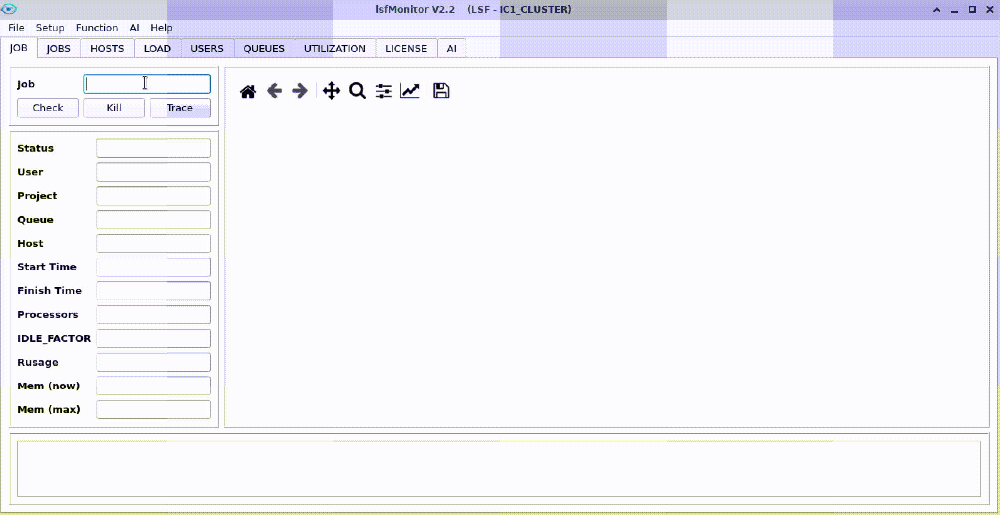
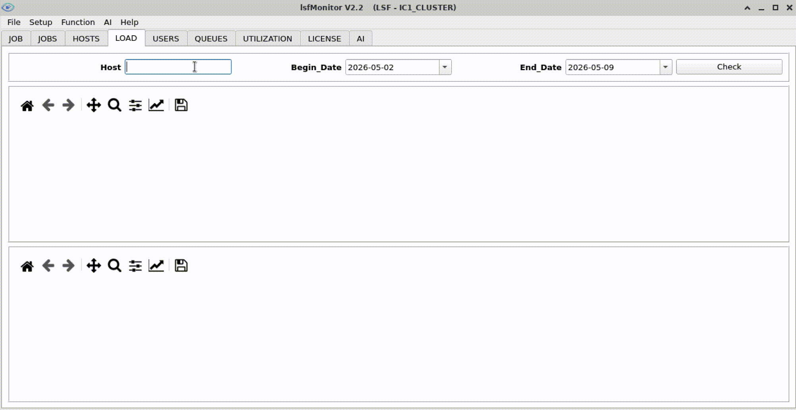
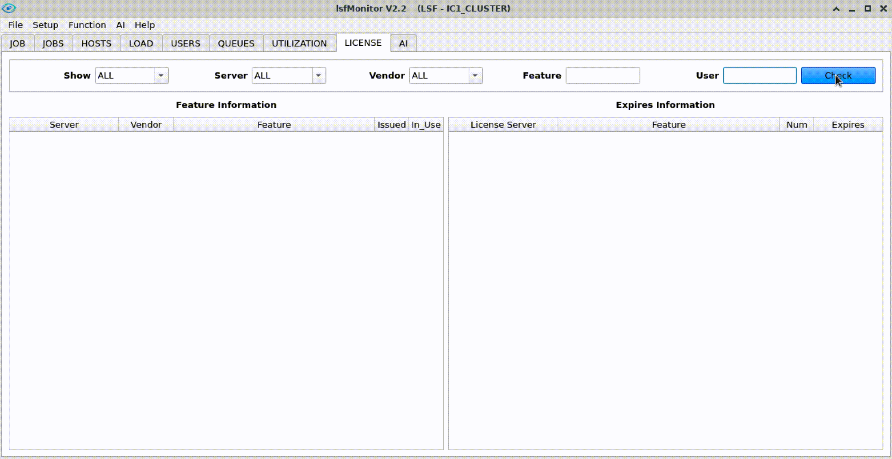
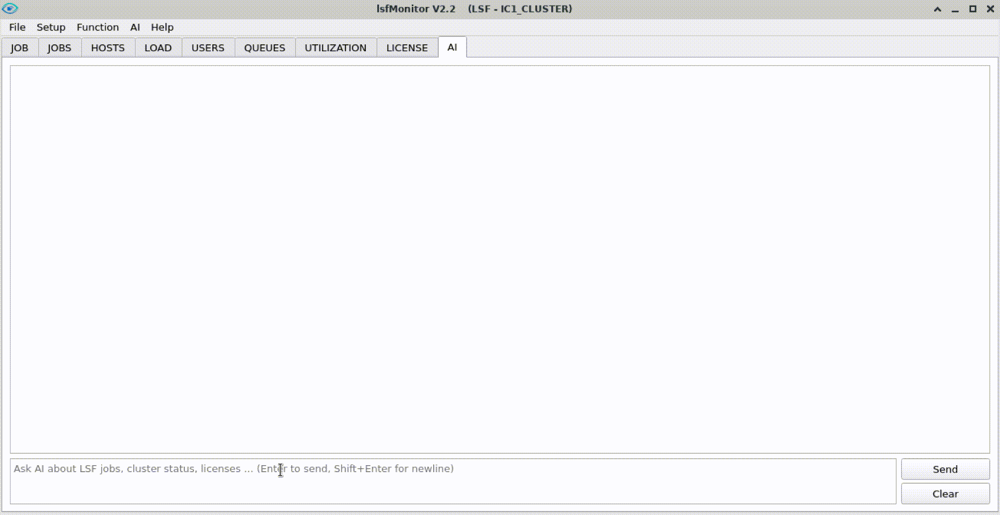

# lsfMonitor

An open-source HPC cluster monitoring tool for **LSF**, **volclava**, and **OpenLava**. It collects, analyzes, and visualizes cluster metrics (jobs, queues, hosts, load, utilization, licenses) via a PyQt5 desktop GUI. Also includes an ML-based job memory prediction subsystem and an LLM-powered AI helpdesk with RAG.

**Author:** liyanqing1987@163.com
**Version:** V2.2
**License:** GPL-3.0

## Features

- **JOB** — Single job details + memory usage curve
- **JOBS** — Batch view of running jobs with filtering by Status/Queue/Host/User
- **HOSTS** — Server status and resource overview with alert highlighting
- **LOAD** — Historical CPU/memory load curves per host
- **USERS** — User-level job statistics (pass rate, memory waste)
- **QUEUES** — Queue slot/pend/run trends over time
- **UTILIZATION** — Cluster-wide slot/cpu/mem utilization rates
- **LICENSE** — EDA license feature usage and expiration tracking
- **AI** — LLM-powered helpdesk with RAG document search and tool execution

## Quick Start

### 1. Install dependencies

Requires **Python 3.12.12**.

```bash
pip install -r requirements.txt
```

### 2. Install

```bash
python3 install.py
```

Options: `-p PREFIX` (install path), `-f` (force reinstall), `-m` (include memPrediction).

### 3. Configure

Edit `monitor/conf/config.py`:

```python
db_path = "/path/to/lsfMonitor/db"
license_administrators = "all"
lmstat_path = "/path/to/lmstat"
lmstat_bsub_command = ""
excluded_license_servers = ""
```

### 4. Sample data

Set up crontab for periodic data collection:

```bash
# Example crontab (crontab -e)
# Remember to set PATH and LSF_* environment variables in crontab header

3 0 * * * <INSTALL_PATH>/monitor/bin/bsample -c       # cleanup
10 11,23 * * * <INSTALL_PATH>/monitor/bin/bsample -j   # jobs history
*/5 * * * * <INSTALL_PATH>/monitor/bin/bsample -m       # job memory
*/5 * * * * <INSTALL_PATH>/monitor/bin/bsample -q       # queues
*/10 * * * * <INSTALL_PATH>/monitor/bin/bsample -qH     # queue-host mapping
*/5 * * * * <INSTALL_PATH>/monitor/bin/bsample -H       # hosts
*/5 * * * * <INSTALL_PATH>/monitor/bin/bsample -l       # load
30 11,23 * * * <INSTALL_PATH>/monitor/bin/bsample -u    # users
*/10 * * * * <INSTALL_PATH>/monitor/bin/bsample -U      # utilization
55 23 * * * <INSTALL_PATH>/monitor/bin/bsample -UD      # utilization daily
```

### 5. Launch GUI

```bash
bmonitor            # default (light mode)
bmonitor -d         # dark mode
bmonitor -j 12345   # jump to JOB tab for specific job
```

## Demo

**Job trace:**



**Server load:**



**License search:**



**AI function:**



## Auxiliary Tools

| Tool | Description |
|------|-------------|
| `akill` | Enhanced bkill — kill jobs by jobid/name/command/host/queue/user |
| `seedb` | Inspect sqlite3 database contents |
| `patch` | Apply incremental updates from a new install package |
| `rag_builder` | Build RAG vector database for AI helpdesk |
| `process_tracer` | Trace job process tree and system calls |
| `check_issue_reason` | Diagnose job PEND/SLOW/FAIL reasons |
| `show_license_feature_usage` | View license feature check-in details |

## Documentation

- [User Manual (Markdown)](docs/lsfMonitor_user_manual.md)
- [memPrediction Manual (PDF)](docs/memPrediction_user_manual.pdf)

## Update History

| Version | Date    | Highlights |
|---------|---------|------------|
| V1.0    | 2017    | Initial release as "openlavaMonitor" |
| V1.1    | 2020    | Renamed to lsfMonitor, added LSF support |
| V1.2    | 2022    | Added LICENSE tab |
| V1.3    | 2023.05 | Added UTILIZATION tab, patch tool, optimized DB format |
| V1.3.1  | 2023.06 | Optimized utilization sampling; multi-process license sampling |
| V1.3.2  | 2023.06 | Added host/license filtering on HOSTS and LICENSE tabs |
| V1.3.3  | 2023.09 | Feature-job association on LICENSE tab; added akill tool |
| V1.4    | 2023.11 | Checkbox multi-select; detailed QUEUES/UTILIZATION curves |
| V1.4.1  | 2023.12 | Logo, table export, curve display optimization |
| V1.4.2  | 2024.03 | Multi LSF/openlava cluster support |
| V1.5    | 2024.06 | UI auto-resize, kill job, right-click menus, memPrediction tool |
| V1.5.1  | 2024.08 | DONE/EXIT job sampling; memPrediction json data source |
| V1.6    | 2024.09 | USERS tab, dark mode, volclava support |
| V1.7    | 2025.03 | Faster sampling, aMem/saMem split, excluded_license_servers |
| V1.8    | 2025.10 | Fuzzy matching, queue aggregation, license_administrators |
| V2.0    | 2026.01 | Python 3.12.12, logging, code optimization |
| V2.1    | 2026.03 | Queue-host mapping, dynamic utilization, lazy loading, Modify Rusage Mem |
| V2.2    | 2026.04 | AI tab with LLM helpdesk and RAG document search |
