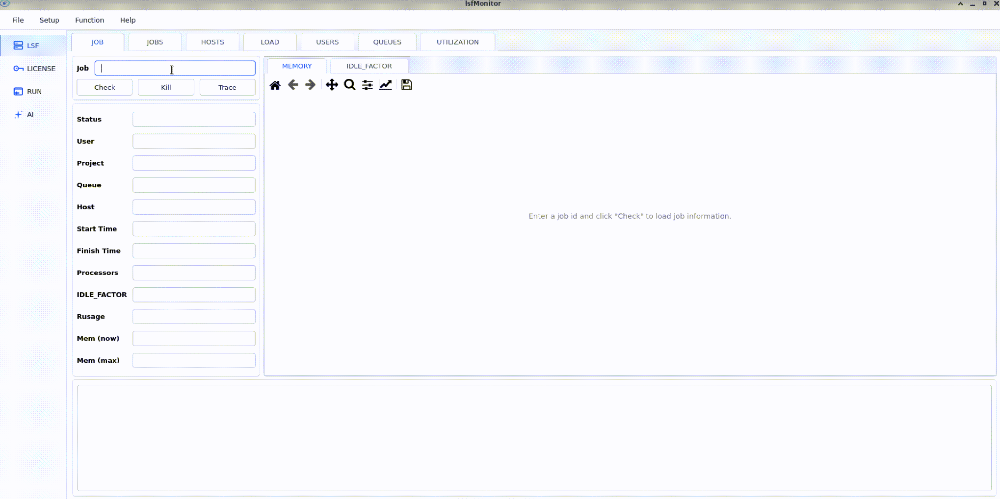
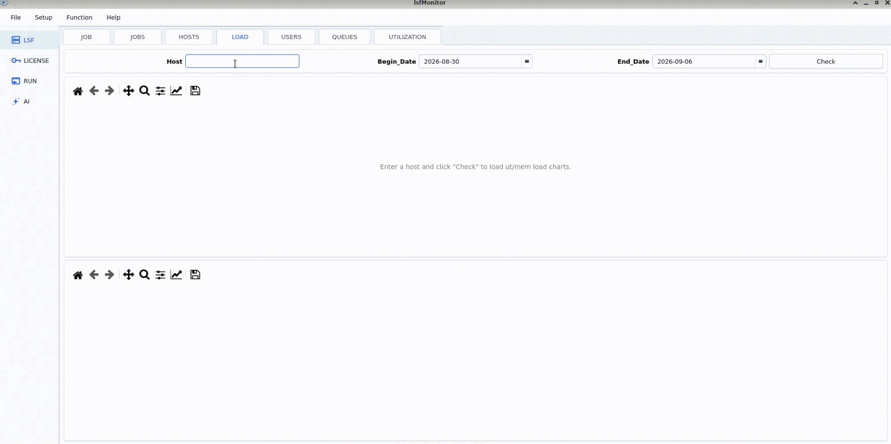
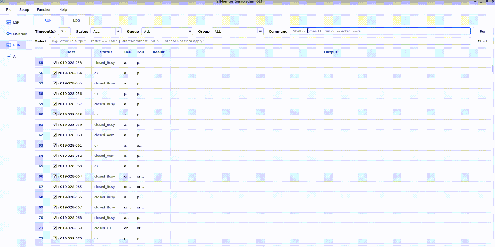
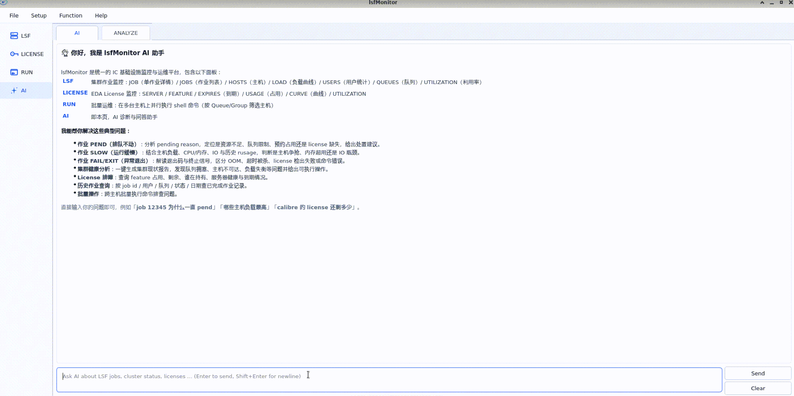

# lsfMonitor

An open-source HPC cluster monitoring tool for **LSF**, **volclava**, and **OpenLava**. It collects, analyzes, and visualizes cluster metrics (jobs, queues, hosts, load, utilization, licenses) via a PyQt5 desktop GUI. Also includes an ML-based job memory prediction subsystem and an LLM-powered AI helpdesk with RAG. Ships a JSON-output **CLI** (`bmonitor_cli`) for scripts and AI assistants.

**Author:** liyanqing1987@163.com

**Version:** V3.0

**License:** GPL-3.0


## Features

The GUI has four sidebar panels, each with its own inner tabs:

| Panel | Tab | Description |
|-------|-----|-------------|
| **LSF** | JOB | Single job details + memory usage and idle_factor (cputime/runtime) curves |
| | JOBS | Batch view of running jobs with filtering by Status/Queue/Host/User (multi-value, exact-preferred fuzzy match) |
| | HOSTS | Server status and resource overview with alert highlighting (queue/group filter); Host filter supports multi-value |
| | LOAD | Historical CPU/memory load curves per host (single host) |
| | USERS | User-level job statistics (pass rate, memory waste); User filter supports multi-value |
| | QUEUES | Queue slot/pend/run trends over time |
| | UTILIZATION | Cluster-wide slot/cpu/mem utilization rates (queue/group dimensions) |
| **LICENSE** | SERVER | License server status, version, and feature issued/in-use counts |
| | FEATURE | Feature usage snapshot: who holds how many, occupancy details |
| | EXPIRES | License expiration dates with ahead-of-time alerts |
| | USAGE | Feature occupancy trends over time |
| | CURVE | Historical feature in-use curves per server/feature |
| | UTILIZATION | Feature utilization rates across servers |
| **RUN** | RUN | Run shell commands across many hosts concurrently (ssh + pexpect, per-host timeout), filter hosts by status/queue/group |
| | LOG | Command history log (per-user table, date/user/login_user/command/log) |
| **AI** | AI | LLM-powered helpdesk with RAG document search and tool execution |
| | ANALYZE | One-shot health reports (cluster / user / job / queue), self-contained HTML |

Beyond the GUI:

- **bmonitor_cli** — Command-line tool that outputs structured **JSON**. Real-time queries (jobs/hosts/queues/license) plus a `db` subcommand group for historical sampling data (finished jobs, load/utilization trends, license history). Covers bjobs/bhist/bpeek/bhosts/bqueues/busers/lmstat with structured output. Designed for scripts and AI agents.
- **memPrediction** — ML-based job memory prediction subsystem (XGBoost), with a Flask + React web app.

## Quick Start

### 1. Install dependencies

Requires **Python 3.12.12**.

```bash
pip install -r requirements.txt
```

### 2. Install

```bash
python3 install.py
```

Options: `-p PREFIX` (install path), `-c` (cleanup shell tools & configs before install), `-f` (force reinstall, overwrites config), `-m` (include memPrediction subsystem).

### 3. Configure

lsfMonitor uses **per-panel config files** under `config/`, one per sidebar tab. A user can override any of them by placing a same-named file under `~/.lsfMonitor/config/` (higher priority, merge-loaded).

| File | Panel | Key settings |
|------|-------|--------------|
| `config/config.py` | top-level | `db_path` (root data dir shared by all subsystems; each panel config's empty `db_path` falls back to `<db_path>/<name>`) |
| `config/config_lsf.py` | LSF | `db_path`, `cleanup_expire_days` |
| `config/config_license.py` | LICENSE | `administrators`, `lmstat_path`, `lmstat_bsub_command`, `db_path`, `fresh_interval` |
| `config/config_run.py` | RUN | `default_ssh_command`, `parallel_timeout`, `max_parallel` |
| `config/config_ai.py` | AI | `ai_api_base_url`, `ai_api_key`, `ai_model_name`, `ai_embedding_*`, `ai_dangerous_commands` |

Generated file permissions: `config_lsf.py` / `config_run.py` / `config_ai.py` are `0o644` (owner-writable, others read-only) so every user can read the shared config — including `config_ai.py`, whose `ai_api_key` is treated as a shared team key. `config_license.py` is `0o755`. User-owned overrides under `~/.lsfMonitor/config/` are managed by the user.

### 4. Sample data

Set up crontab for periodic data collection:

```bash
# Example crontab (crontab -e)
# Remember to set PATH and LSF_* environment variables in crontab header

3 0 * * * <INSTALL_PATH>/bin/bsample -c         # cleanup
10 11,23 * * * <INSTALL_PATH>/bin/bsample -j    # jobs history
*/5 * * * * <INSTALL_PATH>/bin/bsample -m       # job memory & idle_factor
*/5 * * * * <INSTALL_PATH>/bin/bsample -q       # queues
*/30 * * * * <INSTALL_PATH>/bin/bsample -qH     # queue-host mapping
*/30 * * * * <INSTALL_PATH>/bin/bsample -gH     # host group-host mapping
*/5 * * * * <INSTALL_PATH>/bin/bsample -H       # hosts
*/5 * * * * <INSTALL_PATH>/bin/bsample -l       # load
30 11,23 * * * <INSTALL_PATH>/bin/bsample -u    # users
*/10 * * * * <INSTALL_PATH>/bin/bsample -U      # utilization
55 23 * * * <INSTALL_PATH>/bin/bsample -UD      # utilization daily
5 8 * * * <INSTALL_PATH>/bin/bsample -A         # AI cluster analysis report (requires AI config)

# License sampling (config_license.py db_path, defaults to <db_path>/license)
*/30 * * * * <INSTALL_PATH>/bin/license_sample -u -U    # feature usage + utilization
3 0 * * * <INSTALL_PATH>/bin/license_sample -c          # cleanup expired data
```

### 5. Launch GUI

```bash
bmonitor                          # default (light mode, LSF panel → JOBS tab)
bmonitor -d                       # dark mode
bmonitor -j 12345                 # jump to LSF JOB tab for a specific job
bmonitor -u liyanqing             # LSF JOBS tab for a user (also fills USERS + LICENSE-USAGE)
bmonitor -u alice bob             # multiple users (space-separated)
bmonitor -H n019-123-001          # LSF LOAD tab for a host (also fills HOSTS)
bmonitor -H h1 h2 h3              # multiple hosts: HOSTS gets all, LOAD takes the first (warns)
bmonitor -f calibre               # LICENSE FEATURE tab for a feature (also fills EXPIRES/USAGE/CURVE)
bmonitor -f calibre vcs           # multiple features (space-separated)
bmonitor -f calibre -u someone    # LICENSE USAGE tab, feature + user
bmonitor -p lsf -t HOSTS          # explicitly set panel + tab (overrides auto-inference)
bmonitor -p license -t CURVE -f calibre

# license_monitor: same unified GUI, focused on the License panel (= bmonitor --panel license)
license_monitor
license_monitor -f calibre        # FEATURE tab, filtered
license_monitor -u someone        # USAGE tab for a user
license_monitor -d
```

`--panel`/`--tab` auto-inferred from `-j`/`-u`/`-H`/`-f` when not given; no args → LSF panel, JOBS tab. Requires an X11/graphical display.

### 6. Query via CLI (`bmonitor_cli`)

`bmonitor_cli` is a read-only JSON CLI that wraps live LSF/volclava commands (`bjobs`/`bhist`/`bpeek`/`bhosts`/`bqueues`/`busers`/`lsid`/`bmgroup`/`lsload`) and `lmstat` for license data, plus a `db` group that reads the SQLite sampling databases written by `bsample`/`license_sample`. It captures: **cluster identity & summary, job lists/details/history/output + pend/slow/fail diagnosis, host status/load/detail + host groups, queue overview/detail, user job counts, pending-reason Top-N, and license feature usage/expiration/user-occupancy** — both in real time (parsed live from the scheduler) and historically (from sampled DBs). Designed for scripts and AI agents.

Run `bmonitor_cli --help` or `bmonitor_cli db --help` for the full list.

```bash
# Real-time (parsed live from LSF / lmstat)
bmonitor_cli cluster-info                        # lsid: scheduler type/version/cluster/master
bmonitor_cli cluster-summary                     # slot/cpu/mem utilization + job counts + queue/user/pending-reason tops
bmonitor_cli host-groups                         # bmgroup: host groups → hosts
bmonitor_cli jobs --status RUN --user someone    # bjobs -w with filters (status/queue/host/limit)
bmonitor_cli job 12345                           # bjobs -UF: full job fields
bmonitor_cli job 12345 --diagnose pend           # diagnose pend / slow / fail
bmonitor_cli job-hist 12345                      # bhist -l (completed jobs bjobs can't see)
bmonitor_cli job-output 12345                    # bpeek: running job stdout
bmonitor_cli hosts --status unavail --sort-load  # bhosts + lsload, filter by status/queue/group, sort by ut
bmonitor_cli host-detail n019-028-184            # bhosts -l scheduling-load detail (r15s/ut/mem/slots ...)
bmonitor_cli host-load n019-028-184 --days 30    # host load history (from sampled DB)
bmonitor_cli queues                              # bqueues -w overview
bmonitor_cli queue normal                        # bqueues -l: real limits (RUNLIMIT/USERS/HOSTS/RES_REQ/SHARES) + member hosts
bmonitor_cli users --sort PEND                   # busers all job counts, sorted
bmonitor_cli pending-reasons --top 20            # bjobs -u all -p: top pending reasons
bmonitor_cli license --feature calibre           # lmstat: issued/in_use/available + holders
bmonitor_cli license-expires --feature calibre   # lmstat: feature expiration dates
bmonitor_cli license-usage --user someone        # lmstat: per-record user usage

# Historical sampling data (db subcommand group, read-only)
bmonitor_cli db clusters                         # sampled clusters + date ranges
bmonitor_cli db job 12345                        # completed job detail from DB
bmonitor_cli db jobs --status EXIT --days 7 --limit 100   # historical finished jobs (user/status/queue/exit-code/date/limit)
bmonitor_cli db job-mem 12345 --days 1           # job memory/idle_factor time series
bmonitor_cli db user liyanqing --days 7          # user's finished-jobs summary
bmonitor_cli db queue normal --days 30           # queue load trend (slot/pend/run over time)
bmonitor_cli db queue-hosts normal --days 30     # queue member-host history
bmonitor_cli db group-hosts IC_ETX --days 30     # host-group member history
bmonitor_cli db host-jobs n019-123-001 --days 7  # host job-count trend
bmonitor_cli db host-util n019-028-184 --daily   # host utilization trend (daily with --daily)
bmonitor_cli db license-servers --feature calibre          # sampled license server/vendor/feature
bmonitor_cli db license-usage --feature calibre --days 7   # sampled feature occupancy over time
bmonitor_cli db license-util --feature calibre --daily     # feature utilization trend (daily with --daily)
```

Behavior: all commands are read-only; trend queries are down-sampled to ≤100 points; missing data returns `{"error": ...}` instead of crashing; `bprint` warnings go to stderr so stdout stays pure JSON.

## Demo

**Job trace:**



**Server load:**



**Batch run across hosts (RUN panel):**



**AI helpdesk (AI panel):**



## Auxiliary Tools

Located under `tools/`:

| Tool | Description |
|------|-------------|
| `akill` | Enhanced bkill — kill jobs by jobid/name/command/host/queue/user |
| `check_issue_reason` | Diagnose job PEND/SLOW/FAIL reasons (standalone, predates AI skills) |
| `gen_LM_LICENSE_FILE` | Generate the LM_LICENSE_FILE config from module config |
| `lmstat` | Bundled lmstat binary shim for license queries |
| `message` | Non-blocking loading prompt dialog (PyQt5, auto-close 5s), called by GUI ShowMessage |
| `patch` | Apply incremental updates from a new install package (config migration) |
| `process_tracer` | Trace job process tree on execution hosts |
| `rag_builder` | Build/update RAG vector database for AI helpdesk (output to `db/ai/rag/`) |
| `seedb` | Inspect sqlite3 sampling database contents |

## Documentation

- [User Manual](docs/lsfMonitor_user_manual.md) — installation, config, GUI panels, bmonitor_cli, auxiliary tools (§5), FAQ, exit codes, db_path permission spec (附3)
- [memPrediction Manual](docs/memPrediction_user_manual.md) — ML subsystem

> Auxiliary tool usage (akill / patch / rag_builder / seedb) is documented inside the User Manual §5, not as standalone files.

## Update History

| Version | Date    | Highlights |
|---------|---------|------------|
| V1.0    | 2017    | Initial release as "openlavaMonitor" |
| V1.1    | 2020    | Renamed to lsfMonitor, added LSF support |
| V1.2    | 2022    | Added LICENSE tab |
| V1.3    | 2023.05 | Added UTILIZATION tab, patch tool, optimized DB format |
| V1.3.1  | 2023.06 | Optimized utilization sampling; multi-process license sampling |
| V1.3.2  | 2023.06 | Added host/license filtering on HOSTS and LICENSE tabs |
| V1.3.3  | 2023.09 | Feature-job association on LICENSE tab; added akill tool |
| V1.4    | 2023.11 | Checkbox multi-select; detailed QUEUES/UTILIZATION curves |
| V1.4.1  | 2023.12 | Logo, table export, curve display optimization |
| V1.4.2  | 2024.03 | Multi LSF/openlava cluster support |
| V1.5    | 2024.06 | UI auto-resize, kill job, right-click menus, memPrediction tool |
| V1.5.1  | 2024.08 | DONE/EXIT job sampling; memPrediction json data source |
| V1.6    | 2024.09 | USERS tab, dark mode, volclava support |
| V1.7    | 2025.03 | Faster sampling, aMem/saMem split, excluded_license_servers |
| V1.8    | 2025.10 | Fuzzy matching, queue aggregation, license_administrators |
| V2.0    | 2026.01 | Python 3.12.12, logging, code optimization |
| V2.1    | 2026.03 | Queue-host mapping, dynamic utilization, lazy loading, Modify Rusage Mem |
| V2.2    | 2026.04 | AI tab with LLM helpdesk and RAG document search |
| V2.3    | 2026.06 | IDLE_FACTOR sampling & chart; AI ANALYZE one-shot reports (cluster/user/job/queue) |
| V2.4    | 2026.08 | Host group support: `bsample -gH` sampling; HOSTS/UTILIZATION tabs add Group filter for Queue/Group dual-dimension stats |
| V3.0    | 2026.09 | `bmonitor_cli` JSON CLI (real-time + `db` historical, for scripts/AI); bugfixes (jobs status filter, hosts sort-load, bprint stdout); RAG store moved to `db/ai/rag/` |
