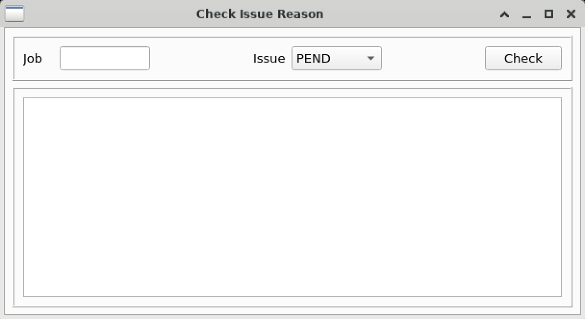

# check_issue_reason 用户手册

## 概述

`check_issue_reason` 是 lsfMonitor 提供的图形化诊断工具，用于分析 LSF 作业的 PEND（等待）、SLOW（运行缓慢）、FAIL（失败）问题的原因。

## 使用方法

```
check_issue_reason [选项]
```

## 命令行参数

| 参数 | 缩写 | 说明 |
|------|------|------|
| `--job` | `-j` | 指定要诊断的 Job ID |
| `--issue` | `-i` | 指定问题类型：`PEND`、`SLOW`、`FAIL`（默认为 `PEND`） |

## 图形界面说明

启动后会打开一个 GUI 窗口，包含以下区域：

- **顶部选择区**：输入 Job ID，选择问题类型（PEND/SLOW/FAIL），点击 Check 按钮执行诊断。
- **下方信息区**：显示诊断结果。



## 诊断功能详解

### PEND 诊断

当选择 PEND 类型时，工具会查询作业的 pending reason 并给出中文解释：

| LSF Pending Reason | 诊断说明 |
|---|---|
| New job is waiting for scheduling | 任务分发中，请耐心等待 |
| Not enough job slot | CPU 需求不能满足，请等待队列资源 |
| Job slot limit reached | CPU 需求不能满足，请等待队列资源 |
| Not enough processors to meet spanning requirement | CPU 需求不能满足，请等待队列资源 |
| Job requirements for reserving resource (mem) not satisfied | 内存需求不能满足，请等待队列资源或申请专有队列 |
| There are no suitable hosts for the job | 资源申请条件可能过于苛刻，请检查 |
| User has reached the per-user job slot limit | 队列限制，请耐心等待 |

同时会显示作业请求的 CPU slot 数和内存需求，帮助定位资源瓶颈。

### SLOW 诊断

当选择 SLOW 类型时（作业必须为 RUN 状态），工具会：

1. 显示分步诊断指引。
2. 自动启动 `process_tracer` 工具跟踪作业的进程树。

诊断步骤：

- **Step 1**：在 Process Tracer 中检查进程的 STAT 列。`R` 表示运行中，`S` 表示睡眠。
- **Step 2**：如果有进程为 `R` 状态，说明进程状态正常，需检查 EDA 工具配置。
- **Step 3**：如果所有进程均为 `S` 状态，在 Process Tracer 中点击关键进程的 PID 列，通过 strace 终端查看 EDA 工具正在执行的操作。

### FAIL 诊断

当选择 FAIL 类型时（作业必须为 DONE 或 EXIT 状态），工具会显示：

- **DONE 状态**：作业本身成功完成，问题可能出在用户命令，建议检查命令日志。
- **EXIT 状态**：
  - 显示 Exit Code 及其含义（根据 `monitor/conf/exit_code.yaml`）。
  - 显示 Termination Signal 及其含义（根据 `monitor/conf/term_signal.yaml`）。

## 使用示例

```bash
# 直接启动 GUI
check_issue_reason

# 诊断指定作业的 PEND 原因
check_issue_reason -j 12345 -i PEND

# 诊断作业的失败原因
check_issue_reason -j 12345 -i FAIL
```

## 注意事项

- SLOW 诊断需要作业为 RUN 状态，且会启动 `process_tracer` 工具。
- FAIL 诊断需要作业为 DONE 或 EXIT 状态。
- 该工具需要 PyQt5 图形环境支持，请确保有可用的 X11 显示。
