# lsfMonitor用户手册

| 项目 | 内容 |
|------|------|
| Product Name | lsfMonitor |
| Product Version | V2.3 |
| Release Date | 2026.06.06 |
| Contact | @李艳青（liyanqing1987@163.com） |

## 一、简介

LSF是 IBM 旗下的一款分布式集群管理系统软件，负责计算资源的管理和批处理作业的调度。它具有良好的可伸缩性和高可用性，支持几乎所有的主流操作系统，是高性能计算的重要基础软件。Openlava是基于LSF早期版本开源的Lava做的二次开源项目，其支持LSF的大部分功能。Volclava则是ByteDance开源的LSF兼容调度器。

lsfMonitor是一款适用于LSF/Openlava/Volclava等调度器的数据收集、分析及展示工具，亦可用于EDA License实时信息检索，可以满足集成电路行业用户对于LSF/License的绝大部分信息需求。lsfMonitor主要提供如下功能：

- **JOB**: 查询指定job的详细信息，并可分析job PEND/SLOW/EXIT等异常原因。
- **JOBS**: 查询所有job的基本信息。
- **HOSTS**: 查询所有host的基本信息。
- **LOAD**: 查询指定host的cpu/mem负载信息。
- **USERS**: 查询User维度的job资源使用汇聚信息。
- **QUEUES**: 查询Queue维度的job SLOTS/RUN/PEND数量汇聚信息。
- **UTILIZATION**: 查询Queue维度的slot/cpu/mem使用率汇聚信息。
- **LICENSE**: 查询当前Terminal环境可见的EDA License使用信息。
- **AI**: AI助手。

## 二、环境依赖

### 2.1 操作系统依赖

lsfMonitor的开发和测试操作系统为 CentOS Linux release 7.9.2009 (Core) 和 Rocky Linux release 8.10 (Green Obsidian)，这也是IC设计常用的操作系统版本。

GCC和OpenSSL需要满足如下版本要求，最好使用NAS安装的版本，以做到跨服务器、跨操作系统版本通用。

- GCC >= 8.5
- OpenSSL = 1.1.1

### 2.2 python版本依赖

lsfMonitor基于python开发，其开发和测试的python版本为python3.12.12。

python安装时可以参照如下环境载入方式和编译命令。

```bash
./configure \
    --prefix=${PYTHON_ROOT}/python3.12.12  # 指定安装路径（建议自定义，避免覆盖系统Python）
    --enable-optimizations          # 启用优化（提升Python运行速度）
    --with-ssl=${OPENSSL_ROOT}      # 强制启用SSL模块（依赖libssl-dev）

make -j8
make altinstall
```

### 2.3 集群管理工具

lsfMonitor依赖LSF/Oenlava/Volclava集群管理系统，暂不支持其它集群管理系统。

LSF 9.1.3及以上的版本良好支持，volclava支持良好，Openlava几个版本间输出信息格式有一定差异，仅支持openlava4.0的主流版本。

## 三、工具安装及配置

### 3.1 工具下载

lsfMonitor的github路径位于 https://github.com/liyanqing1987/lsfMonitor

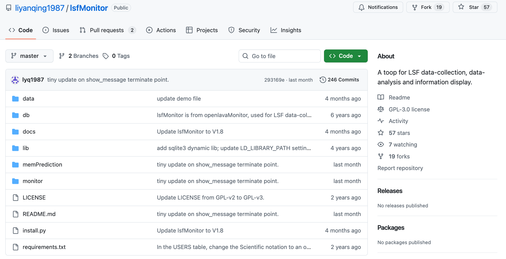

可以采用"git clone https://github.com/liyanqing1987/lsfMonitor.git"的方式拉取源代码。

```bash
git clone git@github.com:liyanqing1987/lsfMonitor.git
```

也可以在lsfMonitor的github页面上，Code -> Download ZIP的方式拉取代码包。

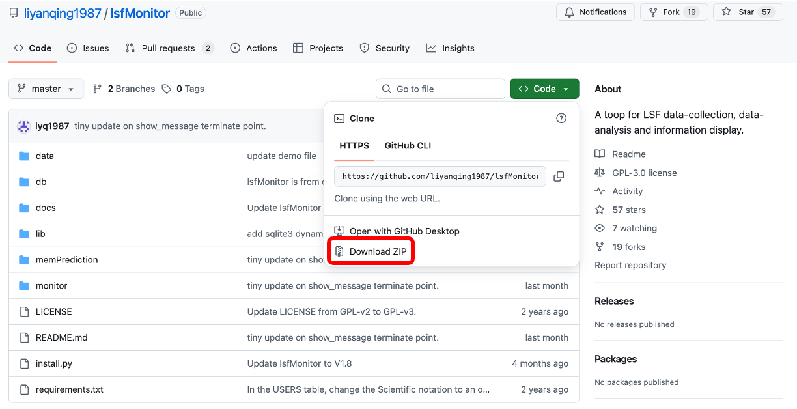

### 3.2 工具安装

工具安装之前，首先参照第二章"环境依赖"满足lsfMonitor的环境依赖关系。

确认python版本正确（Python 3.12.12），并基于安装包中的requirements.txt安装python依赖库。

```bash
python3 --version
pip3 install -r requirements.txt
```

在安装目录下，使用命令"python3 install.py"安装lsfMonitor。

```bash
python3 install.py
```

请注意，此处的install.py是支持多个参数的，如果是初次安装且仅使用lsfMonitor，则不需要加任何参数。

```
python3 install.py -h
usage: install.py [-h] [-p PREFIX] [-c] [-f] [-m]

options:
  -h, --help            show this help message and exit
  -p PREFIX, --prefix PREFIX
                        Specify lsfMonitor install path on config file, default is current directory.
  -c, --clean           Cleanup old installation.
  -f, --force           Install by force.
  -m, --memPrediction   Install memPrediction the same time.
```

- `--prefix`：指定安装路径，默认为当前路径。
- `--clean`：清理旧的安装数据。
- `--force`：强制初始化config.py，用于二次安装的情况不保留旧的设置，慎用。
- `--memPrediction`：同时安装memPrediction这个附加工具。

### 3.3 工具配置

安装目录下主配置文件为monitor/conf/config.py，如果monitor/conf/config_\<CLUSTER\>.py存在，则优先生效。安装后默认配置如下，一般需要重新配置。

#### 用户个人配置（可选）

用户可在`~/.lsfMonitor/conf/`目录下创建个人config.py，实现个性化配置而不影响安装目录的全局配置。个人配置采用**合并加载**机制：

- 始终先加载安装目录的`monitor/conf/config.py`作为基础配置。
- 如果`~/.lsfMonitor/conf/config.py`存在，则将其中的变量覆盖到基础配置之上。
- 用户config中未设置的变量，自动使用基础配置的默认值（不会报错）。
- 用户config中独有的变量，也可正常使用。

同样支持cluster-specific的个人配置（`~/.lsfMonitor/conf/config_<CLUSTER>.py`），合并优先级从低到高为：

```
monitor/conf/config.py < monitor/conf/config_<CLUSTER>.py < ~/.lsfMonitor/conf/config.py < ~/.lsfMonitor/conf/config_<CLUSTER>.py
```

这意味着用户只需在个人config中写入需要覆盖的变量即可，例如：

```python
# ~/.lsfMonitor/conf/config.py
# 只覆盖需要修改的配置，其余使用全局默认值
db_path = "/my/custom/db/path"
ai_api_key = "my-personal-api-key"
```

#### 全局默认配置

```python
# Specify the database directory.
db_path = "/ic/software/cad_tools/it/lsfMonitor/db"

# Specify EDA license administrators.
license_administrators = "all"

# Specify lmstat path, example "/eda/synopsys/scl/2021.03/linux64/bin/lmstat".
lmstat_path = "/ic/software/cad_tools/it/lsfMonitor/monitor/tools/lmstat"

# Specify lmstat bsub command, example "bsub -q normal -Is".
lmstat_bsub_command = ""

# Excluded license servers, format is "27020@lic_server 5280@lic_server".
excluded_license_servers = ""

# AI helpdesk settings (OpenAI-compatible API).
ai_api_base_url = ""
ai_api_key = ""
ai_model_name = ""

# AI embedding model for RAG documentation search (optional).
# Default recommendation for the "Doubao-embedding-vision" model of Volcano Ark.
# If ai_embedding_api_base_url/ai_embedding_api_key are empty, falls back to ai_api_base_url/ai_api_key.
ai_embedding_api_base_url = ""
ai_embedding_api_key = ""
ai_embedding_model_name = ""

# Commands requiring user confirmation before AI executes (space-separated).
# Default if empty: "bkill badmin brestart bstop bresume bswitch rm kill killall shutdown reboot mkfs dd"
ai_dangerous_commands = ""
```

各配置项说明如下：

- `db_path`：采样数据的数据库存放路径，默认为lsfMonitor安装路径下的db目录。如果lsfMonitor用版本管理工具管理，那么建议把db_path修改到独立的数据存放路径。
- `license_administrators`：设定license信息的管理员，仅指定的用户可见LICENSE页，默认为"all"，即全员可见。
- `lmstat_path`：lsfMonitor通过工具lmstat获取EDA license信息，此处用于配置lmstat工具的路径。
- `lmstat_bsub_command`：lsfMonitor一般在Linux环境的login server上运行，而login server一般会通过iptables等方法设置禁止lmstat等EDA相关的工具运行，所以执行lmstat的时候一般需要通过bsub方式。
- `excluded_license_servers`：license信息检索时排除指定的license servers，被排除的license server信息将不会显示在LICENSE页，默认为""，即不排除任何license server。
- `ai_api_base_url`：指定AI模型的base url，未设置无法使用AI功能。支持多种格式：标准OpenAI格式（如`https://api.openai.com/v1`）、火山方舟格式（如`https://ark.cn-beijing.volces.com/api/v3`）、自建OpenWebUI等完整endpoint格式（如`http://chat.mysite.com/api/chat/completions`）均可自动识别。
- `ai_api_key`：指定AI模型的api key，未设置无法使用AI功能。
- `ai_model_name`：指定AI模型的模型名，未设置无法使用AI功能。
- `ai_embedding_api_base_url`：指定AI向量模型的base url，默认使用ai_api_base_url的设置，未设置无法使用AI RAG文档检索功能。
- `ai_embedding_api_key`：指定AI向量模型的api key，默认使用ai_api_key的设置。
- `ai_embedding_model_name`：指定AI向量模型的模型名。
- `ai_dangerous_commands`：指定AI模型运行时需要用户确认的命令（空格分隔）。默认包含 `bkill badmin brestart bstop bresume bswitch rm kill killall shutdown reboot mkfs dd`。AI执行这些命令前会弹窗确认，防止误操作。

一个使用的demo配置如下。

```python
# Specify the database directory.
db_path = "/ic/data/CAD/it/lsfMonitor/db"

# Specify EDA license administrators.
license_administrators = "all"

# Specify lmstat path, example "/eda/synopsys/scl/2021.03/linux64/bin/lmstat".
lmstat_path = "/ic/software/cad_tools/it/lsfMonitor/monitor/tools/lmstat"

# Specify lmstat bsub command, example "bsub -q normal -Is".
lmstat_bsub_command = "bsub -q normal -Is"

# Excluded license servers, format is "27020@lic_server 5280@lic_server".
excluded_license_servers = ""

# AI helpdesk settings (OpenAI-compatible API).
ai_api_base_url = "https://ark.cn-beijing.volces.com/api/v3"
ai_api_key = "f518eba2-de59-4dc0-aad2-xxxxxxxxxxxx"
ai_model_name = "ep-20260325145526-xxxxx"

# AI embedding model for RAG documentation search (optional).
# Default recommendation for the "Doubao-embedding-vision" model of Volcano Ark.
# If ai_embedding_api_base_url/ai_embedding_api_key are empty, falls back to ai_api_base_url/ai_api_key.
ai_embedding_api_base_url = ""
ai_embedding_api_key = ""
ai_embedding_model_name = "ep-20260409164110-xxxxx"

# Commands requiring user confirmation before AI executes (space-separated).
# Default if empty: "bkill badmin brestart bstop bresume bswitch rm kill killall shutdown reboot mkfs dd"
ai_dangerous_commands = "bkill badmin brestart bstop bresume bswitch rm kill killall shutdown reboot mkfs dd"
```

其中AI模型相关的配置，如下不同类型的大模型均测试可用，使用效果会有一定差异。

- 业界顶尖的C-opus-4.6、G-5.4-pro等模型。
- 火山方舟的Doubao-Seed-2.0-pro、Kimi-K2.5等模型。
- 私有化部署的Kimi-K2.5等模型。

## 四、工具使用

lsfMonitor工具包括"数据采集"和"数据展示"两大部分，对应的执行脚本分别为bsample和bmonitor，均位于lsfMonitor安装路径下的monitor/bin子目录中。

### 4.1 数据采集 bsample

#### 4.1.1 帮助信息

bsample用于采集job/queue/host/load/user/utilization信息。

```
bsample -h
usage: bsample.py [-h] [-j] [-m] [-q] [-H] [-l] [-u] [-U] [-UD] [-A]

optional arguments:
  -h, --help            show this help message and exit
  -c, --cleanup         Clean up database with expire days limiation.
  -j, --job             Sample (finished) job info with command "bjobs -u all -d -UF".
  -m, --job_mem         Sample (running) job mem and idle_factor(cputime/runtime) with command "bjobs -u all -r -UF".
  -q, --queue           Sample queue info with command "bqueues".
  -qH, --queue_host_mapping
                        Sample queue-host mapping info with command "bqueues -l".
  -H, --host            Sample host info with command "bhosts".
  -l, --load            Sample host load (ut/tmp/swp/mem) info with command "lsload".
  -u, --user            Sample user (finished) job info with command "bjobs -u all -d -UF".
  -U, --utilization     Sample utilization (slot/cpu/mem) info with command "lsload/bhosts/lshosts".
  -UD, --utilization_day
                        Count and save utilization-day info with utilization data.
  -A, --analysis        Generate an AI cluster analysis HTML report (requires AI config).
```

- `--help`: 打印帮助信息。
- `--cleanup`: 清理超出保留天数的数据库数据。保留天数通过config.py中的`cleanup_expire_days`配置，默认job/job_data保留90天，其余保留365天。清理范围包括：job/（删除超龄文件）、user/（删除超龄文件）、job_data/（删除过期行，清空文件自动删除）、queue.db/host.db/load.db/utilization.db/utilization_day.db（删除过期行）。
- `--job`: 采集job信息并存储。
- `--job_mem`: 采集job的MEM和idle_factor(cputime/runtime)信息并存储。
- `--queue`: 采集queue信息并存储。
- `--queue_host_mapping`: 采集queue跟host的映射关系。
- `--host`: 采集host信息并存储。（bmonitor暂时不需要）
- `--load`: 采集host load信息并存储。
- `--user`: 采集user信息并存储。
- `--utilization`: 采集slot/cpu/memory的utilization信息。
- `--utilization_day`: 根据utilization数据计算按天核算的utilization值。
- `--analysis`: 基于大模型生成一份集群体检HTML报告（需先配置AI）。详见 4.2.12 AI页。

#### 4.1.2 手工采样

下面是一个手工采样示例，我们使用monitor/bin/bsample采样job MEM用量的信息。

```bash
monitor/bin/bsample -m
>>> Sampling job mem usage info ...
    Done (5744 jobs).
```

#### 4.1.3 自动采样（定时）

首先，建议LSF的CLEAN_PERIOD参数至少设置为86400（一天），默认值一般为3600（一小时），这个值过小的话容易导致部分采样中出现数据缺失。

我们推荐用crontab来自动定时采样，job/user采样较慢所以一天两次即可，其它采样建议5~10分钟一次。下面是一个示例。（crontab -e）

bsample -c则用于自动清理database中的旧数据，以防止数据库尺寸过大。

```bash
SHELL=/bin/bash
PATH=/usr/local/bin:/bin:/usr/bin:/usr/local/sbin:/usr/sbin:/ic/software/tools/lsf/10.1/linux3.10-glibc2.17-x86_64/bin
LSF_SERVERDIR=/ic/software/tools/lsf/10.1/linux3.10-glibc2.17-x86_64/etc
LSF_LIBDIR=/ic/software/tools/lsf/10.1/linux3.10-glibc2.17-x86_64/lib
LSF_BINDIR=/ic/software/tools/lsf/10.1/linux3.10-glibc2.17-x86_64/bin
LSF_ENVDIR=/ic/software/tools/lsf/conf
LSF_TOP=/ic/software/tools/lsf

# For lsfMonitor
3 0 * * * /ic/software/tools/lsfMonitor/monitor/bin/bsample -c
10 11,23 * * * /ic/software/tools/lsfMonitor/monitor/bin/bsample -j
*/5 * * * * /ic/software/tools/lsfMonitor/monitor/bin/bsample -m
*/5 * * * * /ic/software/tools/lsfMonitor/monitor/bin/bsample -q
*/10 * * * * /ic/software/tools/lsfMonitor/monitor/bin/bsample -qH
*/5 * * * * /ic/software/tools/lsfMonitor/monitor/bin/bsample -H
*/5 * * * * /ic/software/tools/lsfMonitor/monitor/bin/bsample -l
30 11,23 * * * /ic/software/tools/lsfMonitor/monitor/bin/bsample -u
*/10 * * * * /ic/software/tools/lsfMonitor/monitor/bin/bsample -U
55 23 * * * /ic/software/tools/lsfMonitor/monitor/bin/bsample -UD
5 8 * * * /ic/software/tools/lsfMonitor/monitor/bin/bsample -A
```

其中`bsample -A`会调用大模型生成一份集群分析报告，是一次较慢的大模型调用，建议低频执行（如每天一份日报即可），不要高频触发。

请注意，crontab中默认是没有任何环境的，所以需要在crontab中设置好PATH及LSF_*等变量，否则bsample中引用的bjobs等工具无法生效。这些变量可以通过如下方式获取。

```bash
echo $PATH
env | grep "LSF_"
```

#### 4.1.4 数据库

lsfMonitor支持多LSF/Openlava/Volclava clusters，会根据cluster来存放数据，所以有可能在db_path下面看到多个cluster的采样数据目录。

测试环境的cluster信息为"IC1_CLUSTER"。

```bash
lsid
...
My cluster name is IC1_CLUSTER
My master name is ic-lsf-main-m1
```

所以采样目录为同名目录。

```bash
ls db
IC1_CLUSTER
```

采样目录下的数据如下。

```bash
ls -p db/IC1_CLUSTER/
host.db  job/  job_data/  job_mem/  load.db  queue.db  queue_host_mapping.db  user/  utilization_day.db  utilization.db
```

- `host.db`: 记录host的静态信息，由"bsample -H"生成。
- `job/<date>`: 记录job历史信息，文件为json格式，由"bsample -j"生成。
- `job_data/*.db`: 记录job的mem和idle_factor信息，由"bsample -m"生成。
- `job_mem/*.db`: 旧版job mem采样数据（已废弃，保留用于向前兼容读取）。
- `load.db`：记录host的load信息，由"bsample -l"生成。
- `queue.db`：记录queue的run/pend slot信息，由"bsample -q"生成。
- `queue_host_mapping.db`：记录queue跟host的映射关系，由"bsample -qH"生成。
- `user/<date>`：记录用户的job关键信息，由"bsample -u"生成。
- `utilization_day.db`：记录slot/cpu/mem的utilization信息，按天汇聚，由"bsample -UD"生成。
- `utilization.db`：记录slot/cpu/mem的utilization信息，由"bsample -U"生成。

### 4.2 数据展示 bmonitor

#### 4.2.1 工具载入

lsfMonitor的核心工具叫做bmonitor，是一个图形界面工具，其载入方式有多种。

- 引用bmonitor绝对路径。
- 将bmonitor的路径加入到环境变量PATH中，直接执行bmonitor即可。
- 采用modules管理和加载环境，直接执行bmonitor即可。
- 将bmonitor link到LSF的bsub脚本路径中，直接执行bmonitor即可。

推荐最后一种方式，下面是具体效果。

```bash
which bmonitor
/ic/software/tools/lsf/10.1/linux2.6-glibc2.3-x86_64/bin/bmonitor
```

其启动效果如下所示。

```
bmonitor
[2026-05-03 21:50:17] lsfMonitor Version: V2.2 (2026.05.02)
[2026-05-03 21:50:17]
[2026-05-03 21:50:17] Checking cluster information ...
[2026-05-03 21:50:17] LSF (10.1.0.12)
[2026-05-03 21:50:17] My cluster name is "IC1_CLUSTER"
[2026-05-03 21:50:17] My master  name is "ic-lsf-main-m1"
[2026-05-03 21:50:17]
[2026-05-03 21:50:18] Generating JOB tab ...
[2026-05-03 21:50:18] Generating JOBS tab ...
[2026-05-03 21:50:18] Loading LSF bqueues information ...
[2026-05-03 21:50:18] Loading LSF bhosts information ...
[2026-05-03 21:50:18] Loading LSF busers information ...
[2026-05-03 21:50:18] Loading LSF jobs information ...
[2026-05-03 21:50:23] Generating HOSTS tab ...
[2026-05-03 21:50:23] Loading LSF lshosts information ...
[2026-05-03 21:50:23] Loading LSF host_queue information ...
[2026-05-03 21:50:23] Loading LSF lsload information ...
[2026-05-03 21:50:23] Loading LSF bhosts_load information ...
[2026-05-03 21:50:23] Generating LOAD tab ...
[2026-05-03 21:50:23] Generating USERS tab ...
[2026-05-03 21:50:23] Generating QUEUES tab ...
[2026-05-03 21:50:23] Loading LSF queue_host information ...
[2026-05-03 21:50:24] Generating UTILIZATION tab ...
[2026-05-03 21:50:24] Generating LICENSE tab ...
[2026-05-03 21:50:24] Generating AI tab ...
[2026-05-03 21:50:24] Loading AI documents ...
[2026-05-03 21:50:24] Loading AI skills ...
[2026-05-03 21:50:24] Initializing main window ...
[2026-05-03 21:50:24] lsfMonitor is ready.
```

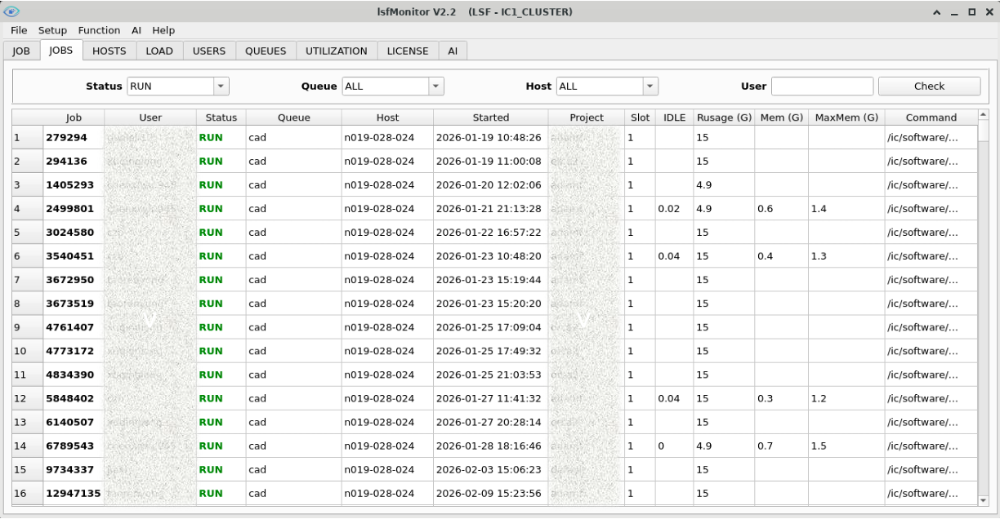

我们可以看到当前集群的基本信息，以及图形界面启动过程中加载数据的过程。

#### 4.2.2 帮助信息

直接执行bmonitor会启动图形界面。

执行"bmonitor -h"则可以查看bmonitor的帮助信息，bmonitor的参数主要用于初始化部分信息，不过这些参数一般也可以在bmonitor启动后设置。

```
bmonitor -h
usage: bmonitor.py [-h] [-j JOBID] [-u USER] [-f FEATURE]
                   [-t {JOB,JOBS,HOSTS,LOAD,USERS,QUEUES,UTILIZATION,LICENSE,AI}]
                   [--disable_license] [-d]

options:
  -h, --help            show this help message and exit
  -j JOBID, --jobid JOBID
                        Specify the jobid which show it's information on "JOB" tab.
  -u USER, --user USER  Specify the user show how's job information on "JOBS" tab.
  -f FEATURE, --feature FEATURE
                        Specify license feature which you want to see on "LICENSE" tab.
  -t {JOB,JOBS,HOSTS,LOAD,USERS,QUEUES,UTILIZATION,LICENSE,AI}, --tab {JOB,JOBS,HOSTS,LOAD,USERS,QUEUES,UTILIZATION,LICENSE,AI}
                        Specify current tab, default is "JOBS" tab.
  --disable_license     Disable license check function.
  -d, --dark_mode       Enable dark mode on the main interface.
```

- `--help`: 打印帮助信息。
- `--jobid`: 指定jobid，用于切换到JOB页并直接显示指定jobid的信息，此时其它页内容并不加载，以加快GUI打开速度。
- `--user`: 指定user，用于切换到JOBS页并显示指定用户的所有job信息。
- `--feature`: 指定license feature，用于切换到LICENSE页并显示指定license feature的信息。
- `--tab {JOB, JOBS, HOSTS, QUEUES, LOAD, UTILIZATION, LICENSE}`： 指定页面，会将bmonitor打开到指定GUI页面。
- `--disable_license`: 启动的时候不执行license信息获取步骤，以加快GUI打开速度。
- `--dark_mode`：启用暗黑主题模式。

#### 4.2.3 菜单栏

bmonitor菜单栏包含File，Setup，Function，Help四部分。

- **File**：包含Export * table功能和Exit功能。
- **Setup**：包含"Enable queue detail"和"Enable utilization detail"两个复选框。
- **Function**：包含"Check Pend reason"、"Check Slow reason"和"Check Fail reason"三个功能。
- **AI**：包含"Record Search"、"Problem Analysis"、"Record Cleanup"和"Cluster Analysis"等功能。
- **Help**：包含"Version"和"About lsfMonitor"两个信息项。

#### 4.2.4 JOB页

JOB页主要用于查看指定job的详细信息，以及job内存用量和idle_factor（cputime/runtime）的历史曲线。

在Job框输入jobid，点击Check按钮，可以查看指定job的详细信息（来源于bjob -UF \<JOBID\>），以及job的内存用量曲线和idle_factor曲线。

右边栏的曲线区域可在memory和idle_factor两种视图间切换：

memory视图，显示job生命周期内的内存用量曲线。

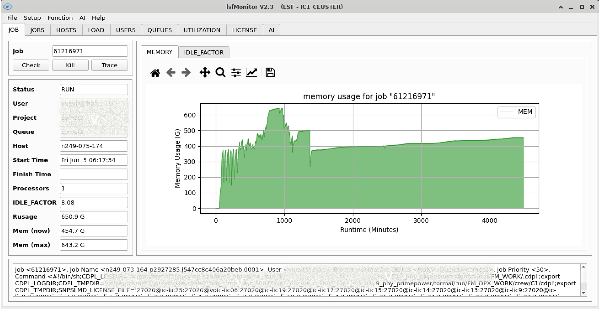

idle_factor视图，显示job生命周期内的idle_factor（cputime/runtime）曲线，用于判断job是否充分利用了CPU。

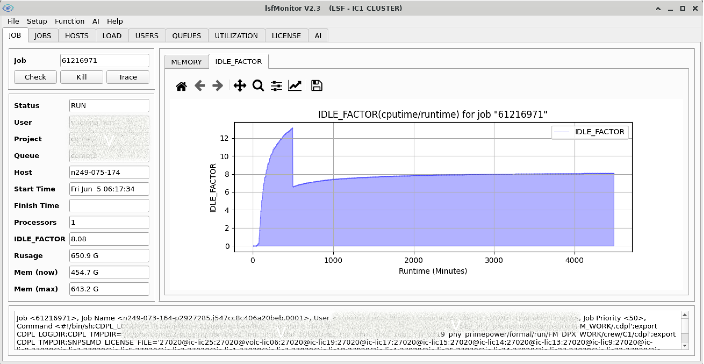

说明：

- 右边栏显示job生命周期内的memory用量曲线和idle_factor曲线，如未显示，可能是没有启动周期性的采样（bsample -m），或者采样了但是job的runtime太短未采到。
- 下侧显示job的详细信息。（通过bjobs -UF \<jobid\>获取）
- 点击"Kill"按钮，在有权限的情况下会kill掉当前job。
- 点击"Trace"按钮，会追踪当前job pend/slow/fail的原因（仅能trace自己的job）。
- 在有job信息的情况下，在Host框中敲击回车，会跳转到LOAD页，并显示第一台server的负载变化情况。

#### 4.2.5 JOBS页

JOBS页主要用于批量查看jobs的关键信息。


说明：

- 点击任意列标题，可以排序列内容。
- 如果job Rusage没有设，或者Rusage小于Mem（job的实际内存用量）的值，Mem值背景色会变红。
- 点击Job列内容，可以直接跳转到JOB页，并展示job的信息。（粗体字均可点击跳转，后同）
- 点击Status列内容：
  - 如果Status为RUN，bmonitor会调用工具"Check Issue Reason"来查看job SLOW的原因。
  - 如果Status为PEND，bmonitor会调用工具"Check Issue Reason"来查看job PEND的原因。
  - 如果Status为EXIT，bmonitor会调用工具"Check Issue Reason"来查看job FAIL的原因。
- 如果是自己的job，点击（右键）Rusage列内容，可以调出Modify Rusage Mem功能，可以在此修正自己RUN状态job的内存预设值。

#### 4.2.6 HOSTS页

HOSTS页主要用于查看hosts的静态和动态信息。

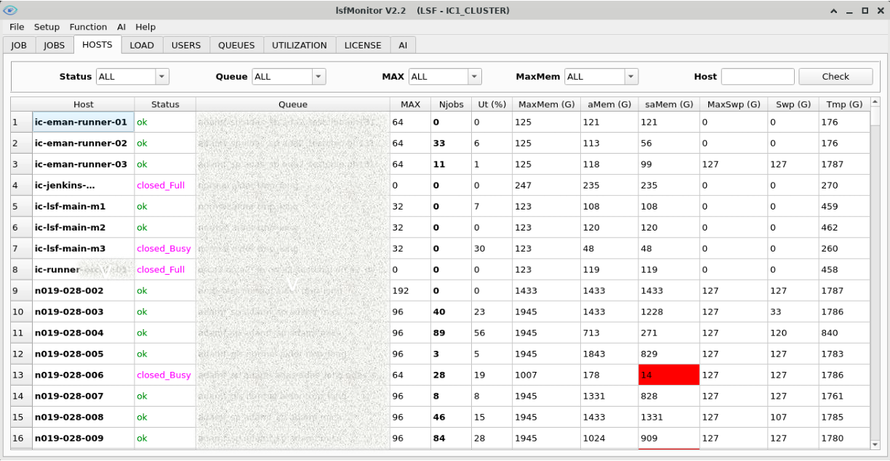

说明：

- 点击任意列标题，可以排序列内容。
- 如果host的Status异常（unavail/unreach/closed_LIM），Status状态背景色会变红。
- 如果host的Ut使用率超过90%，Ut值背景色会变红。
- 如果host的aMem或者saMem不足MaxMem的10%，对应值的背景色会变红。
- 如果host的tmp可用量变为0，Tmp值背景色会变红。
- "aMem"是指系统的available memory，即系统上实际的可用内存。
- "saMem"是指scheduling available memory，即调度器所判断的可用内存，是aMem减去rusage_mem之后的内存值。
- MaxMem >= aMem >= saMem
- 左击Host列内容，可以跳转到LOAD页，展示指定host的cpu和memory历史用量曲线。
- 右击Host列内容，可以弹出"Open"和"Close"两个选项，分别用于hopen和hclose当前host，生效的前提是当前用户具有LSF管理员权限。
- 点击Njobs列内容，可以跳转到JOBS页，展示指定host上所有的RUN jobs。

#### 4.2.7 LOAD页

LOAD页主要用于查看host的ut和memory负载信息。

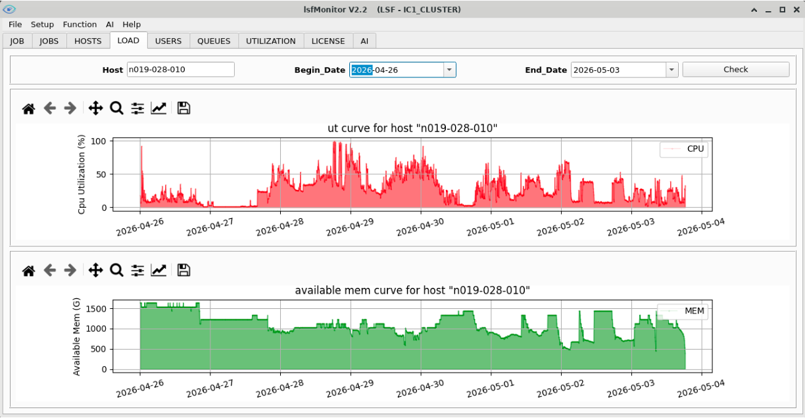

说明：

Host文本框支持模糊匹配，也可以从HOSTS页面点击hostname跳转过来。

#### 4.2.8 USERS页

USERS页主要用于查看用户job相关的统计信息。

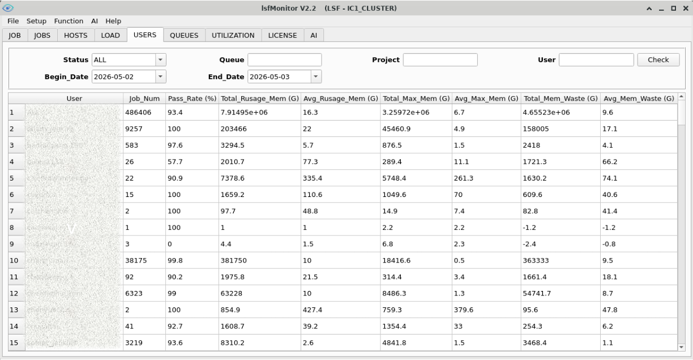

说明：

- 点击任意列标题，可以排序列内容。
- Job_Num是在指定时间段内用户所有DONE/EXIT任务的总量。
- Pass_Rate是在指定时间段内用户 DONE任务数量/Job_Num数量 的比值。
- Total_Mem_Waste是在指定时间段内 Total_Rusage_Mem - Total_Max_Mem的值，标识用户申请了但未使用而造成的内存浪费的量。

#### 4.2.9 QUEUES页

QUEUES页主要用于查看所有queue的实时和历史信息，默认统计周期为最近一月。

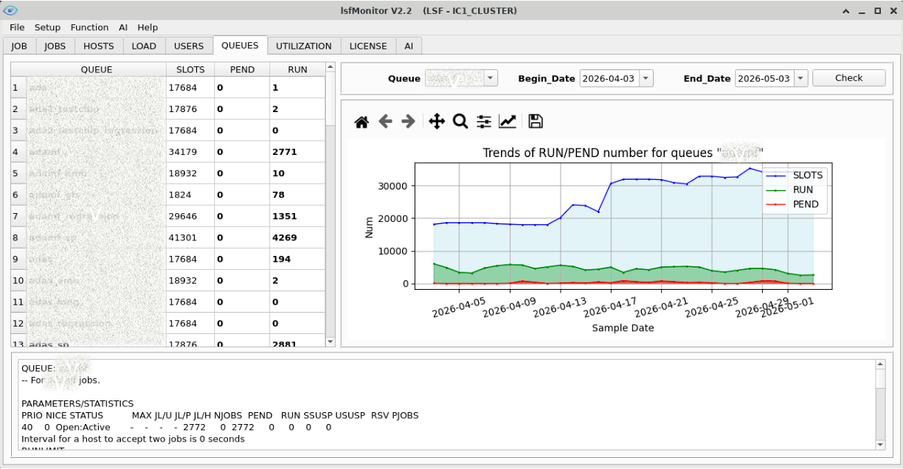

选中 Setup -> Enable queue detail以后，默认统计周期变为最近一周，但可以显示更详细的信息。

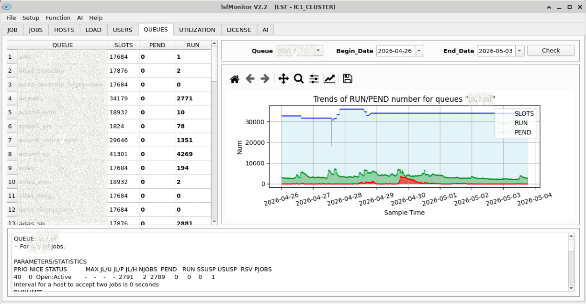

说明：

- 如果queue中PEND的job数目不为0，数字会被红标。
- 点击QUEUE列内容，可以展示对应queue的详细信息和queue中SLOTS/RUN/PEND数据的变化曲线。
- 点击PEND列内容，可以跳转到JOBS页，展示指定queue上所有的PEND jobs。（点击RUN列数字亦然）
- 在Queue下拉菜单中选择多个queue，点击Check按钮，可以把多个queues的SLOTS/PEND/RUN信息累加展示。（对于共享队列，累加的SLOTS不具备参考意义）

#### 4.2.10 UTILIZATION页

UTILIZATION页主要用来查看slot/cpu/memory等资源的使用率统计信息，默认统计当前Cluster中的所有queues，默认统计周期为最近一月。

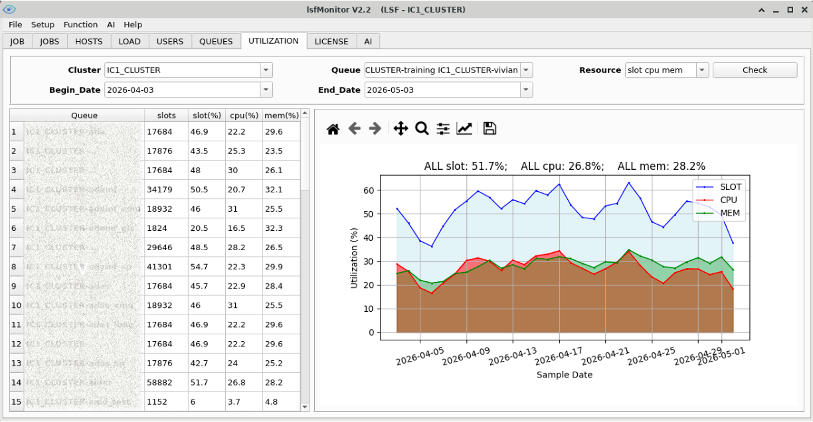

选中 Setup -> Enable utilization detail以后，默认统计周期变为最近一周，但可以显示更详细的信息。

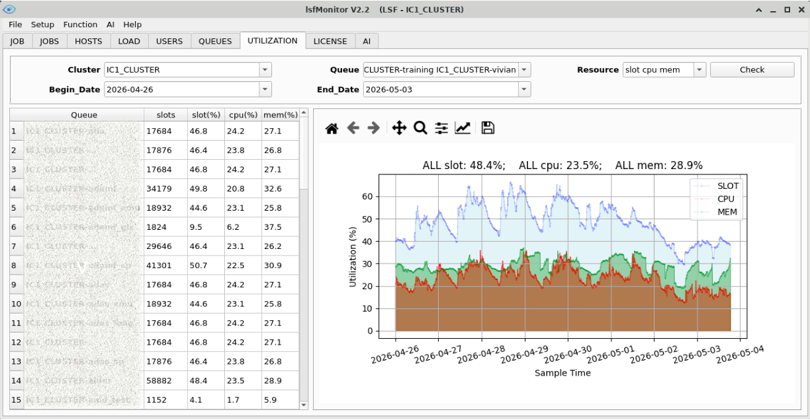

说明：

- 点击任意列标题，可以排序列内容。
- 点击QUEUE列的内容，可以展示queue的slot/cpu/mem使用率的变化曲线。
- 左侧和右侧的utilization统计值有可能会有所差别，尤其是在队列机器有变更（增加/减少）的情况，这是因为左侧结果是按照 "sum(服务器利用率)/len(服务器数目)"计算出来的，右侧结果是按照"sum(整体按天汇聚利用率)/天数"计算出来的。

#### 4.2.11 LICENSE页

LICENSE页主要用于查看EDA license的使用情况。

启动lsfMonitor前，需要保证当前terminal中LM_LICENSE_FILE环境变量配置正确，bmonitor将环境变量LM_LICENSE_FILE作为唯一的license server设定来源。

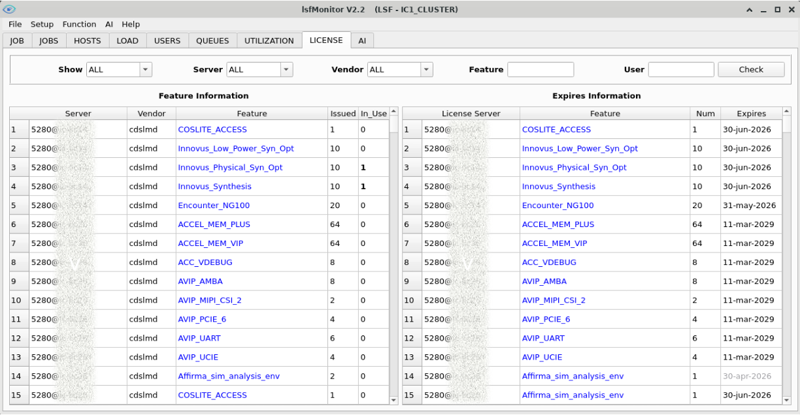

说明：

- 点击任意列标题，可以排序列内容。
- 其中START_TIME启动时间在3天以前的，日期会标红。
- 右侧Expires Information表格中"Expires"列的内容，如果已过期，显示为灰色字体；如果两周内过期，显示为红色字体；如果未过期，显示为黑色字体。
- 左侧Feature Information表格中"In_Use"列的内容，如果非零，左击可以弹出license feature的使用详情。
- 如果conf/config.py中license_administrator配置不是"all"，且当前用户不在其中，则LICENSE页面不可见。
- 如果conf/config.py中excluded_license_servers配置了指定的license server(s)，则指定license server(s)的信息会在LICENSE页面中被过滤掉。

#### 4.2.12 AI页

AI页主要具备如下能力：

- 知识检索。（基于大模型能力和内置RAG向量数据库）
- 信息查询。
- 状态分析。（基于大模型能力和内置的skills）
- 任务执行。

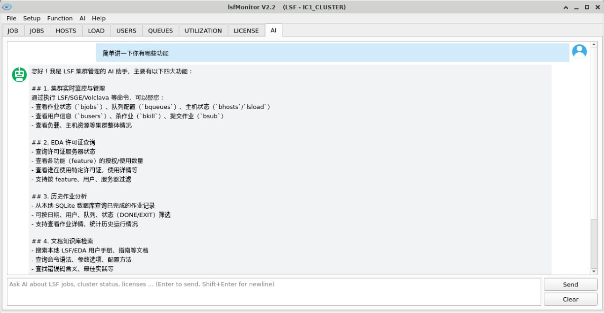

AI在内置check_issue_reason工具的基础上更进一步，可以更加精准地分析各种异常现象并给出解决方案。

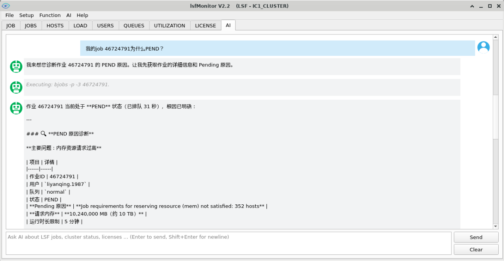

或者直接帮助用户操作系统完成任务。

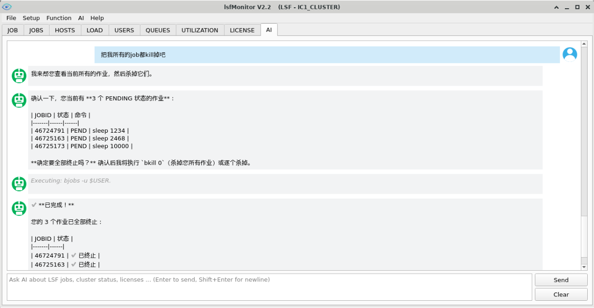

请注意，AI能力主要取决于配置的大模型能力，但是在内置RAG向量数据库和skills加持的情况下，相关的任务一般都可以较好地完成。

所有跟AI的交互记录，可以从 AI -> Record Search 调取。

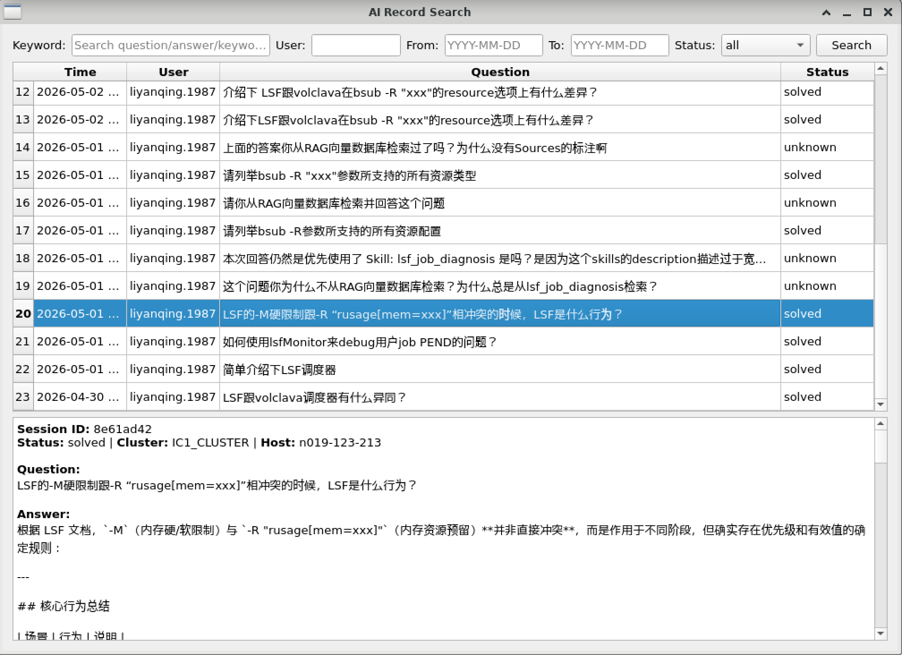

所有利用AI解决的问题，可以从 AI -> Problem Analysis 来获取汇总报告。

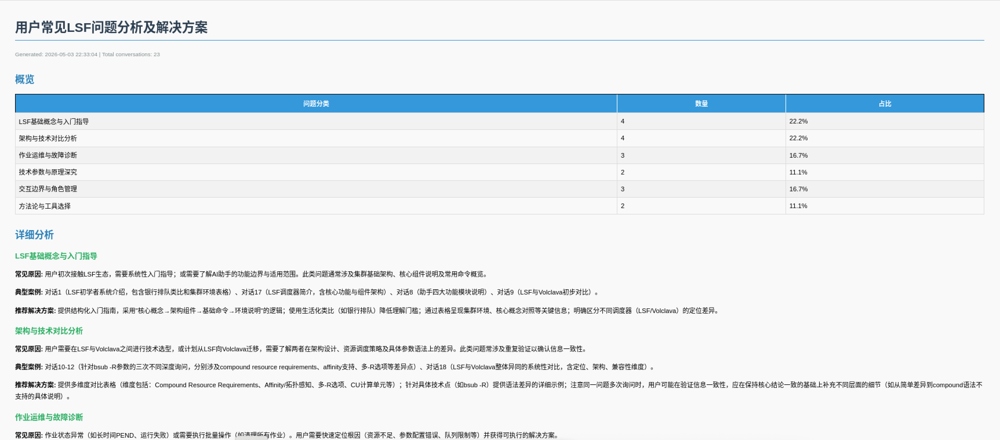

除了对话式问答，AI菜单还提供一键式的 **Cluster Analysis**（集群分析）：从 AI -> Cluster Analysis 触发，无需输入问题，直接采集集群只读快照，生成一份固定格式、可离线打开的集群体检HTML报告，生成后自动用浏览器打开。也可通过命令行`bsample -A`生成，适合放进crontab定时产出日报。

报告固定包含三段：

- **集群现状**：总揽（主机数/总核数/总slots/总内存/总作业数）、利用率（slot/cpu/mem）、主机状态、队列负载、作业与用户分析。该段由程序精确计算并渲染，不依赖大模型，每次运行结果一致。
- **集群问题**：由大模型分析，按 严重 / 中等 / 轻微 分级，每个问题独立成框，含问题描述、问题分析、问题解决（并注明应由系统管理员还是用户处理及具体操作）。若无问题则显示“未发现明显问题”。
- **分析汇总**：由大模型给出总体评估、当前严重问题清单，以及系统管理员与用户各自的待办（TODO）。

报告支持浅色/暗色模式（跟随浏览器/系统主题自动切换）。

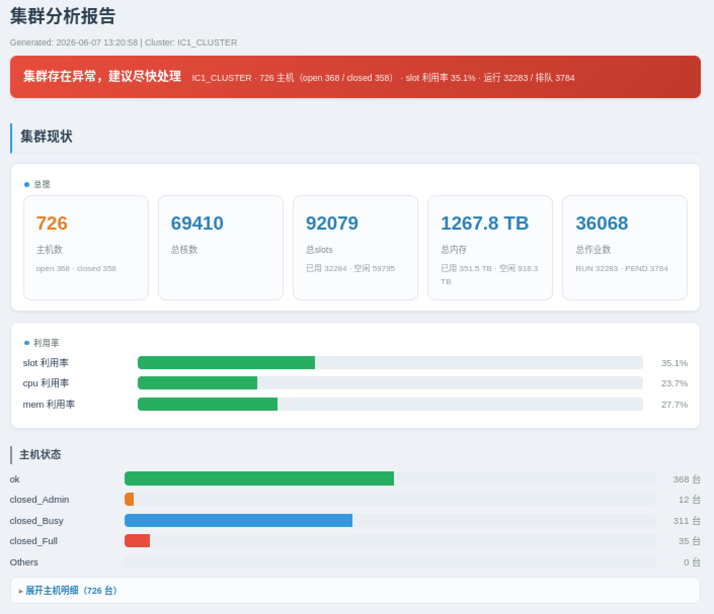

## 五、辅助工具

lsfMonitor自带一些组件和独立工具，位于monitor/tools目录下，以扩展lsfMonitor实现更多功能。

| 工具 | 类型 | 描述 | 文档 |
|------|------|------|------|
| akill | 独立工具 | bkill的增强型工具，根据多维度便捷地kill jobs | [用户手册](akill_user_manual.md) |
| check_issue_reason | 组件 & 独立工具 | 查看job PEND/FAIL/SLOW的原因 | [用户手册](check_issue_reason_user_manual.md) |
| lmstat | 独立工具 | 用于检索EDA license信息 | — |
| message.py | 组件 | 显示指定信息 | — |
| patch | 独立工具 | 用于更新工具安装包 | [用户手册](patch_user_manual.md) |
| process_tracer | 组件 & 独立工具 | 追踪指定process或jobid的进程树 | [用户手册](process_tracer_user_manual.md) |
| rag_builder | 独立工具 | 用于生成和管理RAG向量数据库 | [用户手册](rag_builder.md) |
| seedb | 独立工具 | 查看sqlite3数据库内容 | [用户手册](seedb_user_manual.md) |
| show_license_feature_usage | 组件 & 独立工具 | 查看EDA license feature的使用情况 | [用户手册](show_license_feature_usage_user_manual.md) |

### 5.1 akill

akill是bkill的增强型工具，位于安装目录下的monitor/tools/akill，可以根据jobid/job_name/command/submit_time/execute_host/queue/user等维度来便捷地kill jobs。

```
monitor/tools/akill -h
usage: akill.py [-h] [-j JOBID [JOBID ...]] [-J JOB_NAME [JOB_NAME ...]]
                [-c COMMAND [COMMAND ...]] [-s SUBMIT_TIME [SUBMIT_TIME ...]]
                [-m EXECUTE_HOST [EXECUTE_HOST ...]]
                [-q QUEUE [QUEUE ...]] [-u USER [USER ...]]

optional arguments:
  -h, --help            show this help message and exit
  -j JOBID [JOBID ...], --jobid JOBID [JOBID ...]
                        kill specified job(s) based on jobid(s), support fuzzy matching,
                        also support jobid range like "10200-10450".
  -J JOB_NAME [JOB_NAME ...], --job_name JOB_NAME [JOB_NAME ...]
                        kill specified job(s) based on job_name(s), support fuzzy matching.
  -c COMMAND [COMMAND ...], --command COMMAND [COMMAND ...]
                        kill specified job(s) based on command(s), support fuzzy matching.
  -s SUBMIT_TIME [SUBMIT_TIME ...], --submit_time SUBMIT_TIME [SUBMIT_TIME ...]
                        kill specified job(s) based on submit_time(s), support fuzzy matching.
  -m EXECUTE_HOST [EXECUTE_HOST ...], --execute_host EXECUTE_HOST [EXECUTE_HOST ...]
                        kill specified job(s) based on execute host(s).
  -q QUEUE [QUEUE ...], --queue QUEUE [QUEUE ...]
                        kill specified job(s) based on queue(s).
  -u USER [USER ...], --user USER [USER ...]
                        kill specified job(s) based on user(s).
```

### 5.2 patch

patch是帮助lsfMonitor打补丁的工具，其帮助信息如下。

```
monitor/tools/patch -h
usage: patch.py [-h] [-p PATCH_PATH] [-d] [--no-backup]

options:
  -h, --help            show this help message and exit
  -p PATCH_PATH, --patch_path PATCH_PATH
                        Specify patch path (new install package path).
  -d, --dry_run         Preview changes without applying.
  --no-backup           Skip backup creation before patching.
```

- `--patch_path`：指定补丁包（也就是新的安装包）路径。
- `--dry_run`：在打补丁之前预览一下变化。
- `--no-backup`：在打补丁之前跳过备份环节。

patch脚本主要用于小版本更新的补丁操作，针对较大的变更，推荐重新安装以确保全量更新，拷贝配置文件monitor/conf/config.py及早期数据库文件即可实现无缝升级。

### 5.3 rag_builder

rag_builder用于RAG向量数据库的构建和管理，其帮助信息如下。

```
monitor/tools/rag_builder -h
usage: rag_builder.py [-h] [-i INPUT_FILES [INPUT_FILES ...]] [-l]
                      [-d DELETE [DELETE ...]] [--rebuild]
                      [--chunk_size CHUNK_SIZE] [--chunk_overlap CHUNK_OVERLAP]
                      [-o OUTPUT_DIR] [--prefix PREFIX]
                      [--compress {flat,sq8,sq6,sq4,pq256,pq128,pq64}]
                      [--batch_size BATCH_SIZE] [--workers WORKERS]

options:
  -h, --help            show this help message and exit
  -i INPUT_FILES [INPUT_FILES ...], --input_files INPUT_FILES [INPUT_FILES ...]
                        Input files or directories (scanned recursively for .pdf/.txt/.md/.rst).
  -l, --list            List all documents indexed in the RAG database.
  -d DELETE [DELETE ...], --delete DELETE [DELETE ...]
                        Delete documents from the RAG database (match by filename substring).
  --rebuild             Discard existing data and rebuild from scratch (default: append mode).
  --chunk_size CHUNK_SIZE
                        Chunk size in characters (default: 700).
  --chunk_overlap CHUNK_OVERLAP
                        Chunk overlap in characters (default: 100).
  -o OUTPUT_DIR, --output_dir OUTPUT_DIR
                        Output directory for RAG files (default: $LSFMONITOR_INSTALL_PATH/db/ai).
  --prefix PREFIX       Filename prefix for output files (default: rag).
  --compress {flat,sq8,sq6,sq4,pq256,pq128,pq64}
                        FAISS index type (default: flat).
  --batch_size BATCH_SIZE
                        Number of chunks per embedding API call (default: 10).
  --workers WORKERS     Number of concurrent workers for embedding API calls (default: 10).
```

- `--input_files`：指定一个或者多个输入文件并将其转换为RAG向量数据库，支持.pdf/.txt/.md/.rst的常见格式文档。
- `--list`：列出RAG向量数据库中包含哪些文档，一般配合--output_dir和--prefix一起使用。
- `--delete`：删除RAG向量数据库中的指定文档，一般配合--output_dir和--prefix一起使用。
- `--rebuild`：重置RAG向量数据库，如未指定则默认是追加模式。
- `--chunk_size`：指定chunk块的大小，一般不用修改。
- `--chunk_overlap`：指定chunk块的overlap，一般不用修改。
- `--output_dir`：指定输出RAG向量数据库的输出路径，默认在"$LSFMONITOR_INSTALL_PATH/db/ai"下。
- `--prefix`：指定输出RAG向量数据库名称前缀，默认为"rag"。
- `--compress`：指定压缩方式，不同压缩方式的检索精准度和尺寸均不同，默认为精度最高的"flat"。
- `--batch_size`：指定chunk流程的并行度，默认为10。
- `--workers`：指定embedding模型调用并行度，默认为10，如不支持并行则自动修改为串行模式。

### 5.4 seedb

seedb是查看sqlite3文本数据库内容的工具，其帮助信息如下：

```
monitor/tools/seedb -h
usage: seedb.py [-h] -d DATABASE [-t TABLES [TABLES ...]]
                [-k KEYS [KEYS ...]] [-n NUMBER]

optional arguments:
  -h, --help            show this help message and exit
  -d DATABASE, --database DATABASE
                        Required argument, specify the datebase file.
  -t TABLES [TABLES ...], --tables TABLES [TABLES ...]
                        Specify the tables you want to review, make sure the tables exist.
  -k KEYS [KEYS ...], --keys KEYS [KEYS ...]
                        Specify the table keys you want to review, make sure the table keys exist.
  -n NUMBER, --number NUMBER
                        How many lines you want to see.
```

示例一，查看load.db数据库中的表。

```bash
monitor/tools/seedb -d db/IC1_CLUSTER/load.db
DB_FILE : db/IC1_CLUSTER/load.db
TABLES  :
========
load_ic-hpc-mon02
load_ic-lsfmaster1
load_ic-lsfmaster2
...
========
```

示例二，查看load.db数据库中指定的表（load_n212-206-211）的内容。

```bash
monitor/tools/seedb -d db/IC1_CLUSTER/load.db -t load_n212-206-211
DB_FILE : db/IC1_CLUSTER/load.db
TABLE   : load_n212-206-211
========
sample_second  sample_time      ut   tmp     swp      mem
----           ----             ---- ----    ----     ----
1683984602     20230513_213002  0%   1671G   252.8G   773G
1683984902     20230513_213502  0%   1671G   252.8G   809G
...
========
```

示例三，查看load.db数据库中指定的表（load_n212-206-211）的指定列（mem）的内容。

```bash
monitor/tools/seedb -d db/IC1_CLUSTER/load.db -t load_n212-206-211 -k mem
DB_FILE : db/IC1_CLUSTER/load.db
TABLE   : load_n212-206-211
========
mem
----
773G
809G
845G
886G
903G
...
======
```

示例四，查看load.db数据库中指定的表（load_n212-206-211）的指定列（mem）的内容，只看前三行。

```bash
monitor/tools/seedb -d db/IC1_CLUSTER/load.db -t load_n212-206-211 -k mem -n 3
DB_FILE : db/IC1_CLUSTER/load.db
TABLE   : load_n212-206-211
========
mem
----
773G
809G
845G
======
```

## 六、lsfMonitor常见问题及解决

### 6.1 图形显示问题

**问题描述：**

安装后bmonitor不显示图形界面，或者图形界面显示不全、显示效果异常。

**问题原因：**

- 使用的python版本并非3.12.12或者兼容版本。
- python库安装不全。

**解决方案：**

使用推荐的python3.12.12，按照3.2章节的方法安装requirements.txt的python依赖库。

### 6.2 JOBS页信息缺失

**问题描述：**

JOBS页部分信息缺失。

**问题原因：**

- 使用的非兼容版本的openlava。
- 使用的版本过老的LSF（比如9.1.2或者更老的版本）。

**解决方案：**

使用推荐版本的LSF/volclava/openlava。

### 6.3 LICENSE页信息缺失

**问题描述：**

LICENSE页不显示有效的license信息。

**问题原因：**

- bmonitor启动的terminal没有配置环境变量LM_LICENSE_FILE。
- monitor/conf/config.py中lmstat_bsub_command变量配置错误。（常见）

**解决方案：**

- 确认bmonitor启动的terminal中已经配置好正确有效的环境变量LM_LICENSE_FILE。
- 如果当前机器允许执行EDA工具（可运行lmstat），那么将monitor/conf/config.py中lmstat_bsub_command变量配置为空，否则设置合适的bsub命令。

### 6.4 HOSTS页和LOAD页中的mem值为什么不一致

**问题描述：**

对同一台server，就当前时刻而言，在HOSTS页上看到的Mem值和在LOAD页中看到的"available mem"值不一致，HOSTS中看到的值往往偏小。

**问题原因：**

HOSTS页中的Mem值跟LOAD页中的mem值信息来源不一样，作用也不一样。

- **HOSTS页**，mem信息来源于"bhosts -l"，显示的是这台机器上实际可以被reserve的mem，已经把被用的和被reserve的都排除在外了，所以值会偏小。（用途是判断机器还能否接受job）
- **LOAD页**，mem的信息来源是"lsload"，显示的是这台机器上真实的剩余mem信息，不考虑rusage的mem。（用途是判断机器真实的mem用量，判断是否会发生OOM）

## 七、技术支持

本工具为开源工具，由开源社区维护，可以提供如下类型的技术支持：

- 部署和使用技术指导。
- 接收bug反馈并修复。
- 接收功能修改建议。（需审核和排期）

获取技术支持的方式包括：

- 通过Contact邮箱联系开发者。
- 添加作者微信 "liyanqing_1987"，注明"真实姓名/公司/lsfMonitor"，由作者拉入技术支持群。


## 附录

### 附1. 变更历史

备注：小的hotfix不计入变更历史，bugfix会实时checkin到github上。

| 版本 | 日期 | 变更描述 | 备注 |
|------|------|----------|------|
| V1.0 | 2017 | 发布第一个版本openlavaMonitor | |
| V1.1 | 2020 | 更名lsfMonitor，增加LSF支持 | |
| V1.2 | 2022 | 增加LICENSE信息采集和展示 | |
| V1.3 | 2023.05 | 增加UTILIZATION页，增加patch工具，优化数据库格式 | 数据库格式不兼容，需重新安装 |
| V1.3.1 | 2023.06 | 优化utilization采样方式；多进程并行license采样 | |
| V1.3.2 | 2023.06 | HOSTS页/LICENSE页增加过滤功能 | |
| V1.3.3 | 2023.09 | LICENSE页feature-job关联；增加akill工具 | |
| V1.4 | 2023.11 | 单选改复选框；QUEUES/UTILIZATION细粒度曲线 | queue.db格式不兼容，需删除旧db |
| V1.4.1 | 2023.12 | 增加Logo和菜单图标；表格导出；曲线显示优化 | |
| V1.4.2 | 2024.03 | 支持多LSF/openlava cluster | |
| V1.5 | 2024.06 | UI自适应尺寸；kill job功能；右键菜单；memPrediction工具 | |
| V1.5.1 | 2024.08 | DONE/EXIT job采样；memPrediction json数据源 | job目录切换为job_mem目录 |
| V1.6 | 2024.09 | USERS页；暗黑模式；volclava支持 | |
| V1.7 | 2025.03 | 加快采样速度；aMem/saMem拆分；excluded_license_servers | |
| V1.8 | 2025.10 | 模糊匹配；Queue汇聚；license_administrators | |
| V2.0 | 2026.01 | Python 3.12.12；日志记录；代码优化 | 建议重新安装 |
| V2.1 | 2026.03 | queue-host映射采样；动态utilization计算；懒加载；Modify Rusage Mem | |
| V2.2 | 2026.05 | AI页面，支持知识检索/信息查询/状态分析/任务执行 | 新增RAG和skills，建议重新安装 |
| V2.3 | 2026.06 | bsample -m增加IDLE_FACTOR采样；bmonitor JOB页增加IDLE_FACTOR曲线展示；Cluster Analysis集群分析（AI一键体检报告，GUI菜单及bsample -A） | job_data目录取代job_mem目录 |

### 附2. LSF任务exit code含义

| Exit Code | 含义 |
|-----------|------|
| -9 | 作业被强制终止 |
| -8 | 资源严重不足 |
| -7 | 无效的主机名或节点 |
| -6 | 作业被系统强制终止 |
| -5 | 作业被用户终止或中断 |
| -4 | 无效的队列名称 |
| -3 | 无效的作业 ID |
| -2 | 内部错误 |
| -1 | 系统级错误 |
| 0 | 成功完成并正常退出 |
| 1 | 一般性的警告性错误 |
| 2 | 一般性的错误 |
| 3 | 一般性的致命错误 |
| 4 | 初始化失败 |
| 5 | 输入/输出错误 |
| 6 | 无效的参数 |
| 7 | 无法分配足够的内存 |
| 8 | 目录不存在或无法访问 |
| 9 | 文件不存在或无法访问 |
| 10 | 不支持的功能或操作 |
| 11 | 文件已存在 |
| 12 | 超时错误 |
| 13 | 权限被拒绝 |
| 14 | 资源不足 |
| 15 | 信号中断 |
| 16 | 管道损坏或被关闭 |
| 17 | 死锁错误 |
| 18 | 磁盘已满 |
| 19 | 读取错误 |
| 20 | 写入错误 |
| 21 | 连接错误 |
| 22 | 无效或损坏的数据 |
| 23 | 操作被中止 |
| 24 | 过多打开的文件 |
| 25 | 操作不可行 |
| 26 | 无效的文件系统操作 |
| 27 | 文件太大, 超出限制 |
| 28 | 信号已被阻塞 |
| 29 | 管道已满或破裂 |
| 30 | 无效的进程 |
| 31 | 操作中断时出现错误 |
| 32 | 命令的语法错误 |
| 33 | 触发限制或配额 |
| 34 | 服务或进程的异常终止 |
| 35 | 输入或输出的格式错误 |
| 36 | 进程或作业已经在运行 |
| 37 | 进程或作业已经停止或结束 |
| 38 | 操作被取消或中断 |
| 39 | 需要更高的权限来执行操作 |
| 40 | 连接或会话已经关闭 |
| 41 | 接收到无效或损坏的数据 |
| 42 | 网络连接失败 |
| 43 | 网络服务不可用 |
| 44 | 数据库操作失败 |
| 45 | 文件或目录已经损坏 |
| 46 | 操作已超时 |
| 47 | 安全验证失败 |
| 48 | 发生未知的错误 |
| 49 | 任务或处理已中断 |
| 50 | 进程或作业达到资源限制 |
| 51 | 故障引起的不可恢复的错误 |
| 52 | 进程被非法访问或操作 |
| 53 | 操作被有效的权限限制 |
| 54 | 系统服务或组件不可用 |
| 55 | 数据损坏或丢失 |
| 56 | 网络连接已经超时 |
| 57 | 数据库连接失败 |
| 58 | 脚本或程序操作失败 |
| 59 | 任务被取消或终止 |
| 60 | 进程或作业已过期 |
| 61 | 配置错误导致无法正常执行 |
| 62 | 日志文件错误 |
| 63 | 加密或解密操作失败 |
| 64 | 进程或作业运行时间过长 |
| 65 | 与硬件设备的通信失败 |
| 66 | 数据库查询操作失败 |
| 67 | 网络协议错误 |
| 68 | 文件系统操作失败 |
| 69 | 环境变量未设置或无效 |
| 70 | 进程或作业的使用量超过限制 |
| 71 | 数据库连接超时 |
| 72 | 配置文件错误 |
| 73 | 依赖项未满足 |
| 74 | 加密或解密密钥无效 |
| 75 | 消息传递失败 |
| 76 | 网络通信错误 |
| 77 | 文件或目录已损坏 |
| 78 | 版本错误 |
| 79 | 资源不可用 |
| 80 | 任务超时 |
| 81 | 链接无效或过期 |
| 82 | 权限被拒绝 |
| 83 | 输入无效或错误 |
| 84 | 输出无效或错误 |
| 85 | 连接被重置 |
| 86 | 数据库事务失败 |
| 87 | 网络服务超负荷 |
| 88 | 文件被锁定 |
| 89 | 配置项缺失或无效 |
| 90 | 配置文件丢失或损坏 |
| 91 | 请求被限制或阻止 |
| 92 | 协议错误 |
| 93 | 验证失败 |
| 94 | 数据传输错误 |
| 95 | 脚本或程序非法操作 |
| 96 | 任务被其他任务阻塞 |
| 97 | 命令已过时或不再支持 |
| 98 | 外部资源不可达 |
| 99 | 时间戳无效或过期 |
| 100 | 进程或作业已经终止 |
| 101 | 协议切换失败 |
| 102 | 网络连接已被废弃 |
| 103 | 配置文件格式错误 |
| 104 | 请求被重定向 |
| 105 | 数据库操作异常 |
| 106 | 加密或解密错误 |
| 107 | 脚本或程序运行环境错误 |
| 108 | 资源限制被超出 |
| 109 | 输入输出错误 |
| 110 | 网络连接超载 |
| 111 | 进程或作业被阻塞 |
| 112 | 命令执行失败 |
| 113 | 服务不可达 |
| 114 | 证书无效或过期 |
| 115 | 文件系统错误 |
| 116 | 资源被释放或移除 |
| 117 | 地址被禁止访问 |
| 118 | 任务被挂起或暂停 |
| 119 | 操作系统错误 |
| 120 | 协议版本错误 |
| 121 | 文件或目录不存在 |
| 122 | 资源临时不可用 |
| 123 | 命令语法错误 |
| 124 | 日志记录失败 |
| 125 | 编码或解码错误 |
| 126 | 执行权限不足 |
| 127 | 命令未找到 |
| 128 | 无效的退出状态 |
| 129 | 库依赖项错误 |
| 130 | 进程或作业被中断 |
| 131 | 信号捕获失败 |
| 132 | 文件被修改 |
| 133 | 连接被拒绝 |
| 134 | 堆栈溢出 |
| 135 | 资源超时 |
| 136 | 内存分配错误 |
| 137 | 进程或作业因超出资源限制而被杀死 |
| 138 | 信号超出范围 |
| 139 | 分段错误 |
| 140 | 程序或进程收到了致命信号 |
| 141 | 时钟错误 |
| 142 | 文件格式无效 |
| 143 | 程序被终止或中断 |
| 144 | 信号被阻止 |
| 145 | 操作被终止 |
| 146 | 目录切换失败 |
| 147 | 管道错误 |
| 148 | 孤儿进程（没有父进程） |
| 149 | 挂起的进程或作业 |
| 150 | 资源耗尽 |
| 151 | 镜像损坏或无效 |
| 152 | 文件被锁定 |
| 153 | 内存映射错误 |
| 154 | 信号处理失败 |
| 155 | 网络操作失败 |
| 156 | 设备驱动错误 |
| 157 | 套接字连接错误 |
| 158 | 链接超时 |
| 159 | 文件描述符无效 |
| 160 | 插件或扩展错误 |
| 161 | 远程主机不可达 |
| 162 | 文件读取错误 |
| 163 | 文件写入错误 |
| 164 | 数据包损坏 |
| 165 | 数据库连接错误 |
| 166 | 超出容量限制 |
| 167 | 死锁状态 |
| 168 | 证书验证失败 |
| 169 | 系统时钟漂移 |
| 170 | 正在进行的操作被取消 |
| 171 | 权限不允许操作 |
| 172 | 目标不可到达 |
| 173 | 文件系统不支持操作 |
| 174 | 系统服务异常 |
| 175 | 网络地址不可用 |
| 176 | 资源已经存在 |
| 177 | 数据内容被篡改 |
| 178 | 系统崩溃或故障 |
| 179 | 进程或作业超时 |
| 180 | 用户操作中止 |
| 181 | 文件被加密 |
| 182 | 库文件损坏 |
| 183 | 账户权限不足 |
| 184 | 资源被占用 |
| 185 | 数据格式错误 |
| 186 | 网络连接已关闭 |
| 187 | 缺少依赖项 |
| 188 | 系统日志错误 |
| 189 | 命令行参数错误 |
| 190 | 配置文件缺失或损坏 |
| 191 | 文件权限错误 |
| 192 | 进程或作业已经在运行 |
| 193 | 设备或服务不可用 |
| 194 | 数据验证错误 |
| 195 | 协议操作失败 |
| 196 | 系统初始化错误 |
| 197 | 备份或恢复错误 |
| 198 | 连接被重置 |
| 199 | 程序逻辑错误 |
| 200 | 程序或进程成功终止 |
| 201 | 请求被响应成功 |
| 202 | 异步操作已启动, 结果稍后返回 |
| 203 | 已接收请求但未执行 |
| 204 | 请求成功执行, 无返回内容 |
| 205 | 请求成功, 需发送新请求获取更新 |
| 206 | 请求成功, 仅返回部分内容 |
| 207 | 多状态响应 |
| 208 | 结果已包含在响应消息中 |
| 209 | 返回信息已被代理修改 |
| 210 | 资源已移动 |
| 211 | 返回内容已更改 |
| 212 | 需要额外的身份验证 |
| 213 | 返回数据部分已失效 |
| 214 | 没有满足请求的结果 |
| 215 | 需要进一步处理 |
| 216 | 范围不匹配 |
| 217 | 返回数据类型不受支持 |
| 218 | 返回数据已知 |
| 219 | 存在内部冲突 |
| 220 | 操作处于暂停状态 |
| 221 | 返回内容未更改 |
| 222 | 返回内容已被重新排序 |
| 223 | 返回内容未被重置 |
| 224 | 存在版本冲突 |
| 225 | 服务器过载 |
| 226 | 内容通过协商缓存生成 |
| 227 | 源数据存在问题 |
| 228 | 数据解析失败 |
| 229 | 内容更新冲突 |
| 230 | 返回内容包含警告信息 |
| 231 | 返回内容需要用户进一步处理 |
| 232 | 返回结果需要进一步验证 |
| 233 | 返回内容需要管理员干预 |
| 234 | 存在资源限制 |
| 235 | 返回内容包含敏感信息 |
| 236 | 返回内容包含过期信息 |
| 237 | 返回内容存在冲突 |
| 238 | 返回内容被转换 |
| 239 | 服务端要求重新认证 |
| 240 | 需要进行重定向 |
| 241 | 存在过多的重定向 |
| 242 | 返回内容需要安全验证 |
| 243 | 返回内容需要数据转换 |
| 244 | 存在连接超时 |
| 245 | 返回内容已过期 |
| 246 | 返回内容需要语义解析 |
| 247 | 返回内容需要格式转换 |
| 248 | 返回内容需要编码转换 |
| 249 | 返回内容需要内容裁剪 |
| 250 | 返回内容需要内容合并 |
| 251 | 返回内容需要内容过滤 |
| 252 | 返回内容需要内容排序 |
| 253 | 返回内容需要内容分割 |
| 254 | 返回内容需要内容聚合 |
| 255 | 命令因不明原因执行失败 |
