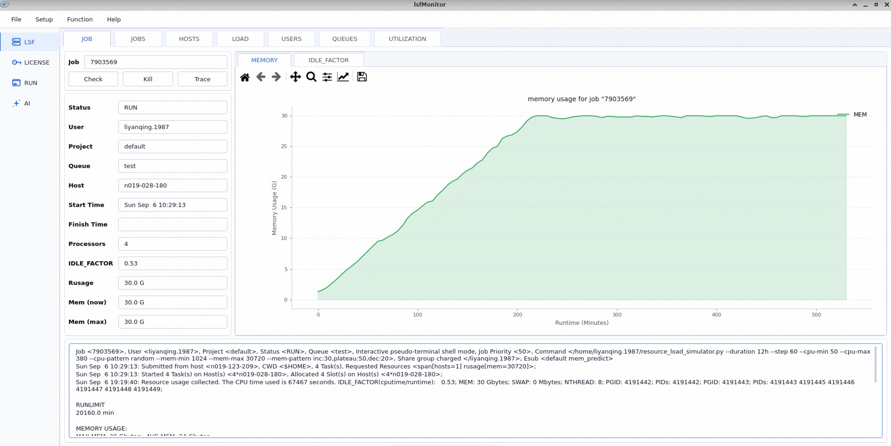
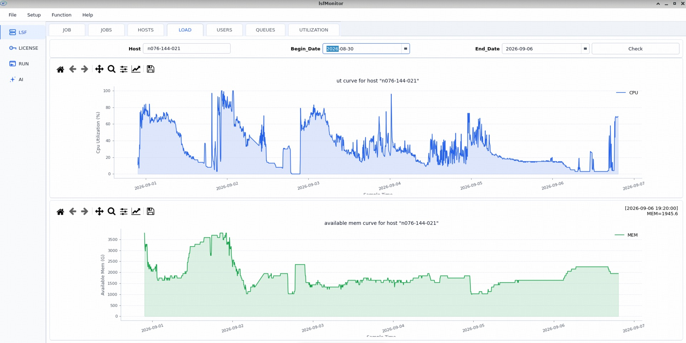
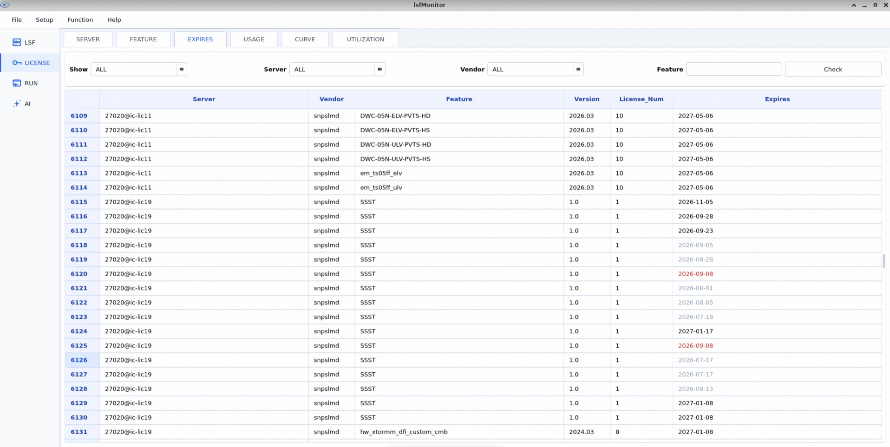
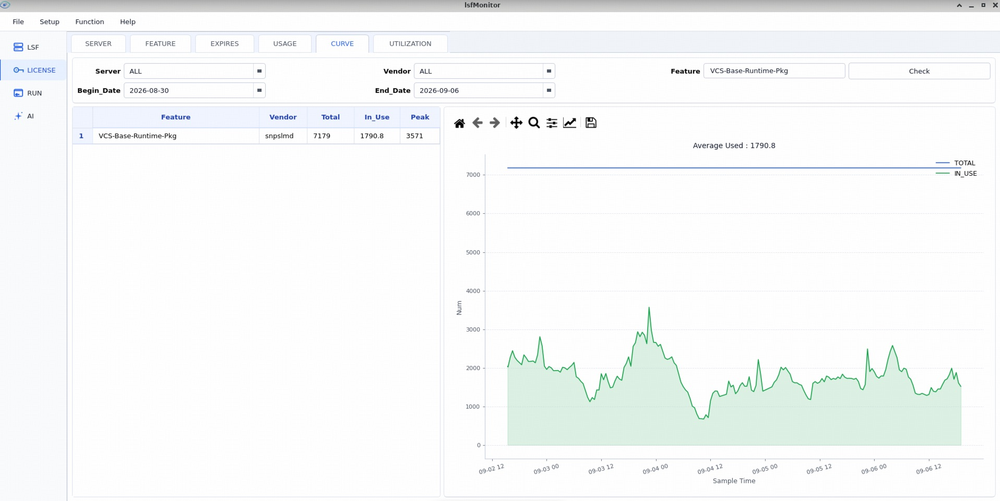
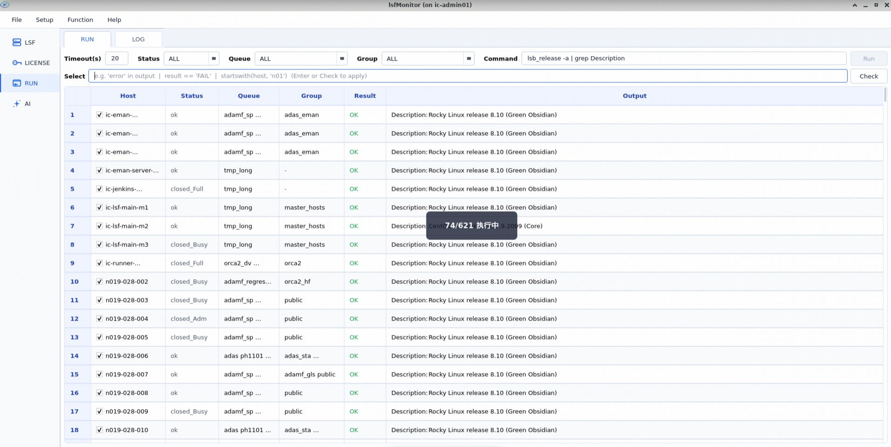
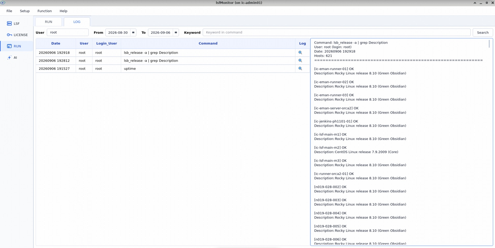
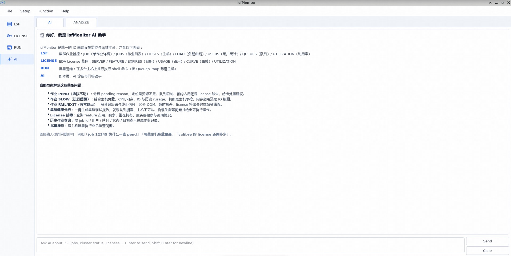
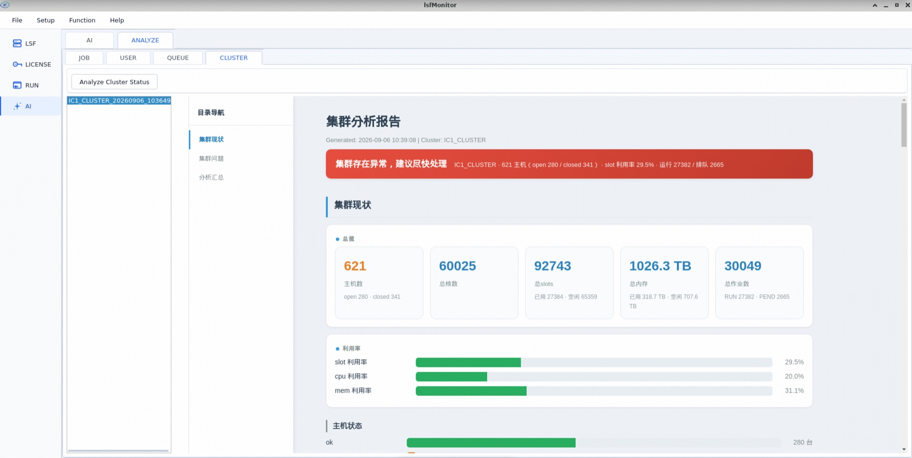

# lsfMonitor用户手册

| 项目 | 内容 |
|------|------|
| Product Name | lsfMonitor |
| Product Version | V3.0 |
| Release Date | 2026.09.15 |
| Contact | @李艳青（liyanqing1987@163.com） |

## 目录

- [一、简介](#一简介)
- [二、环境依赖](#二环境依赖)
  - [2.1 操作系统依赖](#21-操作系统依赖)
  - [2.2 python版本依赖](#22-python版本依赖)
  - [2.3 集群管理工具](#23-集群管理工具)
- [三、工具安装及配置](#三工具安装及配置)
  - [3.1 工具下载](#31-工具下载)
  - [3.2 工具安装](#32-工具安装)
  - [3.3 工具配置](#33-工具配置)
- [四、工具使用](#四工具使用)
  - [4.1 数据采集 bsample / license_sample](#41-数据采集-bsample--license_sample)
  - [4.2 数据展示 bmonitor](#42-数据展示-bmonitor)
  - [4.3 命令行查询 bmonitor_cli](#43-命令行查询-bmonitor_cli)
- [五、辅助工具](#五辅助工具)
  - [5.1 akill](#51-akill)
  - [5.2 patch](#52-patch)
  - [5.3 rag_builder](#53-rag_builder)
  - [5.4 seedb](#54-seedb)
  - [5.5 check_issue_reason](#55-check_issue_reason)
  - [5.6 gen_LM_LICENSE_FILE](#56-gen_lm_license_file)
  - [5.7 process_tracer](#57-process_tracer)
  - [5.8 lmstat](#58-lmstat)
  - [5.9 message.py](#59-messagepy)
- [六、lsfMonitor常见问题及解决](#六lsfmonitor常见问题及解决)
- [七、技术支持](#七技术支持)
- [附录](#附录)
  - [附1. 变更历史](#附1-变更历史)
  - [附2. LSF任务exit code含义](#附2-lsf任务exit-code含义)
  - [附3. db_path 目录与权限规范](#附3-db_path-目录与权限规范)

## 一、简介

LSF是 IBM 旗下的一款分布式集群管理系统软件，负责计算资源的管理和批处理作业的调度。它具有良好的可伸缩性和高可用性，支持几乎所有的主流操作系统，是高性能计算的重要基础软件。Openlava是基于LSF早期版本开源的Lava做的二次开源项目，其支持LSF的大部分功能。Volclava则是ByteDance开源的LSF兼容调度器。

lsfMonitor是一款适用于LSF/Openlava/Volclava等调度器的数据收集、分析及展示工具，亦可用于EDA License实时信息检索，可以满足集成电路行业用户对于LSF/License的绝大部分信息需求。

lsfMonitor 的 GUI（bmonitor）采用「4 个外层 panel，每个 panel 含若干内层 tab」的两级结构。各 panel 职责独立、配置分离，非启动 panel 首次切换时才懒加载，所以启动很快、切页时才加载数据。各 panel 与内层 tab 如下：

| Panel | Tab | 说明 |
|-------|-----|------|
| **LSF** | JOB | 查询单个作业详情，分析 PEND/SLOW/EXIT 异常原因，展示内存用量与 idle_factor 曲线 |
| | JOBS | 批量查看作业关键信息，支持按 Status/Queue/Host/User 筛选 |
| | HOSTS | 主机静态与动态信息，异常状态/资源告警高亮，支持 queue/group 筛选 |
| | LOAD | 单台主机的 CPU/内存历史负载曲线 |
| | USERS | 用户维度的作业统计（通过率、内存浪费等） |
| | QUEUES | 队列 SLOTS/RUN/PEND 的实时与历史趋势 |
| | UTILIZATION | 集群 slot/cpu/mem 使用率（支持 Queue/Group 两个维度） |
| **LICENSE** | SERVER | License server 与 vendor daemon 状态、feature issued/in_use 数量 |
| | FEATURE | 各 feature 的 issued/in_use 数量，左击 In_Use 查看占用详情 |
| | EXPIRES | License 到期时间，过期/临期告警着色 |
| | USAGE | feature 占用明细：谁、在哪台主机、占用了几个 license |
| | CURVE | feature 用量趋势曲线（含 Peak，管理员可见） |
| | UTILIZATION | feature 利用率百分比统计（管理员可见） |
| **RUN** | RUN | 跨主机并发执行 shell 命令（ssh+pexpect，每主机独立超时），按 status/queue/group 筛选主机 |
| | LOG | 命令历史日志（按用户分表，含 date/user/login_user/command/log） |
| **AI** | AI | 大模型助手，支持 RAG 文档检索与工具调用执行 |
| | ANALYZE | 一键式体检报告（cluster / user / job / queue 四类），自包含 HTML |

> GUI 默认聚焦 LSF panel；`license_monitor` 命令等价于 `bmonitor --panel license`，默认聚焦 LICENSE panel，详见 4.2。

除 GUI 外，lsfMonitor 还提供以下命令行工具，面向脚本和自动化调用：

- **bsample / license_sample**：数据采样，采集 LSF 与 License 的实时/历史数据落 SQLite，见 4.1。
- **bmonitor_cli**：命令行查询，所有输出为 JSON，支持实时查询与历史采样数据查询（db 子命令组），见 4.3。

## 二、环境依赖

### 2.1 操作系统依赖

lsfMonitor的开发和测试操作系统为 CentOS Linux release 7.9.2009 (Core) 和 Rocky Linux release 8.10 (Green Obsidian)，这也是IC设计常用的操作系统版本。

GCC和OpenSSL需要满足如下版本要求，最好使用NAS安装的版本，以做到跨服务器、跨操作系统版本通用。

- GCC >= 8.5
- OpenSSL = 1.1.1

### 2.2 python版本依赖

lsfMonitor基于python开发，其开发和测试的python版本为python3.12.12。

python安装时可以参照如下环境载入方式和编译命令。

```bash
./configure \
    --prefix=${PYTHON_ROOT}/python3.12.12  # 指定安装路径（建议自定义，避免覆盖系统Python）
    --enable-optimizations                 # 启用优化（提升Python运行速度）
    --with-ssl=${OPENSSL_ROOT}             # 强制启用SSL模块（依赖libssl-dev）

make -j8
make altinstall
```

### 2.3 集群管理工具

lsfMonitor依赖LSF/Oenlava/Volclava集群管理系统，暂不支持其它集群管理系统。

LSF 9.1.3及以上的版本良好支持，volclava支持良好，Openlava几个版本间输出信息格式有一定差异，仅支持openlava4.0的主流版本。

## 三、工具安装及配置

### 3.1 工具下载

lsfMonitor的github路径位于 https://github.com/liyanqing1987/lsfMonitor

可以采用"git clone https://github.com/liyanqing1987/lsfMonitor.git"的方式拉取源代码。

```bash
git clone git@github.com:liyanqing1987/lsfMonitor.git
```

也可以在lsfMonitor的github页面上，Code -> Download ZIP的方式拉取代码包。

### 3.2 工具安装

工具安装之前，首先参照第二章"环境依赖"满足lsfMonitor的环境依赖关系。

确认python版本正确（Python 3.12.12），并基于安装包中的requirements.txt安装python依赖库。

```bash
python3 --version
pip3 install -r requirements.txt
```

在安装目录下，使用命令"python3 install.py"安装lsfMonitor。

```bash
python3 install.py
```

请注意，此处的install.py是支持多个参数的，如果是初次安装且仅使用lsfMonitor，则不需要加任何参数。

```
python3 install.py -h
usage: install.py [-h] [-p PREFIX] [-c] [-f] [-m]

options:
  -h, --help            show this help message and exit
  -p PREFIX, --prefix PREFIX
                        Specify lsfMonitor install path on config file, default is current directory.
  -c, --clean           Cleanup old installation.
  -f, --force           Install by force.
  -m, --memPrediction   Install memPrediction the same time.
```

- `--prefix`：指定安装路径，默认为当前路径。
- `--clean`：清理旧的安装数据。
- `--force`：强制重新初始化配置文件，用于二次安装时不保留旧的设置，慎用。
- `--memPrediction`：同时安装memPrediction这个附加工具。

### 3.3 工具配置

lsfMonitor 采用**分 panel 配置**：1 个顶层默认配置 + 4 个 panel 配置文件，各 panel 读各自的配置，互不干扰。配置位于安装目录的 `config/`，用户可在 `~/.lsfMonitor/config/` 下放同名文件覆盖（优先级更高，合并加载）。

| 配置文件 | 对应 panel | 说明 |
|----------|-----------|------|
| `config/config.py` | 顶层默认 | db_path（各 panel 的 db_path 为空时回退到这里加 `/<panel>`） |
| `config/config_lsf.py` | LSF | db_path / cleanup_expire_days |
| `config/config_license.py` | LICENSE | db_path / administrators / lmstat_path / lmstat_bsub_command / fresh_interval / cleanup_expire_days |
| `config/config_run.py` | RUN | db_path / default_ssh_command / parallel_timeout / max_parallel |
| `config/config_ai.py` | AI | db_path / ai_api_base_url / ai_api_key / ai_model_name / ai_embedding_* / ai_dangerous_commands |

此外 `config/lsf/` 下存放 LSF 子系统的静态数据文件（`exit_code.yaml`、`term_signal.yaml`，供 `bmonitor_cli job --diagnose fail` 解读 exit code 与 term signal），`config/license/LM_LICENSE_FILE` 存放 license server 来源（见 4.2.11）。

如果 `config/config_<CLUSTER>.py` 存在，则对 LSF 配置优先生效（集群级覆盖）。安装后默认配置如下，一般需要重新配置。

**配置文件权限**：install 生成的 `config_lsf.py`/`config_run.py`/`config_ai.py` 为 `0o644`（属主可写、其他只读），`config_license.py` 为 `0o755`。其中 `config_ai.py` 含 `ai_api_key`，视为团队共享密钥，所有用户可读以使用 AI 功能，仅属主可改，避免误改基线配置影响他人。

#### 用户个人配置（可选）

用户可在`~/.lsfMonitor/config/`目录下创建个人配置文件（如 `config_lsf.py`、`config_ai.py`），实现个性化配置而不影响安装目录的全局配置。个人配置采用**合并加载**机制：

- 始终先加载安装目录的 `config/config_<name>.py` 作为基础配置。
- 如果 `~/.lsfMonitor/config/config_<name>.py` 存在，则将其中的变量覆盖到基础配置之上。
- 用户config中未设置的变量，自动使用基础配置的默认值（不会报错）。
- 用户config中独有的变量，也可正常使用。

LSF 配置同样支持 cluster-specific 的个人配置（`~/.lsfMonitor/config/config_<CLUSTER>.py`），合并优先级从低到高为：

```
config/config_lsf.py < config/config_<CLUSTER>.py < ~/.lsfMonitor/config/config_lsf.py < ~/.lsfMonitor/config/config_<CLUSTER>.py
```

这意味着用户只需在个人config中写入需要覆盖的变量即可，例如：

```python
# ~/.lsfMonitor/config/config_ai.py
# 只覆盖需要修改的配置，其余使用全局默认值
ai_api_key = "my-personal-api-key"
```

#### 各 panel 默认配置

下面是 install.py 生成的默认配置文件原文（含注释）。安装后一般需要重新配置 AI 与 license 相关项。

`config/config.py`（顶层默认，各 panel 的 `db_path` 为空时回退到 `<db_path>/<panel>`）：

```python
# Specify the database directory.
db_path = "<install>/db"
```

`config/config_lsf.py`：

```python
# Specify the lsf database directory.
# Empty by default — falls back to config.py's <db_path> + '/lsf'.
db_path = ""

# Data retention days for cleanup (bsample --cleanup).
cleanup_expire_days = {'job': 30, 'job_data': 30, 'user': 365, 'queue': 365, 'queue_host_mapping': 365, 'group_host_mapping': 365, 'host': 365, 'load': 365, 'utilization': 365, 'utilization_day': 365}
```

`config/config_license.py`：

```python
# Specify the license database directory.
# Empty by default — falls back to config.py's <db_path> + '/license'.
db_path = ""

# Specify EDA license administrators.
administrators = "ALL"

# Specify lmstat path, example "/eda/synopsys/scl/2021.03/linux64/bin/lmstat".
lmstat_path = "<install>/tools/lmstat"

# Specify lmstat bsub command, example "bsub -q normal -Is".
lmstat_bsub_command = "bsub -q normal -Is"

# The time interval to fresh license information automatically, unit is "second".
fresh_interval = 300

# Data retention days for cleanup (license_sample -c).
cleanup_expire_days = {'usage': 365, 'utilization': 365, 'utilization_day': 365}
```

`config/config_run.py`：

```python
# Specify the run database directory.
# Empty by default — falls back to config.py's <db_path> + '/run'.
db_path = ""

# Default ssh command.
default_ssh_command = "ssh -o StrictHostKeyChecking=accept-new -o ConnectTimeout=10 -o ConnectionAttempts=2 -o GSSAPIAuthentication=no -t -q"

# Define timeout for ssh command, unit is "second".
parallel_timeout = 20

# Upper bound on parallel ssh sessions.
max_parallel = 512
```

`config/config_ai.py`：

```python
# Specify the ai database directory.
# Empty by default — falls back to config.py's <db_path> + '/ai'.
db_path = ""

# AI helpdesk settings (OpenAI-compatible API).
ai_api_base_url = ""
ai_api_key = ""
ai_model_name = ""

# AI embedding model for RAG documentation search (optional).
# If ai_embedding_api_base_url/ai_embedding_api_key are empty, falls back to ai_api_base_url/ai_api_key.
ai_embedding_api_base_url = ""
ai_embedding_api_key = ""
ai_embedding_model_name = ""

# Commands requiring user confirmation before AI executes (space-separated).
ai_dangerous_commands = "bkill badmin brestart bstop bresume bswitch bmod rm kill killall shutdown reboot mkfs dd eval source xargs"
```

各配置项说明：

- `db_path`：各 panel 采样数据存放路径，为空时回退到顶层 `config.py` 的 `db_path/<panel>`。
- `cleanup_expire_days`：`bsample -c` / `license_sample -c` 清理旧数据的保留天数，按数据项分别配置。
- `administrators`（license）：LICENSE 页可见的用户列表，`"ALL"` 表示全员可见。
- `lmstat_path` / `lmstat_bsub_command`（license）：lmstat 工具路径及执行方式。login server 常用 iptables 禁止直跑 EDA 工具，故需经 `bsub` 提交执行。
- `fresh_interval`（license）：GUI LICENSE 页自动刷新 license 信息的间隔（秒）。
- `default_ssh_command` / `parallel_timeout` / `max_parallel`（run）：RUN 页跨主机执行命令的 ssh 基命令、单主机超时、并发上限。
- `ai_api_base_url` / `ai_api_key` / `ai_model_name`（ai）：AI 对话与报告的大模型配置，支持标准 OpenAI、火山方舟、自建 OpenWebUI 等 endpoint 格式，自动识别。
- `ai_embedding_*`（ai）：RAG 文档检索的向量模型配置，base_url/key 为空时回退到 `ai_api_*`。
- `ai_dangerous_commands`（ai）：AI 执行前需用户弹窗确认的危险命令（空格分隔）。

一个常用的 demo 配置示例（按 panel 分文件，此处以 `config_ai.py` 为例，其余 panel 同理只改各自变量）：

```python
# ~/.lsfMonitor/config/config_ai.py （只覆盖需要改的项，其余用安装目录默认值）
ai_api_base_url = "https://ark.cn-beijing.volces.com/api/v3"
ai_api_key = "f518eba2-de59-4dc0-aad2-xxxxxxxxxxxx"
ai_model_name = "ep-20260325145526-xxxxx"
ai_embedding_model_name = "ep-20260409164110-xxxxx"   # 向量模型，base_url/key 回退到 ai_api_*
```

`config.py` 顶层一般只需改 `db_path` 指向独立的数据存放路径（避免随源码版本管理）：

```python
# config/config.py
db_path = "/ic/data/CAD/it/lsfMonitor/db"
```

AI 模型相关配置，如下不同类型的大模型均测试可用，使用效果会有一定差异：

- 业界顶尖的 C-opus-4.8、G-5.5 等模型。
- 火山方舟的 Doubao-Seed-2.1-pro、GLM-5.2 等模型。
- 私有化部署的 Kimi-K2.5 等模型。

## 四、工具使用

lsfMonitor工具包括"数据采集"和"数据展示"两大部分，对应的执行脚本分别为bsample和bmonitor，均位于lsfMonitor安装路径下的bin 子目录中。

### 4.1 数据采集 bsample / license_sample

lsfMonitor 的数据采集由两个采样器承担：`bsample` 采集 LSF 集群数据（job/queue/host/load/user/utilization），`license_sample` 采集 EDA License 数据（usage/utilization）。两者均位于安装路径下的 `bin/` 子目录，采样结果落 SQLite 数据库，供 GUI 展示与 `bmonitor_cli db` 历史查询。

#### 4.1.1 bsample 帮助信息

bsample 用于采集 LSF 集群的 job/queue/host/load/user/utilization 信息。

```
bsample -h
usage: bsample.py [-h] [-c] [-j] [-m] [-q] [-qH] [-gH] [-H] [-l] [-u] [-U] [-UD] [-A]

optional arguments:
  -h, --help            show this help message and exit
  -c, --cleanup         Clean up database with expire days limiation.
  -j, --job             Sample (finished) job info with command "bjobs -u all -d -UF".
  -m, --job_mem         Sample (running) job mem and idle_factor(cputime/runtime) with command "bjobs -u all -r -UF".
  -q, --queue           Sample queue info with command "bqueues".
  -qH, --queue_host_mapping
                        Sample queue-host mapping info with command "bqueues -l".
  -gH, --group_host_mapping
                        Sample host group-host mapping info with command "bmgroup -w -r".
  -H, --host            Sample host info with command "bhosts".
  -l, --load            Sample host load (ut/tmp/swp/mem) info with command "lsload".
  -u, --user            Sample user (finished) job info with command "bjobs -u all -d -UF".
  -U, --utilization     Sample utilization (slot/cpu/mem) info with command "lsload/bhosts/lshosts".
  -UD, --utilization_day
                        Count and save utilization-day info with utilization data.
  -A, --analyze         Generate an AI cluster analysis HTML report (requires AI config).
```

- `--help`: 打印帮助信息。
- `--cleanup`: 清理超出保留天数的数据库数据。保留天数通过 `config_lsf.py` 的 `cleanup_expire_days` 配置，默认 job/job_data 保留 30 天，其余保留 365 天。清理范围包括：job/、user/（删除超龄日期文件）、job_data/（删除过期行，清空文件自动删除）、queue.db / host.db / load.db / utilization.db / utilization_day.db / queue_host_mapping.db / group_host_mapping.db（删除过期行）。
- `--job`: 采集已完成作业详情（`bjobs -u all -d -UF`），按完成日期落 `job/<date>.db`。
- `--job_mem`: 采集运行中作业的 mem 和 idle_factor（`bjobs -u all -r -UF`），落 `job_data/<range>.db`（单表 schema，检测 jobid 复用并清理陈旧数据）。
- `--queue`: 采集队列 SLOTS/PEND/RUN/SUSP（`bqueues` + `bhosts`），落 `queue.db`（含 ALL 汇总行）。
- `--queue_host_mapping`: 采集队列-主机映射（`bqueues -l`），落 `queue_host_mapping.db`，仅成员变化时写。
- `--group_host_mapping`: 采集 host group-主机映射（`bmgroup -w -r`），落 `group_host_mapping.db`，仅成员变化时写。
- `--host`: 采集主机 NJOBS/RUN/SSUSP/USUSP（`bhosts`），落 `host.db`。
- `--load`: 采集主机负载 ut/tmp/swp/mem（`lsload`），落 `load.db`。
- `--user`: 采集用户作业统计（`bjobs -u all -d -UF`），按完成日期落 `user/<date>.db`，每用户一张表。
- `--utilization`: 采集集群 slot/cpu/mem 利用率（`lsload`/`bhosts`/`lshosts`），落 `utilization.db`。
- `--utilization_day`: 基于当日 utilization 数据计算日均利用率，落 `utilization_day.db`。
- `--analyze`: 基于大模型生成集群体检 HTML 报告（需先配置 AI）。详见 4.2.21 AI - ANALYZE页。多个采样项并行执行（每个一个进程，超时 600s 终止）；`-A` 单独内联执行（慢，LLM 调用）。

手工采样示例，采集作业内存用量：

```bash
bin/bsample -m
>>> Sampling job mem/idle_factor info ...
    Done (5744 jobs, bjobs: 1.2s, db_write: 0.4s).
```

#### 4.1.2 license_sample 帮助信息

license_sample 用于采集 EDA License 的 usage 与 utilization 信息，数据落 `<db_path>/license/license_server/<server>/<vendor>/`。

```
license_sample -h
usage: license_sample.py [-h] [-c] [-u] [-U]

options:
  -h, --help            show this help message and exit
  -c, --cleanup         Clean up database with expire days limitation.
  -u, --usage           Sample license usage info with command "lmstat -a -i".
  -U, --utilization     Sample license utilization info.
```

- `--help`: 打印帮助信息。
- `--cleanup`: 清理超出保留天数的数据库数据，保留天数通过 `config_license.py` 的 `cleanup_expire_days` 配置（安装配置默认 usage/utilization/utilization_day 均为 365 天；代码回退默认 usage/utilization 为 90 天、utilization_day 为 365 天）。
- `--usage`: 采集 license feature 的占用详情（`lmstat -a -i`），按 server/vendor 落 `usage.db`。lmstat 调用方式由 `config_license.py` 的 `lmstat_path` 与 `lmstat_bsub_command` 决定（login server 常禁直跑，需经 `bsub` 提交）。
- `--utilization`: 采集 license 利用率，落 `utilization.db`，并据此计算日均利用率落 `utilization_day.db`。

手工采样示例：

```bash
bin/license_sample -u
>>> Sampling license usage info ...
    Done (3 servers, lmstat: 8.5s, db_write: 0.3s).
```

#### 4.1.3 自动采样（定时）

首先，建议LSF的CLEAN_PERIOD参数至少设置为86400（一天），默认值一般为3600（一小时），这个值过小的话容易导致部分采样中出现数据缺失。

我们推荐用crontab来自动定时采样，job/user采样较慢所以一天两次即可，其它采样建议5~10分钟一次。下面是一个示例。（crontab -e）

bsample -c / license_sample -c 则用于自动清理database中的旧数据，以防止数据库尺寸过大。

```bash
SHELL=/bin/bash
PATH=/usr/local/bin:/bin:/usr/bin:/usr/local/sbin:/usr/sbin:/ic/software/tools/lsf/10.1/linux3.10-glibc2.17-x86_64/bin
LSF_SERVERDIR=/ic/software/tools/lsf/10.1/linux3.10-glibc2.17-x86_64/etc
LSF_LIBDIR=/ic/software/tools/lsf/10.1/linux3.10-glibc2.17-x86_64/lib
LSF_BINDIR=/ic/software/tools/lsf/10.1/linux3.10-glibc2.17-x86_64/bin
LSF_ENVDIR=/ic/software/tools/lsf/conf
LSF_TOP=/ic/software/tools/lsf

# For lsfMonitor (LSF)
3 0 * * * /ic/software/tools/lsfMonitor/bin/bsample -c
10 11,23 * * * /ic/software/tools/lsfMonitor/bin/bsample -j
*/5 * * * * /ic/software/tools/lsfMonitor/bin/bsample -m
*/5 * * * * /ic/software/tools/lsfMonitor/bin/bsample -q
*/30 * * * * /ic/software/tools/lsfMonitor/bin/bsample -qH
*/30 * * * * /ic/software/tools/lsfMonitor/bin/bsample -gH
*/5 * * * * /ic/software/tools/lsfMonitor/bin/bsample -H
*/5 * * * * /ic/software/tools/lsfMonitor/bin/bsample -l
30 11,23 * * * /ic/software/tools/lsfMonitor/bin/bsample -u
*/10 * * * * /ic/software/tools/lsfMonitor/bin/bsample -U
55 23 * * * /ic/software/tools/lsfMonitor/bin/bsample -UD
5 8 * * * /ic/software/tools/lsfMonitor/bin/bsample -A

# For lsfMonitor (License)
3 0 * * * /ic/software/tools/lsfMonitor/bin/license_sample -c
*/10 * * * * /ic/software/tools/lsfMonitor/bin/license_sample -u
*/30 * * * * /ic/software/tools/lsfMonitor/bin/license_sample -U
```

其中`bsample -A`会调用大模型生成一份集群分析报告，是一次较慢的大模型调用，建议低频执行（如每天一份日报即可），不要高频触发。

请注意，crontab中默认是没有任何环境的，所以需要在crontab中设置好PATH及LSF_*等变量，否则bsample中引用的bjobs等工具无法生效。这些变量可以通过如下方式获取。

```bash
echo $PATH
env | grep "LSF_"
```

#### 4.1.4 数据库

lsfMonitor 的采样与运行数据统一存放在 `config.py` 的 `db_path` 下（默认 `<install>/db/`），按子系统分子目录组织。目录树如下：

```bash
ls -p db/
ai/  license/  log/  lsf/  run/
```

各子目录职责：

| 子目录 | 来源 | 说明 |
|--------|------|------|
| `lsf/` | bsample | LSF 集群采样数据，按 cluster 分子目录 |
| `license/` | license_sample | EDA License 采样数据，按 server/vendor 分子目录 |
| `log/` | bmonitor/license_monitor 启动 | GUI 启动日志（log.db）+ db 健康事件日志 |
| `run/` | RUN panel | 跨主机命令执行历史 |
| `ai/` | bsample -A / ANALYZE | AI 体检报告与 RAG 向量库 |

##### LSF 采样数据（`db/lsf/`）

lsfMonitor 支持多 LSF/Openlava/Volclava clusters，会根据 cluster 来存放数据，所以有可能在 `db/lsf/` 下看到多个 cluster 的采样数据目录。

测试环境的 cluster 信息为"IC1_CLUSTER"。

```bash
lsid
...
My cluster name is IC1_CLUSTER
My master name is ic-lsf-main-m1
```

所以采样目录为同名目录。

```bash
ls db/lsf/
IC1_CLUSTER
```

采样目录下的数据如下。

```bash
ls -p db/lsf/IC1_CLUSTER/
group_host_mapping.db  host.db  job/  job_data/  load.db  queue.db  queue_host_mapping.db  user/  utilization.db  utilization_day.db
```

- `host.db`：记录主机 NJOBS/RUN/SSUSP/USUSP，表名 `host_<host>`，由 `bsample -H` 生成。
- `job/<date>.db`：记录已完成作业详情（单表 `job`，作业 id 为主键），由 `bsample -j` 按完成日期生成。
- `job_data/<head>_<tail>.db`：记录运行中作业的 mem/idle_factor 时序（单表 `job_data`，主键 job_id+sample_second，按 10 万 jobid 分档 `range_size=100000`），由 `bsample -m` 生成。读取方（GUI/bmonitor_cli）按 10 万档优先、100 万档回退的双档查找兼容历史数据。
- `load.db`：记录主机负载 ut/tmp/swp/mem，表名 `load_<host>`，由 `bsample -l` 生成。
- `queue.db`：记录队列 SLOTS/PEND/RUN/SUSP，表名 `queue_<queue>`（含 `queue_ALL` 汇总行），由 `bsample -q` 生成。
- `queue_host_mapping.db`：记录队列-主机映射，表名 `queue_<queue>`，仅成员变化时写，由 `bsample -qH` 生成。
- `group_host_mapping.db`：记录 host group-主机映射，表名 `group_<group>`，仅成员变化时写，由 `bsample -gH` 生成，供 UTILIZATION 页按 Group 维度统计。
- `user/<date>.db`：记录用户作业关键信息，表名 `user_<user>`，由 `bsample -u` 按完成日期生成。
- `utilization.db`：记录主机 slot/cpu/mem 利用率，表名 `utilization_<host>`，由 `bsample -U` 生成。
- `utilization_day.db`：记录主机日均利用率，表名 `utilization_<host>`，由 `bsample -UD` 生成。

##### License 采样数据（`db/license/`）

License 数据按 license server → vendor daemon 两层目录组织，不按 cluster 分（license 是全局的）：

```bash
ls db/license/license_server/
15281@ic-lic1  1717@ic-lic3  2100@ic-lic11  ...

ls db/license/license_server/1717@ic-lic3/
mgcld  saltd  ...

ls db/license/license_server/1717@ic-lic3/mgcld/
usage.db  utilization.db  utilization_day.db
```

- `usage.db`：记录 license feature 占用详情（每个 feature 一张表），由 `license_sample -u` 生成。
- `utilization.db`：记录 feature 利用率，由 `license_sample -U` 生成。
- `utilization_day.db`：记录 feature 日均利用率，由 `license_sample -U` 生成。

##### 运行日志（`db/log/`）

- `log.db`：GUI 启动日志，按用户分表（`app_log_<user>`），由 bmonitor/license_monitor 启动时写入。
- `malformed_event.log`：db 健康事件日志（JSONL，每行一个事件），记录采样时检测到的 db 损坏/恢复/清理动作，便于事后追溯。事件类型含 `quick_check_fail`、`archive_rebuild`、`recover_ok`、`suspect_cleanup`。

##### RUN 命令历史（`db/run/`）

- `run_log.db`：跨主机命令执行历史，按用户分表，由 RUN panel 执行命令时写入，可在 RUN-LOG 子页检索。
- `<user>/`：每个用户的命令明细日志目录（`.log` 文件）。

##### AI 数据（`db/ai/`）

- `ai_report/`：AI 体检报告（HTML），按报告类型分子目录（`cluster/`、`user/`、`job/`、`queue/`），由 ANALYZE 子页或 `bsample -A` 生成。
- `rag/`：RAG 向量库（`rag_chunks.json` + `rag_faiss.index` 等），由 `tools/rag_builder` 生成，供 AI 助手检索。

### 4.2 数据展示 bmonitor

#### 4.2.1 工具载入

lsfMonitor的核心工具叫做bmonitor，是一个图形界面工具，其载入方式有多种。

- 引用bmonitor绝对路径。
- 将bmonitor的路径加入到环境变量PATH中，直接执行bmonitor即可。
- 采用modules管理和加载环境，直接执行bmonitor即可。
- 将bmonitor link到LSF的bsub脚本路径中，直接执行bmonitor即可。

推荐最后一种方式，下面是具体效果。

```bash
which bmonitor
/ic/software/tools/lsf/10.1/linux2.6-glibc2.3-x86_64/bin/bmonitor
```

其启动效果如下所示。

```
bmonitor
[2026-09-01 21:50:17] lsfMonitor Version: V3.0 (2026.09.01)
[2026-09-01 21:50:17]
[2026-09-01 21:50:17] Checking cluster information ...
[2026-09-01 21:50:17] LSF (10.1.0.12)
[2026-09-01 21:50:17] My cluster name is "IC1_CLUSTER"
[2026-09-01 21:50:17] My master  name is "ic-lsf-main-m1"
[2026-09-01 21:50:17]
[2026-09-01 21:50:18] Building LSF panel ...
[2026-09-01 21:50:18] Building LICENSE panel ...
[2026-09-01 21:50:18] Building RUN panel ...
[2026-09-01 21:50:18] Building AI panel ...
[2026-09-01 21:50:19] Loading AI documents ...
[2026-09-01 21:50:19] lsfMonitor is ready.
```

启动时各 panel 的 UI 会按需懒加载（首次切到某个 panel 时才构建其内层 tab 数据），所以启动很快、切页时才加载数据。我们可以看到当前集群的基本信息，以及图形界面启动过程中各 panel 的构建过程。

**license_monitor 命令**：除 `bmonitor` 外，安装目录还提供 `license_monitor` 命令，它是一个薄包装，内部注入 `--panel=license` 后调用同一个 `main_window`，等价于 `bmonitor --panel license`。因此 `license_monitor` 启动的也是完整的 lsfMonitor（四个 panel 都可用），只是默认聚焦到 LICENSE panel，方便主要关心 license 的用户。它的参数与 `bmonitor` 一致（见 4.2.2），例如 `license_monitor -f calibre` 会聚焦 LICENSE-FEATURE 页并过滤指定 feature。

#### 4.2.2 帮助信息

直接执行bmonitor会启动图形界面。

执行"bmonitor -h"则可以查看bmonitor的帮助信息，bmonitor的参数主要用于初始化部分信息，不过这些参数一般也可以在bmonitor启动后设置。

```
bmonitor -h
usage: bmonitor.py [-h] [-p {lsf,license,run,ai}] [-t TAB] [-j JOBID]
                    [-u USER [USER ...]] [-H HOST [HOST ...]] [-f FEATURE [FEATURE ...]] [-d]

options:
  -h, --help            show this help message and exit
  -p {lsf,license,run,ai}, --panel {lsf,license,run,ai}
                        指定启动面板：lsf/license/run/ai。不指定时自动推断。
  -t TAB, --tab TAB      指定启动子页名称（如 JOB/JOBS/HOSTS/LOAD/FEATURE/USAGE 等）。不指定时自动推断。
  -j JOBID, --jobid JOBID
                        LSF 作业 ID。自动切到 LSF JOB 页并查询。
  -u USER [USER ...], --user USER [USER ...]
                        用户名，空格分隔可多个。自动切到 LSF JOBS 页并加载，同时填充 USERS 和 LICENSE-USAGE 页。
  -H HOST [HOST ...], --host HOST [HOST ...]
                        主机名，空格分隔可多个。HOSTS 页全部填入；LOAD 页仅取第一个（LOAD 只支持单 host，多值时打印 warning）。
  -f FEATURE [FEATURE ...], --feature FEATURE [FEATURE ...]
                        License feature 名称，空格分隔可多个。自动切到 LICENSE FEATURE 页并过滤，同时填充 EXPIRES/USAGE/CURVE 页。
  -d, --dark_mode        暗黑模式。
```

- `--help`: 打印帮助信息。
- `--panel`: 指定启动时聚焦的外层 panel（lsf/license/run/ai），不指定时根据其它参数自动推断，默认 lsf。
- `--tab`: 指定聚焦 panel 内的内层 tab 名称，会将 bmonitor 打开到指定 GUI 页面；不指定时自动推断。
- `--jobid`: 指定 jobid，自动切到 LSF JOB 页并显示该 job 信息，此时其它页内容并不加载，以加快 GUI 打开速度。
- `--user`: 指定用户名（支持空格分隔多个），自动切到 LSF JOBS 页加载这些用户的所有 job，同时填充 USERS 页和 LICENSE-USAGE 页。
- `--host`: 指定主机名（支持空格分隔多个），HOSTS 页全部填入；LOAD 页仅取第一个（LOAD 只支持单 host，多值时终端打印 warning 提示其余被忽略）。
- `--feature`: 指定 license feature（支持空格分隔多个），自动切到 LICENSE-FEATURE 页并过滤，同时填充 EXPIRES/USAGE/CURVE 页。
- `--dark_mode`: 启用暗黑主题模式。

`--panel` 和 `--tab` 未指定时会按 `-j/-u/-H/-f` 自动推断：给 `-j` 推断 lsf/JOB，给 `-u` 推断 lsf/JOBS，给 `-H` 推断 lsf/LOAD，给 `-f` 推断 license/FEATURE。两者也可手动指定覆盖推断，例如：

```bash
bmonitor --panel lsf --tab HOSTS
bmonitor --panel license --tab CURVE --feature calibre
bmonitor -u alice bob                       # 多用户
bmonitor -f VCS Verdi                       # 多 feature
bmonitor -H h1 h2 h3                        # HOSTS 全填入；LOAD 仅取 h1（多值时 warning）
bmonitor --panel lsf --tab HOSTS -H h1 h2 h3
license_monitor -f calibre        # 等价于 bmonitor --panel license -f calibre
```

#### 4.2.3 菜单栏

bmonitor菜单栏包含File，Setup，Function，Help四部分。

- **File**：包含Export * table功能和Exit功能。
- **Setup**：包含"Enable queue detail"和"Enable utilization detail"两个复选框。
- **Function**：包含"Check Pend reason"、"Check Slow reason"和"Check Fail reason"三个功能。
- **Help**：包含"Version"和"About lsfMonitor"两个信息项。

#### 4.2.4 LSF - JOB页

JOB页主要用于查看指定job的详细信息，以及job内存用量和idle_factor（cputime/runtime）的历史曲线。

在Job框输入jobid，点击Check按钮，可以查看指定job的详细信息（来源于bjob -UF \<JOBID\>），以及job的内存用量曲线和idle_factor曲线。



右边栏的曲线区域可在memory和idle_factor两种视图间切换：

- memory视图，显示job生命周期内的内存用量曲线。
- idle_factor视图，显示job生命周期内的idle_factor（cputime/runtime）曲线，用于判断job是否充分利用了CPU。

说明：

- 右边栏显示job生命周期内的memory用量曲线和idle_factor曲线，如未显示，可能是没有启动周期性的采样（bsample -m），或者采样了但是job的runtime太短未采到。
- 下侧显示job的详细信息。（通过bjobs -UF \<jobid\>获取）
- 点击"Kill"按钮，在有权限的情况下会kill掉当前job。
- 点击"Trace"按钮，会追踪当前job pend/slow/fail的原因（仅能trace自己的job）。
- 在有job信息的情况下，在Host框中敲击回车，会跳转到LOAD页，并显示第一台server的负载变化情况。

#### 4.2.5 LSF - JOBS页

JOBS页主要用于批量查看jobs的关键信息。

说明：

- 点击任意列标题，可以排序列内容。
- 如果job Rusage没有设，或者Rusage小于Mem（job的实际内存用量）的值，Mem值背景色会变红。
- 点击Job列内容，可以直接跳转到JOB页，并展示job的信息。（粗体字均可点击跳转，后同）
- 点击Host列内容，可以跳转到HOSTS页，展示指定host的信息。多机作业会传入所有执行主机。
- 点击Status列内容：
  - 如果Status为RUN，bmonitor会调用工具"Check Issue Reason"来查看job SLOW的原因。
  - 如果Status为PEND，bmonitor会调用工具"Check Issue Reason"来查看job PEND的原因。
  - 如果Status为EXIT，bmonitor会调用工具"Check Issue Reason"来查看job FAIL的原因。
- User输入框支持多输入（空格分隔多个用户），每个值精确匹配优先，无精确命中时模糊匹配。多个精确用户名时按各用户分别查询后合并，速度较快；模糊关键词则会取全部作业过滤，速度较慢。
- Host输入框支持多输入（空格分隔多个主机），每个值精确匹配优先，无精确命中时模糊匹配（如输入 n249 匹配所有 n249-* 主机）。
- 如果是自己的job，点击（右键）Rusage列内容，可以调出Modify Rusage Mem功能，可以在此修正自己RUN状态job的内存预设值。新值不能超过作业所在主机的物理最大内存（Max Mem），超过会被拒绝；若超过主机当前可分配内存（saMem），会弹窗提醒"超出当前空闲资源，需待主机释放内存后才能完全生效"，确认后仍可设置。多机作业按第一台执行主机计算上限。

#### 4.2.6 LSF - HOSTS页

HOSTS页主要用于查看hosts的静态和动态信息。

说明：

- 点击任意列标题，可以排序列内容。
- Queue列展示host所属的queue（一个host可属于多个queue，以空格分隔）；Group列展示host所属的host group（来自`bmgroup`配置，同样可能为多个）。二者是不同维度，一个queue可能由一个或多个host group构成，一个host group也可能跨越多个queue。
- 顶部筛选区在Queue下拉复选框之后提供了Group下拉复选框，可按host group维度筛选机器；同时选择Queue和Group时取两者交集（即只显示既属于选中queue、又属于选中group的host）。
- Host文本框支持多输入（空格分隔多个主机），每个值精确匹配优先，无精确命中时模糊匹配（子串，大小写不敏感）。注意：本页Host过滤不再支持正则表达式。
- 如果host的Status异常（unavail/unreach/closed_LIM），Status状态背景色会变红。
- 如果host的Ut使用率超过90%，Ut值背景色会变红。
- 如果host的aMem或者saMem不足MaxMem的10%，对应值的背景色会变红。
- 如果host的tmp可用量变为0，Tmp值背景色会变红。
- "aMem"是指系统的available memory，即系统上实际的可用内存。
- "saMem"是指scheduling available memory，即调度器所判断的可用内存，是aMem减去rusage_mem之后的内存值。
- MaxMem >= aMem >= saMem
- 左击Host列内容，可以跳转到LOAD页，展示指定host的cpu和memory历史用量曲线。
- 右击Host列内容，可以弹出"Open"和"Close"两个选项，分别用于hopen和hclose当前host，生效的前提是当前用户具有LSF管理员权限。
- 点击Njobs列内容，可以跳转到JOBS页，展示指定host上所有的RUN jobs。

#### 4.2.7 LSF - LOAD页

LOAD页主要用于查看host的ut和memory负载信息。



说明：

Host文本框支持模糊匹配，也可以从HOSTS页面点击hostname跳转过来。本页Host输入框仅支持单个主机（多主机曲线功能后续支持）。

#### 4.2.8 LSF - USERS页

USERS页主要用于查看用户job相关的统计信息。

说明：

- 点击任意列标题，可以排序列内容。
- User输入框支持多输入（空格分隔多个用户），每个值精确匹配优先，无精确命中时模糊匹配。
- Job_Num是在指定时间段内用户所有DONE/EXIT任务的总量。
- Pass_Rate是在指定时间段内用户 DONE任务数量/Job_Num数量 的比值。
- Total_Mem_Waste是在指定时间段内 Total_Rusage_Mem - Total_Max_Mem的值，标识用户申请了但未使用而造成的内存浪费的量。

#### 4.2.9 LSF - QUEUES页

QUEUES页主要用于查看所有queue的实时和历史信息，默认统计周期为最近一月。

选中 Setup -> Enable queue detail以后，默认统计周期变为最近一周，但可以显示更详细的信息。

说明：

- 如果queue中PEND的job数目不为0，数字会被红标。
- 点击QUEUE列内容，可以展示对应queue的详细信息和queue中SLOTS/RUN/PEND数据的变化曲线。
- 点击PEND列内容，可以跳转到JOBS页，展示指定queue上所有的PEND jobs。（点击RUN列数字亦然）
- 在Queue下拉菜单中选择多个queue，点击Check按钮，可以把多个queues的SLOTS/PEND/RUN信息累加展示。（对于共享队列，累加的SLOTS不具备参考意义）

#### 4.2.10 LSF - UTILIZATION页

UTILIZATION页主要用来查看slot/cpu/memory等资源的使用率统计信息，默认统计当前Cluster中的所有queues，默认统计周期为最近一月。

选中 Setup -> Enable utilization detail以后，默认统计周期变为最近一周，但可以显示更详细的信息。

说明：

- 页面提供 Queue 和 Group 两个下拉复选框，二者互斥，按以下规则决定生效维度：
  - 两者均为 "ALL"（或均未选）时，默认按 Queue 维度展示全部。
  - 选中其中一者的非 ALL 项时，另一者会被自动置回 "ALL"，按所选项的维度统计。
  - 将其中一者完全取消选择（连 ALL 也取消，即空选）时，视为把维度交给另一者：例如 Queue 空选而 Group 停在 ALL 时，自动按 Group 维度展示全部 host group，无需逐个勾选。
  - 两者都选了具体项时，后选择的那个生效，另一者自动置回 "ALL"。
- 切换 Cluster 选择时：Queue 自动切换为新选中 Cluster 的队列（联动），Group 默认保持 "ALL"（不随 Cluster 联动勾选，留给用户按需手动选择 Group 维度）。

- Group 维度的成员关系取自历史采样库 `group_host_mapping.db`（由 `bsample -gH` 生成），与 Queue 维度一样可追溯成员的历史变更；库缺失时临时回退到当前 `bmgroup` 快照。
- 点击任意列标题，可以排序列内容。
- 点击首列（Queue 或 Group）的内容，可以展示其 slot/cpu/mem 使用率的变化曲线。
- 左侧和右侧的utilization统计值有可能会有所差别，尤其是在队列机器有变更（增加/减少）的情况，这是因为左侧结果是按照 "sum(服务器利用率)/len(服务器数目)"计算出来的，右侧结果是按照"sum(整体按天汇聚利用率)/天数"计算出来的。

#### 4.2.11 LICENSE panel 概述

LICENSE panel 用于查看 EDA license 的使用情况，含 SERVER / FEATURE / EXPIRES / USAGE / CURVE / UTILIZATION 六个子页，下面分节说明。

启动lsfMonitor前，需要配置 license server 来源。lsfMonitor 优先读取 `config/license/LM_LICENSE_FILE` 文件（每行一个 `port@server`），该文件非空时覆盖环境变量；为空或注释则回退到 shell 的 `LM_LICENSE_FILE` 环境变量。可运行 `tools/gen_LM_LICENSE_FILE` 从 module 配置自动生成该文件。

LICENSE 页的自动刷新间隔由 `config_license.py` 的 `fresh_interval` 控制（默认 300 秒）。所有子页均支持点击列标题排序；其中 CURVE / UTILIZATION 两个子页仅对 `config/config_license.py` 中 `administrators` 列表中的用户可见（`administrators` 为 `"ALL"` 时所有人可见），普通用户不可见，其余 SERVER / FEATURE / EXPIRES / USAGE 四个子页对所有用户可见。

#### 4.2.12 LICENSE - SERVER页

License server 与 vendor daemon 的状态总览。展示每个 license server 的连通状态、版本及其上各 vendor daemon 的运行状态与版本。

#### 4.2.13 LICENSE - FEATURE页

各 feature 的 issued / in_use 数量。左侧 Feature Information 表格中 "In_Use" 列若非零，左击可跳转到 USAGE 页并自动过滤该 feature 的占用详情。支持按 server / vendor 过滤，feature 输入框支持多输入（空格分隔）并补全，精确匹配优先，无精确命中时模糊匹配。

#### 4.2.14 LICENSE - EXPIRES页

License 到期时间一览。右侧 Expires Information 表格中 "Expires" 列的内容：已过期显示为灰色字体；两周内过期显示为红色字体；未过期显示为黑色字体。



#### 4.2.15 LICENSE - USAGE页

feature 占用明细：谁、在哪台主机、占用了几个 license。表头为 Server / Vendor / Feature / User / Submit_Host / Execute_Host / Num / Version / Start_Time，可按 feature / user / server / submit_host / execute_host 多维过滤，user 与 feature 输入框均支持多输入（空格分隔）并补全，精确匹配优先，无精确命中时模糊匹配。其中 Start_Time 启动时间在 3 天以前的，日期会标红。

#### 4.2.16 LICENSE - CURVE页（管理员可见）

feature 用量趋势曲线。左侧表格列出 Feature / Vendor / Total / In_Use / Peak，右侧绘制所选 feature 的历史 in_use 曲线，便于发现 license 是否长期被少数人独占或即将耗尽。feature 输入框支持多输入（空格分隔），精确匹配优先，无精确命中时模糊匹配。



#### 4.2.17 LICENSE - UTILIZATION页（管理员可见）

feature 利用率百分比统计，表头为 Feature / Vendor / Ut(%)，与采样库 `usage.db` / `utilization.db` 对应，支持按 server / vendor / feature 过滤。feature 输入框支持多输入（空格分隔），精确匹配优先，无精确命中时模糊匹配。

#### 4.2.18 RUN - RUN页

在集群主机上批量执行 shell 命令：跨主机并发执行（每主机独立超时），结果按主机流式回填到表格。主机清单来自 LSF bhosts（与 LSF-HOSTS tab 同源），需已配置对该批主机的免密 ssh。



说明：

- 顶部按 Status/Queue/Group 多选筛选主机（与 LSF-HOSTS tab 的筛选一致），勾选要执行的主机后输入命令并点 Run。
- 选中主机后可只对勾选项执行；Output 列显示每台主机的命令输出，Result 列显示 OK/FAIL/TIMEOUT/UNREACH。
- "Select" 表达式可按结果过滤显示（如 `'error' in output`、`result == 'FAIL'`、`startswith(host, 'n01')`），匹配行显示并勾选、不匹配行隐藏。表达式为空时显示全部行。
- ssh 基命令、单主机超时、并发上限由 `config_run.py` 的 `default_ssh_command` / `parallel_timeout` / `max_parallel` 控制。
- 每次执行的命令与结果会写入命令历史库（可在 LOG 子页检索）。

#### 4.2.19 RUN - LOG页

检索历史执行命令。左侧表格列出历史记录（Date / User / Login_User / Command / Log），右侧展示选中记录的日志明细。可按用户、日期、关键字检索，支持导出。



#### 4.2.20 AI - AI页

AI panel 含 AI 与 ANALYZE 两个子页。

**AI 子页**——对话式助手，具备：

- 知识检索（基于大模型 + 内置 RAG 向量数据库）
- 信息查询（可调用 `bmonitor_cli`、`run_command` 等工具获取集群/license 实时与历史数据）
- 状态分析（基于大模型 + 内置 skills，比独立工具 check_issue_reason 更精准）
- 任务执行（可跨主机执行 shell 命令，危险命令弹窗确认）



AI 能力主要取决于配置的大模型，但在内置 RAG 向量数据库和 skills 加持下，相关任务一般都能较好完成。

#### 4.2.21 AI - ANALYZE页

一键式体检报告，无需输入问题，直接采集只读快照生成固定格式、可离线打开的 HTML 报告。报告分四类，各自一个子页：

| 报告类型 | 分析对象 | 触发方式 |
|----------|----------|----------|
| cluster | 整个集群（主机/队列/作业/负载） | 点 Analysis 按钮，或 `bsample -A`（适合 crontab 日报） |
| user | 指定用户的所有作业 | 输入用户名后 Analysis |
| job | 指定单个作业（深度诊断） | 输入 jobid 后 Analysis |
| queue | 指定队列的负载与资源充裕度 | 输入队列名后 Analysis |

每类报告固定三段：

- **数据段**（程序精确计算，不依赖大模型，每次结果一致）：如集群报告的总揽（主机数/总核数/总 slots/总内存/总作业数）、利用率（slot/cpu/mem）、主机状态、队列负载、作业与用户分析。
- **问题段**（大模型分析）：按 严重/中等/轻微 分级，每个问题独立成框，含问题描述、问题分析、问题解决（注明由系统管理员还是用户处理及具体操作）。无问题则显示"未发现明显问题"。
- **分析汇总段**（大模型给出）：总体评估、当前严重问题清单、系统管理员与用户各自的 TODO。

报告生成后自动用浏览器打开，并出现在历史报告列表中（双击可重新打开），支持浅色/暗色模式（跟随系统主题）。报告存放于 `<ai_db_path>/ai_report/<kind>/`。



### 4.3 命令行查询 bmonitor_cli

`bmonitor_cli` 是面向脚本和 ICMate（AI 助手）的命令行工具，所有命令输出 **JSON**，便于程序解析。与 GUI 工具 `bmonitor` 互补：bmonitor 适合人工交互浏览，bmonitor_cli 适合自动化脚本和 AI 调用。

#### 4.3.1 实时查询

```bash
bmonitor_cli cluster-info                                 # 集群基本信息（lsid）
bmonitor_cli host-groups                                  # host group 列表
bmonitor_cli job <jobid>                                  # 单作业详情（bjobs -UF）
bmonitor_cli job <jobid> --diagnose pend|slow|fail        # 诊断 PEND/SLOW/FAIL
bmonitor_cli jobs [--user X] [--status RUN/PEND/DONE/EXIT] [--queue X] [--host X] [--limit N]
bmonitor_cli hosts [--status ok/closed_Full/...] [--queue X] [--group X] [--sort-load] [--limit N]
bmonitor_cli queues                                       # 队列状态总览（bqueues -w）
bmonitor_cli queue <name>                                 # 单队列详情（bqueues -l 配置 + 成员主机）
bmonitor_cli users [--sort RUN/NJOBS/PEND]                # 用户级作业计数（busers all）
bmonitor_cli pending-reasons [--top N]                    # 集群级排队原因 Top
bmonitor_cli cluster-summary                              # 集群汇总指标（slot/cpu/mem 利用率 + 作业计数）
bmonitor_cli host-load <hostname> [--days N]              # 主机历史负载（读 load.db）
bmonitor_cli license [--feature X] [--user X]             # License feature 占用（lmstat）
bmonitor_cli license-expires [--feature X]                # License 到期时间
bmonitor_cli license-usage [--user X]                     # License 用户使用详情
```

`job --diagnose` 与 GUI 的 Function 菜单 Check Pend/Slow/Fail reason 对应：
- `pend`：返回 pending reason + 队列 slot/pend/run 数 + 请求资源
- `slow`：返回 idle_factor + CPU/内存 + 主机负载
- `fail`：返回 exit_code/term_signal 解读（参考 config/lsf/exit_code.yaml、term_signal.yaml）+ OOM 检测 + 超时检测

#### 4.3.2 历史数据查询（db 子命令组）

`db` 子命令组读取 bsample / license_sample 采集的 SQLite 存量数据，用于趋势分析和历史追溯：

```bash
bmonitor_cli db clusters                                # 已采样集群及数据日期范围
bmonitor_cli db job <jobid>                             # 历史已完成作业详情（跨 job/<date>.db）
bmonitor_cli db jobs [--user X] [--status EXIT] [--queue X] [--exit-code N] [--date YYYYMMDD] [--days N] [--limit N]
bmonitor_cli db job-mem <jobid> [--days N]              # 运行中作业内存/idle_factor 时序
bmonitor_cli db user <user> [--date YYYYMMDD] [--days N] [--limit N]
bmonitor_cli db queue <queue> [--days N]                # 队列 NJOBS/PEND/RUN 趋势
bmonitor_cli db queue-hosts <queue> [--days N]          # 队列成员主机变更历史
bmonitor_cli db group-hosts <group> [--days N]          # host group 成员变更历史
bmonitor_cli db host-jobs <host> [--days N]             # 主机作业数趋势
bmonitor_cli db host-util <host> [--days N] [--daily]   # 主机利用率趋势，--daily 取日均
bmonitor_cli db license-servers [--feature X]           # 已采样 license server/vendor/feature
bmonitor_cli db license-usage [--feature X] [--user X] [--days N]
bmonitor_cli db license-util [--feature X] [--days N] [--daily]
```

历史命令的 DB 路径：
- LSF：`<config_lsf.db_path>/<cluster>/`（cluster 由 `lsid` 自动解析），含 job/job_data/user/queue/host/load/utilization 等
- License：`<config_license.db_path>/license_server/`（不分集群）

#### 4.3.3 特性说明

- 所有命令只读，不写库；趋势类命令自动降采样至 ≤100 个采样点控制输出体积
- **stdout 只输出 JSON**，`bprint` 的 warning/error 走 stderr，不会污染 JSON 解析
- 无数据/无 DB 时返回 `{"error": "..."}`，不崩溃
- `db job-mem` 按 jobid 自动定位 `job_data/<head>_<tail>.db`（优先 10 万档 range_size=100000，回退 100 万档兼容历史数据）
- `db jobs` 的 `--user`/`--status`/`--queue`/`--exit-code` 筛选条件下推到 SQL WHERE（参数化），`--limit` 限制每天返回上限，避免大集群单日数十万作业爆内存；`--days 0` 表示只查今天
- `db license-usage` / `db license-util` 按 vendor 目录分组、8 路并行读，应对数千 feature 的部署规模
- `db clusters` 自动解析当前集群（lsid），历史集群（已停止采样）也可列出其数据日期范围

## 五、辅助工具

lsfMonitor自带一些组件和独立工具，位于 tools 目录下，以扩展lsfMonitor实现更多功能。

| 工具 | 类型 | 描述 | 文档 |
|------|------|------|------|
| akill | 独立工具 | bkill的增强型工具，根据多维度便捷地kill jobs | 见 5.1 |
| patch | 独立工具 | 用于更新工具安装包 | 见 5.2 |
| rag_builder | 独立工具 | 用于生成和管理RAG向量数据库 | 见 5.3 |
| seedb | 独立工具 | 查看sqlite3数据库内容 | 见 5.4 |
| check_issue_reason | 组件 & 独立工具 | 查看job PEND/SLOW/FAIL的原因 | 见 5.5 |
| gen_LM_LICENSE_FILE | 独立工具 | 解析 module 配置生成 LM_LICENSE_FILE | 见 5.6 |
| process_tracer | 组件 & 独立工具 | 追踪指定process或jobid的进程树 | 见 5.7 |
| lmstat | 独立工具（二进制） | FlexNet 自带，用于检索 EDA license 信息，license_sample/license 子命令均调用它 | 见 5.8 |
| message.py | 独立工具 | 非阻塞加载提示弹窗（5 秒自动关闭），GUI 加载数据时由 ShowMessage 子进程调用 | 见 5.9 |

### 5.1 akill

akill是bkill的增强型工具，位于安装目录下的tools/akill，可以根据jobid/job_name/command/submit_time/execute_host/queue/user等维度来便捷地kill jobs。

```
tools/akill -h
usage: akill.py [-h] [-j JOBID [JOBID ...]] [-J JOB_NAME [JOB_NAME ...]]
                [-c COMMAND [COMMAND ...]] [-s SUBMIT_TIME [SUBMIT_TIME ...]]
                [-m EXECUTE_HOST [EXECUTE_HOST ...]]
                [-q QUEUE [QUEUE ...]] [-u USER [USER ...]]

optional arguments:
  -h, --help            show this help message and exit
  -j JOBID [JOBID ...], --jobid JOBID [JOBID ...]
                        kill specified job(s) based on jobid(s), support fuzzy matching,
                        also support jobid range like "10200-10450".
  -J JOB_NAME [JOB_NAME ...], --job_name JOB_NAME [JOB_NAME ...]
                        kill specified job(s) based on job_name(s), support fuzzy matching.
  -c COMMAND [COMMAND ...], --command COMMAND [COMMAND ...]
                        kill specified job(s) based on command(s), support fuzzy matching.
  -s SUBMIT_TIME [SUBMIT_TIME ...], --submit_time SUBMIT_TIME [SUBMIT_TIME ...]
                        kill specified job(s) based on submit_time(s), support fuzzy matching.
  -m EXECUTE_HOST [EXECUTE_HOST ...], --execute_host EXECUTE_HOST [EXECUTE_HOST ...]
                        kill specified job(s) based on execute host(s).
  -q QUEUE [QUEUE ...], --queue QUEUE [QUEUE ...]
                        kill specified job(s) based on queue(s).
  -u USER [USER ...], --user USER [USER ...]
                        kill specified job(s) based on user(s).
```

### 5.2 patch

patch是帮助lsfMonitor打补丁的工具，其帮助信息如下。

```
tools/patch -h
usage: patch.py [-h] [-p PATCH_PATH] [-d] [--no-backup]

options:
  -h, --help            show this help message and exit
  -p PATCH_PATH, --patch_path PATCH_PATH
                        Specify patch path (new install package path).
  -d, --dry_run         Preview changes without applying.
  --no-backup           Skip backup creation before patching.
```

- `--patch_path`：指定补丁包（也就是新的安装包）路径。
- `--dry_run`：在打补丁之前预览一下变化。
- `--no-backup`：在打补丁之前跳过备份环节。

patch脚本主要用于小版本更新的补丁操作，针对较大的变更，推荐重新安装以确保全量更新，拷贝 `config/` 下的配置文件及早期数据库文件即可实现无缝升级。

### 5.3 rag_builder

rag_builder用于RAG向量数据库的构建和管理，其帮助信息如下。

```
tools/rag_builder -h
usage: rag_builder.py [-h] [-i INPUT_FILES [INPUT_FILES ...]] [-l]
                      [-d DELETE [DELETE ...]] [--rebuild]
                      [--chunk_size CHUNK_SIZE] [--chunk_overlap CHUNK_OVERLAP]
                      [-o OUTPUT_DIR] [--prefix PREFIX]
                      [--compress {flat,sq8,sq6,sq4,pq256,pq128,pq64}]
                      [--batch_size BATCH_SIZE] [--workers WORKERS]

options:
  -h, --help            show this help message and exit
  -i INPUT_FILES [INPUT_FILES ...], --input_files INPUT_FILES [INPUT_FILES ...]
                        Input files or directories (scanned recursively for .pdf/.txt/.md/.rst).
  -l, --list            List all documents indexed in the RAG database.
  -d DELETE [DELETE ...], --delete DELETE [DELETE ...]
                        Delete documents from the RAG database (match by filename substring).
  --rebuild             Discard existing data and rebuild from scratch (default: append mode).
  --chunk_size CHUNK_SIZE
                        Chunk size in characters (default: 700).
  --chunk_overlap CHUNK_OVERLAP
                        Chunk overlap in characters (default: 100).
  -o OUTPUT_DIR, --output_dir OUTPUT_DIR
                        Output directory for RAG files (default: $LSFMONITOR_INSTALL_PATH/db/ai/rag).
  --prefix PREFIX       Filename prefix for output files (default: rag).
  --compress {flat,sq8,sq6,sq4,pq256,pq128,pq64}
                        FAISS index type (default: flat).
  --batch_size BATCH_SIZE
                        Number of chunks per embedding API call (default: 10).
  --workers WORKERS     Number of concurrent workers for embedding API calls (default: 10).
```

- `--input_files`：指定一个或者多个输入文件并将其转换为RAG向量数据库，支持.pdf/.txt/.md/.rst的常见格式文档。
- `--list`：列出RAG向量数据库中包含哪些文档，一般配合--output_dir和--prefix一起使用。
- `--delete`：删除RAG向量数据库中的指定文档，一般配合--output_dir和--prefix一起使用。
- `--rebuild`：重置RAG向量数据库，如未指定则默认是追加模式。
- `--chunk_size`：指定chunk块的大小，一般不用修改。
- `--chunk_overlap`：指定chunk块的overlap，一般不用修改。
- `--output_dir`：指定输出RAG向量数据库的输出路径，默认在"$LSFMONITOR_INSTALL_PATH/db/ai/rag"下。
- `--prefix`：指定输出RAG向量数据库名称前缀，默认为"rag"。
- `--compress`：指定压缩方式，不同压缩方式的检索精准度和尺寸均不同，默认为精度最高的"flat"。
- `--batch_size`：指定每次 embedding API 调用的分块数量，默认为10。
- `--workers`：指定 embedding API 调用的并发工作线程数，默认为10。batch 模式不被支持时自动回退为并发单文本模式。

### 5.4 seedb

seedb是查看sqlite3文本数据库内容的工具，其帮助信息如下：

```
tools/seedb -h
usage: seedb.py [-h] -d DATABASE [-t TABLES [TABLES ...]]
                [-k KEYS [KEYS ...]] [-n NUMBER]

optional arguments:
  -h, --help            show this help message and exit
  -d DATABASE, --database DATABASE
                        Required argument, specify the datebase file.
  -t TABLES [TABLES ...], --tables TABLES [TABLES ...]
                        Specify the tables you want to review, make sure the tables exist.
  -k KEYS [KEYS ...], --keys KEYS [KEYS ...]
                        Specify the table keys you want to review, make sure the table keys exist.
  -n NUMBER, --number NUMBER
                        How many lines you want to see.
```

示例一，查看load.db数据库中的表。

```bash
tools/seedb -d db/IC1_CLUSTER/load.db
DB_FILE : db/IC1_CLUSTER/load.db
TABLES  :
========
load_ic-hpc-mon02
load_ic-lsfmaster1
load_ic-lsfmaster2
...
========
```

示例二，查看load.db数据库中指定的表（load_n212-206-211）的内容。

```bash
tools/seedb -d db/IC1_CLUSTER/load.db -t load_n212-206-211
DB_FILE : db/IC1_CLUSTER/load.db
TABLE   : load_n212-206-211
========
sample_second  sample_time      ut   tmp     swp      mem
----           ----             ---- ----    ----     ----
1683984602     20230513_213002  0%   1671G   252.8G   773G
1683984902     20230513_213502  0%   1671G   252.8G   809G
...
========
```

示例三，查看load.db数据库中指定的表（load_n212-206-211）的指定列（mem）的内容。

```bash
tools/seedb -d db/IC1_CLUSTER/load.db -t load_n212-206-211 -k mem
DB_FILE : db/IC1_CLUSTER/load.db
TABLE   : load_n212-206-211
========
mem
----
773G
809G
845G
886G
903G
...
======
```

示例四，查看load.db数据库中指定的表（load_n212-206-211）的指定列（mem）的内容，只看前三行。

```bash
tools/seedb -d db/IC1_CLUSTER/load.db -t load_n212-206-211 -k mem -n 3
DB_FILE : db/IC1_CLUSTER/load.db
TABLE   : load_n212-206-211
========
mem
----
773G
809G
845G
======
```

### 5.5 check_issue_reason

check_issue_reason 是 LSF 作业问题诊断工具，图形化展示 job PEND/SLOW/FAIL 的原因分析与处理建议。它既是独立工具，也被 GUI 的 JOBS 页（点击 Status 列）和 Function 菜单（Check Pend/Slow/Fail reason）调用，AI 子系统在状态分析时也会参考其逻辑。

```
tools/check_issue_reason -h
usage: check_issue_reason.py [-h] [-j JOB] [-i {PEND,SLOW,FAIL}]

options:
  -h, --help            show this help message and exit
  -j JOB, --job JOB     指定 jobid
  -i {PEND,SLOW,FAIL}, --issue {PEND,SLOW,FAIL}
                        指定问题类型，默认为 "PEND"
```

- `--job`: 指定要诊断的 jobid。
- `--issue`: 指定问题类型（PEND=排队不动 / SLOW=跑得慢 / FAIL=失败），默认 PEND。

示例：

```bash
tools/check_issue_reason -j 12345 -i SLOW
tools/check_issue_reason -j 12345 -i FAIL
```

### 5.6 gen_LM_LICENSE_FILE

gen_LM_LICENSE_FILE 用于解析 module 配置文件目录，提取其中的 license server 信息，生成 `LM_LICENSE_FILE` 文件，供 LICENSE panel 使用。生成的文件默认输出到安装目录下的 `LM_LICENSE_FILE`，通常再手工拷贝到 `config/license/LM_LICENSE_FILE`。

```
tools/gen_LM_LICENSE_FILE -h
usage: gen_LM_LICENSE_FILE.py [-h] -m MODULE_FILES_DIRS [MODULE_FILES_DIRS ...]
                              [-f LM_LICENSE_FILE_FILE]

options:
  -h, --help            show this help message and exit
  -m MODULE_FILES_DIRS [MODULE_FILES_DIRS ...], --module_files_dirs MODULE_FILES_DIRS [MODULE_FILES_DIRS ...]
                        必选参数，指定存放 module 配置文件的目录
  -f LM_LICENSE_FILE_FILE, --LM_LICENSE_FILE_file LM_LICENSE_FILE_FILE
                        输出文件，默认为 "<当前工作目录>/LM_LICENSE_FILE"
```

- `--module_files_dirs`: 必选，指定存放 module 配置文件的目录（支持多个，空格分隔）。工具会递归扫描其中的 module 文件，提取 license server 行。
- `--LM_LICENSE_FILE_file`: 指定输出文件路径，默认为当前工作目录下的 `LM_LICENSE_FILE`。

示例：

```bash
tools/gen_LM_LICENSE_FILE -m /ic/software/tools/modulefiles/eda
tools/gen_LM_LICENSE_FILE -m /path/to/modulefiles -f config/license/LM_LICENSE_FILE
```

### 5.7 process_tracer

process_tracer 用于通过 LSF job 或本地 pid 获取进程树，并实时追踪进程状态（CPU/内存/STAT 等）。既是独立工具，也被 GUI 的 JOB 页 "Trace" 按钮调用（追踪当前 job pend/slow/fail 的原因，仅能 trace 自己的 job）。

```
tools/process_tracer -h
usage: process_tracer.py [-h] [-j JOB] [-p PID]

options:
  -h, --help         show this help message and exit
  -j JOB, --job JOB  指定要追踪的 LSF job ID（在远端执行主机上查看进程）
  -p PID, --pid PID  指定要追踪的本地 pid（在本地查看进程树）
```

- `--job`: 指定 LSF job ID，工具会定位该 job 在远端执行主机上的进程并展示进程树。
- `--pid`: 指定本地 pid，展示该 pid 的进程树。`-j` 与 `-p` 二选一。

示例：

```bash
tools/process_tracer -j 12345
tools/process_tracer -p 8888
```

### 5.8 lmstat

lmstat 是 FlexNet License Manager 自带的二进制工具（位于 `tools/lmstat`，非 Python 脚本），用于检索 EDA license 信息。license_sample（`-u`）、bmonitor/license（FEATURE/USAGE 子页）以及 bmonitor_cli 的 license 子命令均调用它。其调用方式由 `config_license.py` 的 `lmstat_path` 与 `lmstat_bsub_command` 决定：login server 常用 iptables 禁止直跑 EDA 工具，故需经 `bsub` 提交执行。

lmstat 一般不直接手工调用，常用命令如下（如允许直跑）：

```bash
tools/lmstat -a -i -c 1717@ic-lic3     # 查看 license server 的 feature 占用详情
tools/lmstat -c 1717@ic-lic3 -i        # 仅列出 feature 列表
```

其中 `-c port@server` 指定 license server，`-a` 输出全部信息，`-i` 输出 feature 信息。日常使用建议通过 GUI 或 bmonitor_cli 间接调用，无需记忆 lmstat 参数。

### 5.9 message.py

message.py 是统一的加载提示弹窗工具，显示非阻塞的加载提示窗口（绿色 Info，5 秒后自动关闭，也可由调用方手动关闭）。GUI 在加载数据（bhosts/bjobs/queues、license 等）时由 ShowMessage 以子进程方式启动它，使主窗口在数据加载期间保持响应。

```
tools/message.py -h
usage: message.py [-h] [-t TITLE [TITLE ...]] -m MESSAGE [MESSAGE ...]
                  [--no-autoclose]

options:
  -h, --help            show this help message and exit
  -t TITLE [TITLE ...], --title TITLE [TITLE ...]
                        指定消息标题，默认为 "Info"
  -m MESSAGE [MESSAGE ...], --message MESSAGE [MESSAGE ...]
                        必选参数，指定消息内容（文本）
  --no-autoclose        不自动关闭（5 秒后），保持显示直到调用方关闭
```

- `--title`: 指定窗口标题，默认 "Info"，多个词空格分隔。
- `--message`: 必选，指定提示内容，多个词空格分隔。
- `--no-autoclose`: 不自动关闭，保持显示直到调用方关闭，用于耗时操作。

示例：

```bash
tools/message.py -m "Loading LSF host information ..."
tools/message.py -t Warning -m "License server unreachable" --no-autoclose
```

> 注：本工具仅用于进度/加载提示。需要用户确认的警告/错误请使用 QMessageBox（弹窗阻塞直到用户点击）。

## 六、lsfMonitor常见问题及解决

### 6.1 图形显示问题

**问题描述：**

安装后bmonitor不显示图形界面，或者图形界面显示不全、显示效果异常。

**问题原因：**

- 使用的python版本并非3.12.12或者兼容版本。
- python库安装不全。

**解决方案：**

使用推荐的python3.12.12，按照3.2章节的方法安装requirements.txt的python依赖库。

### 6.2 JOBS页信息缺失

**问题描述：**

JOBS页部分信息缺失。

**问题原因：**

- 使用的非兼容版本的openlava。
- 使用的版本过老的LSF（比如9.1.2或者更老的版本）。

**解决方案：**

使用推荐版本的LSF/volclava/openlava。

### 6.3 LICENSE页信息缺失

**问题描述：**

LICENSE页不显示有效的license信息。

**问题原因：**

- bmonitor启动的terminal没有配置环境变量LM_LICENSE_FILE。
- config/config_license.py中lmstat_bsub_command变量配置错误。（常见）

**解决方案：**

- 确认bmonitor启动的terminal中已经配置好正确有效的环境变量LM_LICENSE_FILE。
- 如果当前机器允许执行EDA工具（可运行lmstat），那么将config/config_license.py中lmstat_bsub_command变量配置为空，否则设置合适的bsub命令。

### 6.4 HOSTS页和LOAD页中的mem值为什么不一致

**问题描述：**

对同一台server，就当前时刻而言，在HOSTS页上看到的Mem值和在LOAD页中看到的"available mem"值不一致，HOSTS中看到的值往往偏小。

**问题原因：**

HOSTS页中的Mem值跟LOAD页中的mem值信息来源不一样，作用也不一样。

- **HOSTS页**，mem信息来源于"bhosts -l"，显示的是这台机器上实际可以被reserve的mem，已经把被用的和被reserve的都排除在外了，所以值会偏小。（用途是判断机器还能否接受job）
- **LOAD页**，mem的信息来源是"lsload"，显示的是这台机器上真实的剩余mem信息，不考虑rusage的mem。（用途是判断机器真实的mem用量，判断是否会发生OOM）

## 七、技术支持

本工具为开源工具，由开源社区维护，可以提供如下类型的技术支持：

- 部署和使用技术指导。
- 接收bug反馈并修复。
- 接收功能修改建议。（需审核和排期）

获取技术支持的方式包括：

- 通过Contact邮箱联系开发者。
- 添加作者微信 "liyanqing_1987"，注明"真实姓名/公司/lsfMonitor"，由作者拉入技术支持群。

## 附录

### 附1. 变更历史

备注：小的hotfix不计入变更历史，bugfix会实时checkin到github上。

| 版本 | 日期 | 变更描述 | 备注 |
|------|------|----------|------|
| V1.0 | 2017 | 发布第一个版本openlavaMonitor | |
| V1.1 | 2020 | 更名lsfMonitor，增加LSF支持 | |
| V1.2 | 2022 | 增加LICENSE信息采集和展示 | |
| V1.3 | 2023.05 | 增加UTILIZATION页，增加patch工具，优化数据库格式 | 数据库格式不兼容，需重新安装 |
| V1.3.1 | 2023.06 | 优化utilization采样方式；多进程并行license采样 | |
| V1.3.2 | 2023.06 | HOSTS页/LICENSE页增加过滤功能 | |
| V1.3.3 | 2023.09 | LICENSE页feature-job关联；增加akill工具 | |
| V1.4 | 2023.11 | 单选改复选框；QUEUES/UTILIZATION细粒度曲线 | queue.db格式不兼容，需删除旧db |
| V1.4.1 | 2023.12 | 增加Logo和菜单图标；表格导出；曲线显示优化 | |
| V1.4.2 | 2024.03 | 支持多LSF/openlava cluster | |
| V1.5 | 2024.06 | UI自适应尺寸；kill job功能；右键菜单；memPrediction工具 | |
| V1.5.1 | 2024.08 | DONE/EXIT job采样；memPrediction json数据源 | job目录切换为job_mem目录 |
| V1.6 | 2024.09 | USERS页；暗黑模式；volclava支持 | |
| V1.7 | 2025.03 | 加快采样速度；aMem/saMem拆分；excluded_license_servers | |
| V1.8 | 2025.10 | 模糊匹配；Queue汇聚；license_administrators | |
| V2.0 | 2026.01 | Python 3.12.12；日志记录；代码优化 | 建议重新安装 |
| V2.1 | 2026.03 | queue-host映射采样；动态utilization计算；懒加载；Modify Rusage Mem | |
| V2.2 | 2026.05 | AI页面，支持知识检索/信息查询/状态分析/任务执行 | 新增RAG和skills，建议重新安装 |
| V2.3 | 2026.06 | bsample -m增加IDLE_FACTOR采样；bmonitor JOB页增加IDLE_FACTOR曲线展示；AI ANALYZE 分析报告（cluster/user/job/queue四类一键体检报告，GUI ANALYZE tab及bsample -A） | job_data目录取代job_mem目录 |
| V2.4 | 2026.08 | host group支持：bsample -gH采样host group映射(落group_host_mapping.db)；HOSTS页增加GROUP列及Group下拉复选框(与Queue取交集筛选)；UTILIZATION页增加Group下拉复选框(与Queue互斥),支持按Queue/Group两个维度统计utilization；Queue/Group一方空选时自动切换到另一方维度(便于按Group维度展示全部) | 需在crontab中补充`bsample -gH`调度 |
| V3.0 | 2026.09 | 新增 bmonitor_cli 命令行工具（实时查询 + db 历史数据查询子命令组，输出 JSON，面向脚本/AI）；修复 jobs 状态过滤（STAT列）、hosts --sort-load（ut百分号解析）、bprint 污染 stdout 等问题；RAG 向量库迁移至 db/ai/rag/ 并用 .gitignore 排除 | 无 |
|        |         |                                                              |                                    |

### 附2. LSF任务exit code含义

| Exit Code | 含义 |
|-----------|------|
| -9 | 作业被强制终止 |
| -8 | 资源严重不足 |
| -7 | 无效的主机名或节点 |
| -6 | 作业被系统强制终止 |
| -5 | 作业被用户终止或中断 |
| -4 | 无效的队列名称 |
| -3 | 无效的作业 ID |
| -2 | 内部错误 |
| -1 | 系统级错误 |
| 0 | 成功完成并正常退出 |
| 1 | 一般性的警告性错误 |
| 2 | 一般性的错误 |
| 3 | 一般性的致命错误 |
| 4 | 初始化失败 |
| 5 | 输入/输出错误 |
| 6 | 无效的参数 |
| 7 | 无法分配足够的内存 |
| 8 | 目录不存在或无法访问 |
| 9 | 文件不存在或无法访问 |
| 10 | 不支持的功能或操作 |
| 11 | 文件已存在 |
| 12 | 超时错误 |
| 13 | 权限被拒绝 |
| 14 | 资源不足 |
| 15 | 信号中断 |
| 16 | 管道损坏或被关闭 |
| 17 | 死锁错误 |
| 18 | 磁盘已满 |
| 19 | 读取错误 |
| 20 | 写入错误 |
| 21 | 连接错误 |
| 22 | 无效或损坏的数据 |
| 23 | 操作被中止 |
| 24 | 过多打开的文件 |
| 25 | 操作不可行 |
| 26 | 无效的文件系统操作 |
| 27 | 文件太大, 超出限制 |
| 28 | 信号已被阻塞 |
| 29 | 管道已满或破裂 |
| 30 | 无效的进程 |
| 31 | 操作中断时出现错误 |
| 32 | 命令的语法错误 |
| 33 | 触发限制或配额 |
| 34 | 服务或进程的异常终止 |
| 35 | 输入或输出的格式错误 |
| 36 | 进程或作业已经在运行 |
| 37 | 进程或作业已经停止或结束 |
| 38 | 操作被取消或中断 |
| 39 | 需要更高的权限来执行操作 |
| 40 | 连接或会话已经关闭 |
| 41 | 接收到无效或损坏的数据 |
| 42 | 网络连接失败 |
| 43 | 网络服务不可用 |
| 44 | 数据库操作失败 |
| 45 | 文件或目录已经损坏 |
| 46 | 操作已超时 |
| 47 | 安全验证失败 |
| 48 | 发生未知的错误 |
| 49 | 任务或处理已中断 |
| 50 | 进程或作业达到资源限制 |
| 51 | 故障引起的不可恢复的错误 |
| 52 | 进程被非法访问或操作 |
| 53 | 操作被有效的权限限制 |
| 54 | 系统服务或组件不可用 |
| 55 | 数据损坏或丢失 |
| 56 | 网络连接已经超时 |
| 57 | 数据库连接失败 |
| 58 | 脚本或程序操作失败 |
| 59 | 任务被取消或终止 |
| 60 | 进程或作业已过期 |
| 61 | 配置错误导致无法正常执行 |
| 62 | 日志文件错误 |
| 63 | 加密或解密操作失败 |
| 64 | 进程或作业运行时间过长 |
| 65 | 与硬件设备的通信失败 |
| 66 | 数据库查询操作失败 |
| 67 | 网络协议错误 |
| 68 | 文件系统操作失败 |
| 69 | 环境变量未设置或无效 |
| 70 | 进程或作业的使用量超过限制 |
| 71 | 数据库连接超时 |
| 72 | 配置文件错误 |
| 73 | 依赖项未满足 |
| 74 | 加密或解密密钥无效 |
| 75 | 消息传递失败 |
| 76 | 网络通信错误 |
| 77 | 文件或目录已损坏 |
| 78 | 版本错误 |
| 79 | 资源不可用 |
| 80 | 任务超时 |
| 81 | 链接无效或过期 |
| 82 | 权限被拒绝 |
| 83 | 输入无效或错误 |
| 84 | 输出无效或错误 |
| 85 | 连接被重置 |
| 86 | 数据库事务失败 |
| 87 | 网络服务超负荷 |
| 88 | 文件被锁定 |
| 89 | 配置项缺失或无效 |
| 90 | 配置文件丢失或损坏 |
| 91 | 请求被限制或阻止 |
| 92 | 协议错误 |
| 93 | 验证失败 |
| 94 | 数据传输错误 |
| 95 | 脚本或程序非法操作 |
| 96 | 任务被其他任务阻塞 |
| 97 | 命令已过时或不再支持 |
| 98 | 外部资源不可达 |
| 99 | 时间戳无效或过期 |
| 100 | 进程或作业已经终止 |
| 101 | 协议切换失败 |
| 102 | 网络连接已被废弃 |
| 103 | 配置文件格式错误 |
| 104 | 请求被重定向 |
| 105 | 数据库操作异常 |
| 106 | 加密或解密错误 |
| 107 | 脚本或程序运行环境错误 |
| 108 | 资源限制被超出 |
| 109 | 输入输出错误 |
| 110 | 网络连接超载 |
| 111 | 进程或作业被阻塞 |
| 112 | 命令执行失败 |
| 113 | 服务不可达 |
| 114 | 证书无效或过期 |
| 115 | 文件系统错误 |
| 116 | 资源被释放或移除 |
| 117 | 地址被禁止访问 |
| 118 | 任务被挂起或暂停 |
| 119 | 操作系统错误 |
| 120 | 协议版本错误 |
| 121 | 文件或目录不存在 |
| 122 | 资源临时不可用 |
| 123 | 命令语法错误 |
| 124 | 日志记录失败 |
| 125 | 编码或解码错误 |
| 126 | 执行权限不足 |
| 127 | 命令未找到 |
| 128 | 无效的退出状态 |
| 129 | 库依赖项错误 |
| 130 | 进程或作业被中断 |
| 131 | 信号捕获失败 |
| 132 | 文件被修改 |
| 133 | 连接被拒绝 |
| 134 | 堆栈溢出 |
| 135 | 资源超时 |
| 136 | 内存分配错误 |
| 137 | 进程或作业因超出资源限制而被杀死 |
| 138 | 信号超出范围 |
| 139 | 分段错误 |
| 140 | 程序或进程收到了致命信号 |
| 141 | 时钟错误 |
| 142 | 文件格式无效 |
| 143 | 程序被终止或中断 |
| 144 | 信号被阻止 |
| 145 | 操作被终止 |
| 146 | 目录切换失败 |
| 147 | 管道错误 |
| 148 | 孤儿进程（没有父进程） |
| 149 | 挂起的进程或作业 |
| 150 | 资源耗尽 |
| 151 | 镜像损坏或无效 |
| 152 | 文件被锁定 |
| 153 | 内存映射错误 |
| 154 | 信号处理失败 |
| 155 | 网络操作失败 |
| 156 | 设备驱动错误 |
| 157 | 套接字连接错误 |
| 158 | 链接超时 |
| 159 | 文件描述符无效 |
| 160 | 插件或扩展错误 |
| 161 | 远程主机不可达 |
| 162 | 文件读取错误 |
| 163 | 文件写入错误 |
| 164 | 数据包损坏 |
| 165 | 数据库连接错误 |
| 166 | 超出容量限制 |
| 167 | 死锁状态 |
| 168 | 证书验证失败 |
| 169 | 系统时钟漂移 |
| 170 | 正在进行的操作被取消 |
| 171 | 权限不允许操作 |
| 172 | 目标不可到达 |
| 173 | 文件系统不支持操作 |
| 174 | 系统服务异常 |
| 175 | 网络地址不可用 |
| 176 | 资源已经存在 |
| 177 | 数据内容被篡改 |
| 178 | 系统崩溃或故障 |
| 179 | 进程或作业超时 |
| 180 | 用户操作中止 |
| 181 | 文件被加密 |
| 182 | 库文件损坏 |
| 183 | 账户权限不足 |
| 184 | 资源被占用 |
| 185 | 数据格式错误 |
| 186 | 网络连接已关闭 |
| 187 | 缺少依赖项 |
| 188 | 系统日志错误 |
| 189 | 命令行参数错误 |
| 190 | 配置文件缺失或损坏 |
| 191 | 文件权限错误 |
| 192 | 进程或作业已经在运行 |
| 193 | 设备或服务不可用 |
| 194 | 数据验证错误 |
| 195 | 协议操作失败 |
| 196 | 系统初始化错误 |
| 197 | 备份或恢复错误 |
| 198 | 连接被重置 |
| 199 | 程序逻辑错误 |
| 200 | 程序或进程成功终止 |
| 201 | 请求被响应成功 |
| 202 | 异步操作已启动, 结果稍后返回 |
| 203 | 已接收请求但未执行 |
| 204 | 请求成功执行, 无返回内容 |
| 205 | 请求成功, 需发送新请求获取更新 |
| 206 | 请求成功, 仅返回部分内容 |
| 207 | 多状态响应 |
| 208 | 结果已包含在响应消息中 |
| 209 | 返回信息已被代理修改 |
| 210 | 资源已移动 |
| 211 | 返回内容已更改 |
| 212 | 需要额外的身份验证 |
| 213 | 返回数据部分已失效 |
| 214 | 没有满足请求的结果 |
| 215 | 需要进一步处理 |
| 216 | 范围不匹配 |
| 217 | 返回数据类型不受支持 |
| 218 | 返回数据已知 |
| 219 | 存在内部冲突 |
| 220 | 操作处于暂停状态 |
| 221 | 返回内容未更改 |
| 222 | 返回内容已被重新排序 |
| 223 | 返回内容未被重置 |
| 224 | 存在版本冲突 |
| 225 | 服务器过载 |
| 226 | 内容通过协商缓存生成 |
| 227 | 源数据存在问题 |
| 228 | 数据解析失败 |
| 229 | 内容更新冲突 |
| 230 | 返回内容包含警告信息 |
| 231 | 返回内容需要用户进一步处理 |
| 232 | 返回结果需要进一步验证 |
| 233 | 返回内容需要管理员干预 |
| 234 | 存在资源限制 |
| 235 | 返回内容包含敏感信息 |
| 236 | 返回内容包含过期信息 |
| 237 | 返回内容存在冲突 |
| 238 | 返回内容被转换 |
| 239 | 服务端要求重新认证 |
| 240 | 需要进行重定向 |
| 241 | 存在过多的重定向 |
| 242 | 返回内容需要安全验证 |
| 243 | 返回内容需要数据转换 |
| 244 | 存在连接超时 |
| 245 | 返回内容已过期 |
| 246 | 返回内容需要语义解析 |
| 247 | 返回内容需要格式转换 |
| 248 | 返回内容需要编码转换 |
| 249 | 返回内容需要内容裁剪 |
| 250 | 返回内容需要内容合并 |
| 251 | 返回内容需要内容过滤 |
| 252 | 返回内容需要内容排序 |
| 253 | 返回内容需要内容分割 |
| 254 | 返回内容需要内容聚合 |
| 255 | 命令因不明原因执行失败 |

### 附3. db_path 目录与权限规范

db_path（默认 `<install>/db/`，可在 `config/config.py` 自定义）下的目录/文件结构与权限定义如下，作为权限复核的 golden 标准。

#### 目录

| 路径 | 权限 | 说明 |
|---|---|---|
| `db_path/` | `1777` | 共享根，各子系统可建子目录（sticky 防互删） |
| `db_path/lsf/` | `755` | 采样账号独写、GUI 只读 |
| `db_path/lsf/<cluster>/` | `755` | 同上 |
| `db_path/lsf/<cluster>/job/` | `755` | 同上 |
| `db_path/lsf/<cluster>/job_data/` | `755` | 同上 |
| `db_path/lsf/<cluster>/user/` | `755` | 同上 |
| `db_path/license/` | `755` | 采样账号独写、GUI 只读 |
| `db_path/license/license_server/` | `755` | 同上 |
| `db_path/license/license_server/<server>/` | `755` | 同上 |
| `db_path/license/license_server/<server>/<vendor>/` | `755` | 同上 |
| `db_path/ai/` | `1777` | 多用户共享写（报告/RAG） |
| `db_path/ai/ai_report/` | `1777` | 各用户可建 `<type>` 子目录 |
| `db_path/ai/ai_report/cluster/` | `1777` | 各用户写自己的报告 |
| `db_path/ai/ai_report/job/` | `1777` | 同上 |
| `db_path/ai/ai_report/queue/` | `1777` | 同上 |
| `db_path/ai/ai_report/user/` | `1777` | 同上 |
| `db_path/ai/rag/` | `1777` | RAG 索引共享写 |
| `db_path/log/` | `1777` | 多用户启动日志共享写 |
| `db_path/run/` | `1777` | 多用户命令历史共享写 |
| `db_path/run/<user>/` | `700` | 用户私有命令明细日志 |

#### 文件

| 路径 | 权限 | 说明 |
|---|---|---|
| `db_path/lsf/<cluster>/queue.db` | `644` | 采样 owner 写、其他人只读 |
| `db_path/lsf/<cluster>/queue_host_mapping.db` | `644` | 同上 |
| `db_path/lsf/<cluster>/group_host_mapping.db` | `644` | 同上 |
| `db_path/lsf/<cluster>/host.db` | `644` | 同上 |
| `db_path/lsf/<cluster>/load.db` | `644` | 同上 |
| `db_path/lsf/<cluster>/utilization.db` | `644` | 同上 |
| `db_path/lsf/<cluster>/utilization_day.db` | `644` | 同上 |
| `db_path/lsf/<cluster>/job/<YYYYMMDD>.db` | `644` | 同上 |
| `db_path/lsf/<cluster>/job_data/<min>_<max>.db` | `644` | 同上 |
| `db_path/lsf/<cluster>/user/<YYYYMMDD>.db` | `644` | 同上 |
| `db_path/license/license_server/<server>/<vendor>/usage.db` | `644` | 同上 |
| `db_path/license/license_server/<server>/<vendor>/utilization.db` | `644` | 同上 |
| `db_path/license/license_server/<server>/<vendor>/utilization_day.db` | `644` | 同上 |
| `db_path/ai/ai_report/<type>/*.html` | `644` | 报告 owner 写、其他人只读 |
| `db_path/ai/rag/rag_*.{json,index,npy}` | `644` | 同上 |
| `db_path/log/log.db` | `666` | 多用户共写共享日志库 |
| `db_path/run/run_log.db` | `666` | 多用户共写命令历史库 |
| `db_path/run/<user>/*.log` | `600` | 用户私有明细日志 |

> `<type>` ∈ {cluster, job, queue, user}；`<min>_<max>` 为 job ID 范围分块，如 `0_999999`。
>
> 权限分级原则：采样数据（lsf/license）由专用采样账号 owner 写、其他人只读 → 755/644；多用户共享写（log/run/ai 报告/RAG）→ 1777 目录 + 666 共享 db / 644 各自文件；用户私有明细（run/<user>）→ 700/600。`common.create_dir` 会重设已存在目录的权限，自愈 `cp -r`/umask 导致的权限漂移。
