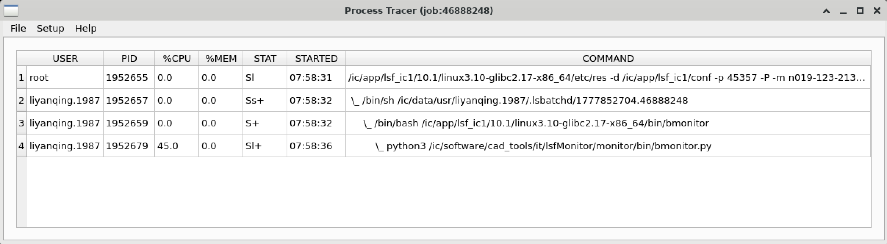

# process_tracer 用户手册

## 概述

`process_tracer` 是 lsfMonitor 提供的图形化进程跟踪工具，用于查看 LSF 作业或本地进程的进程树状态。可以实时监控进程的 CPU、内存使用率和运行状态，并支持通过 strace 深入跟踪单个进程的系统调用。

## 使用方法

```
process_tracer [选项]
```

必须指定 `--job` 或 `--pid` 其中之一。

## 命令行参数

| 参数 | 缩写 | 说明 |
|------|------|------|
| `--job` | `-j` | 指定要跟踪的 LSF Job ID（远程主机） |
| `--pid` | `-p` | 指定要跟踪的本地进程 PID |

## 图形界面说明

启动后显示一个进程表格窗口，包含以下列：

| 列名 | 说明 |
|------|------|
| USER | 进程所属用户 |
| PID | 进程 ID |
| %CPU | CPU 使用率 |
| %MEM | 内存使用率 |
| STAT | 进程状态（R=运行，S=睡眠，D=不可中断睡眠，Z=僵尸等） |
| STARTED | 进程启动时间 |
| COMMAND | 进程命令行 |



### 菜单栏

- **File > Exit**：退出程序。
- **Setup > Fresh**：手动刷新进程信息。
- **Setup > Periodic Fresh (1 min)**：开启/关闭每分钟自动刷新。
- **Help > About**：显示工具说明。

### 交互操作

点击表格中 PID 列的某个进程 ID，工具会自动打开一个 xterm 终端并运行 `strace -tt -p <pid>`，实时显示该进程的系统调用，便于诊断进程卡住或运行缓慢的原因。

## 使用示例

### 跟踪 LSF 作业的进程

```bash
# 跟踪 Job ID 为 12345 的作业进程
process_tracer -j 12345
```

工具会：
1. 通过 `bjobs -UF` 获取作业信息和 PID 列表。
2. 通过 `bsub -Is` 在作业所在的执行主机上远程执行 `ps` 命令获取进程详情。
3. 在 GUI 中展示进程树。

### 跟踪本地进程

```bash
# 跟踪 PID 为 5678 的本地进程
process_tracer -p 5678
```

工具会通过 `pstree -p` 获取完整的进程树，然后查询各进程状态。

## 注意事项

- 使用 `-j` 跟踪 LSF 作业时，作业必须处于 RUN 状态。
- 远程进程跟踪依赖 `bsub -Is` 命令在执行主机上运行 `ps`，需确保目标主机状态为 `ok`。
- strace 功能需要 `xterm` 已安装且有可用的 X11 显示环境。
- 该工具需要 PyQt5 图形环境支持。
