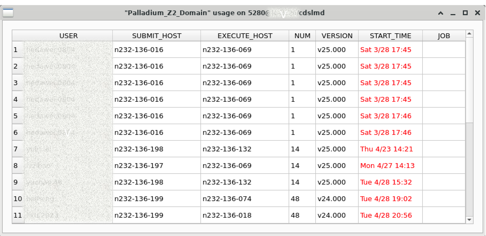

# show_license_feature_usage 用户手册

## 概述

`show_license_feature_usage` 是 lsfMonitor 提供的图形化工具，用于查看 EDA License 某个 Feature 的详细使用情况，包括使用者、主机、许可证数量、版本号、开始时间，以及对应的 LSF 作业关联。

## 使用方法

```
show_license_feature_usage -s <服务器> -v <vendor> -f <feature>
```

所有三个参数均为必需。

## 命令行参数

| 参数 | 缩写 | 说明 |
|------|------|------|
| `--server` | `-s` | （必需）指定 License 服务器地址 |
| `--vendor` | `-v` | （必需）指定 Vendor Daemon 名称 |
| `--feature` | `-f` | （必需）指定要查看的 License Feature 名称 |

## 图形界面说明

启动后显示一个表格窗口，包含以下列：

| 列名 | 说明 |
|------|------|
| USER | 使用该 License 的用户 |
| SUBMIT_HOST | 提交主机 |
| EXECUTE_HOST | 执行主机 |
| NUM | 占用的许可证数量 |
| VERSION | License 版本号 |
| START_TIME | 许可证开始使用时间 |
| JOB | 关联的 LSF 作业 ID |



### 特殊标记

- **START_TIME 红色高亮**：当许可证使用时长超过阈值时，该行的开始时间会显示为红色，便于识别长时间占用许可证的情况。
- **JOB 列**：
  - 显示具体的 Job ID 表示找到唯一对应作业。
  - 显示 `*` 表示匹配到多个可能的作业。
  - 留空表示未找到对应的 LSF 作业。

## 使用示例

```bash
# 查看 lic_server 上 vendor_daemon 的 feature_name 使用情况
show_license_feature_usage -s 27000@lic_server -v snpslmd -f Synopsys
```

## 作业关联机制

工具会自动将 License 使用记录与 LSF 作业进行关联，匹配规则：

1. 用户名（USER）匹配
2. 提交主机（FROM_HOST）匹配
3. 执行主机（EXEC_HOST）匹配
4. License 开始时间晚于作业提交时间

## 前置配置

该工具依赖 `monitor/conf/config.py` 中的以下配置项：

- `lmstat_path`：lmstat 工具的路径。
- `lmstat_bsub_command`：运行 lmstat 的 bsub 命令（因为通常禁止在登录服务器上直接运行 lmstat）。

## 注意事项

- 该工具通常从 `bmonitor` 的 LICENSE 标签页中调用，也可以独立使用。
- 查询 License 信息可能耗时较长，启动时会显示进度提示。
- 该工具需要 PyQt5 图形环境支持，请确保有可用的 X11 显示。
- 需要正确配置 `lmstat_path` 和 `lmstat_bsub_command` 才能正常工作。
